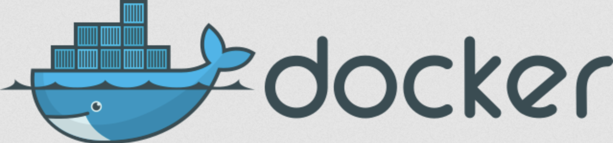
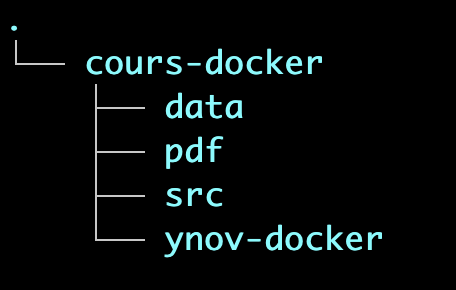

# Docker - Ynov campus - oct/nov 2024

Bienvenue

* Alexis Perrier - [alexis.perrier@ynov.com](mailto:alexis.perrier@ynov.com)
* Linkedin: [alexisperrier](https://www.linkedin.com/in/alexisperrier/)



## Le discord

Connectez-vous au discord dans le channel ynov-docker : [https://discord.gg/yh2cr4UF7y](https://discord.gg/yh2cr4UF7y)

## Le github

Tous les supports de cours sont dans le github [https://github.com/SkatAI/ynov-docker](https://github.com/SkatAI/ynov-docker)

## Le moodle

Les supports de cours seront aussi mis à disposition sur le Moodle de Ynov.

## Le cours

8 Sessions (S01, ... S08) réparties sur 4 journées: 8 et 9 octobre, 29 oct et 18 Novembre.

Chaque session ou demi journée suit le principe

* 1 sujet par session
* intro et recap de ce que l'on a vu précédemment
* TD sur le cours précédent
* Cours sur le sujet de la session

Le but est de vous faire pratiquer le plus possible.

Questions, commentaires à [alexis.perrier@ynov.com](mailto:alexis.perrier@ynov.com) ou via discord.

## Evaluation

* Les TD comptent pour la note final. Vous allez publier toutes vos images Docker sur Docker Hub et elles participeront a votre note du cours.
* Un projet final en classe lors de la dernière après midi ou journée.

La note finale sera composée de 50% (les meilleures notes de TD) + 50% (le projet final)

## Comment organiser votre travail

Créez un répertoire unique pour le cours

```bash
/cours-docker
```

puis

```bash
cd ./cours-docker
```

* dans le repertoire `/cours-docker` créez des folders pour
  * les pdf, `.pdf`
  * votre code: `./src`
  * la data: `./data`
  * Autres folders dont vous avez besoin

puis

* clonez la repo

```bash
git clone git@github.com:SkatAI/ynov-docker.git
```

Cela va créer un sous répertoire `cours-docker/ynov-docker`

Au final la structure est:



### Le terminal

On travaille dans le terminal à 95%

* mac: iTerm
* Windows: WSL ou Git Bash

## Pré-requis

* confortable avec la ligne de commande
* savoir ajouter un path au PATH

## Scope du cours (Ynov)

* Connaître les caractéristiques d'un conteneur et découvrir Docker
* Installer et utiliser Docker
* Dockerfile
* Maîtriser la persistance des données avec Docker
* Utiliser Docker-Compose
* Maîtriser les notions réseaux de Docker

A ceci, nous ajouterons:

* Intro à Linux

et si nous avons le temps

* déployer une application dockerisée sur Azure

> S'il y a des sujets que vous souhaitez aborder, n'hésitez pas à me le dire.

## But du cours

* Qu'utiliser **Docker** dans vos projets devienne une évidence et un réflexe.

## Sondage rapide

Mais tout d'abord pour mieux vous connaitre, quelques questions

* il n'y a pas de mauvaise réponse
* questions et commentaires sont bienvenus

<https://forms.gle/44jJWQHfEwGGfhfo8>
