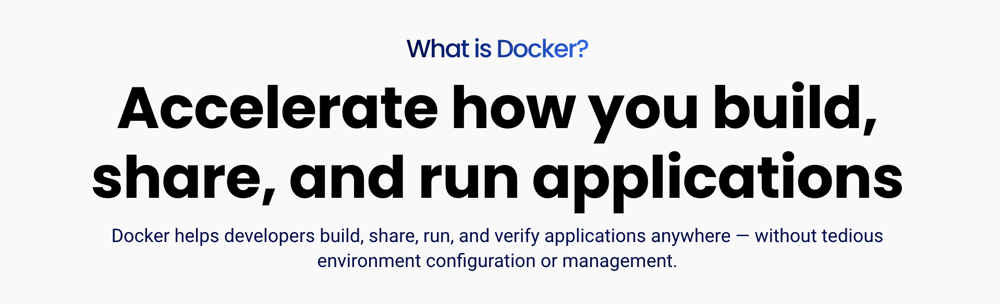
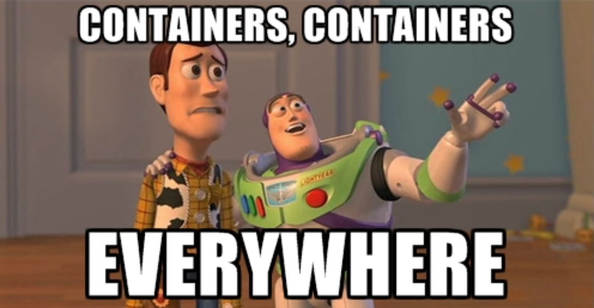
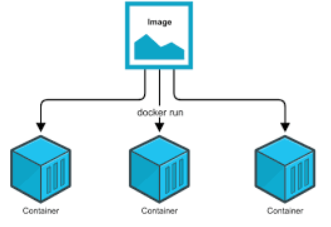
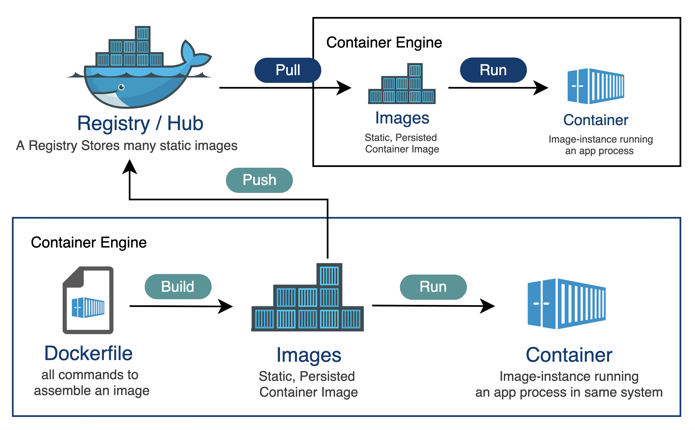

# Docker

- Docker c'est quoi ?
- A quoi ca sert ?

- Et pourquoi c'est important professionnellement

## Docker pourquoi ?

Le mieux est d'aller regarder sur le site de [docker.com](https://docker.com)


- Développer plus vite
- Ca tourne partout
- L'outil de développement numéro 1

Et plus bas :



> Docker est une plateforme open source qui sert à **développer**, **partager**, **livrer** et **executer** des applications
> pour ne plus jamais entendre : **mais ça marche sur ma machine ?!**


Donc docker c'est ce qui permet de passer du stade _amateur_ au niveau **professionnel** quel que soit votre domaine (front, back, mobile, data, ML, ...).

### Sur le plan professionnel

Quelques réponses à la question : [un développeur doit-il apprendre docker](https://www.reddit.com/r/docker/comments/s18o83/is_it_worth_it_to_invest_time_learning_docker_as/) ?

> Most definitely, not **polluting** your machine with app-specific setup is a huge **time/headache saver**.

soit

> ne pas polluer sa machine avec des configurations spécifiques à l'application est un énorme gain de temps et d'énergie.

Pour le CTO:

> As a CTO, docker is the second thing I look for after experience with the core language the team is using. Why? Because any entry level dev can write an app that works on their laptop. [...]. My current team uses docker to **replicate the entire stack locally**. We want to reduce the variance from our test env and our prod env.

En français:

> En tant que CTO, Docker est la 2eme chose que je recherche après l'expérience avec le langage principal utilisé par l'équipe. Pourquoi ? Parce que n'importe quel développeur débutant peut écrire une application qui fonctionne sur son ordinateur portable. [...] Mon équipe  utilise Docker pour **répliquer l'intégralité de la stack en local**. Nous voulons réduire les écarts entre notre environnement de test et notre environnement de production.

#### Popularité de Docker

L'enquête [Stack Overflow 2024](https://www.docker.com/blog/docker-stack-overflow-survey-thank-you-2024/):

> found Docker to be the most-admired (78%). Moreover, Docker is the **most-used tool**  by professional developers, with 59% using it in their work.

en français:

> ... Docker est l'outil le plus admiré (78%). ... Docker est l'outil le plus utilisé par les professionnels,  59 % d'entre eux l'utilise dans leur travail.

Donc quand vous êtes en recherche d'emploi, savoir utiliser docker est définitivement un élément qui vous différencie des autres candidats.

## Pour développer

L'idée est d'encapsuler une application dans un truc appelé un **container** qui devient l'objet de base pour le développement, les tests et le déploiement de l'application.

L'application fonctionne alors dans n'importe quel environnement, sur n'importe quelle machine.

Les conteneurs permettent à un développeur

- d'**encapsuler** une application avec tous ses composants (bibliothèques, dépendances),
- de tout expédier en un seul package.

Et **Docker**, est un outil qui gère vos conteneurs de A à Z :

1. On **développe** l'appli dans des conteneurs.
2. Le conteneur devient l'unité de base pour **distribuer** et **tester** l'appli.
3. Quand tout est prêt, on peut déployer l'appli en **production**, soit par le biais d'un simple conteneur, de multiples containers ou avec un service d'orchestration comme Docker Swarm ou Kubernetes.



### Scénarios

- environnements de dev, test, staging, production
- mise en production
- évolution des versions des librairies
- CI/CD
- onboarding
- projets open source

avec comme bénéfices directs: scalabilité, reproductibilité et fiabilité

## Composants Docker

Comment ça marche ? quel est le principe ?

On parle de **containers** et d'**images**.

### Images

Que dit la doc? [docs.docker.com/get-started/docker-overview](https://docs.docker.com/get-started/docker-overview/)

- An image is a read-only template with instructions for creating a Docker container.
- Often, an image is based on another image, with some additional customization.
- For example, you may build an image which is based on the ubuntu image, but installs the Apache web server and your application, as well as the configuration details needed to make your application run.

en français

- Une image est un modèle (template) en lecture seule avec des instructions pour créer un conteneur Docker.
- Souvent, une image est basée sur une autre image avec des personnalisations supplémentaires.
- Par exemple, vous pouvez créer une image basée sur l'image Ubuntu, qui installe le serveur web Apache, votre application et les configurations nécessaires pour la faire fonctionner.

Ce qui n'est pas super super clair.

Un image c'est un fichier dont le rôle est de permettre de répliquer une application, un service : site web, base de données, API, micro service, ...

Une image contient:

- un OS (**Linux** la plupart du temps)
- des étapes d'installation des librairies nécessaires
- des étapes de configuration: clés d'accès, variables d'environnement, configurations réseau
- et l'exécution d'une ou plusieurs commande

#### Exemples

Une image simple

- une image de départ: Ubuntu 22.04
- une commande: shell

Un site web qui tourne sur Nginx

- une image de départ: Nginx
- On installe Flask,
- on ouvre le port 8080
- puis on lance Nginx et Flask

Une base de données

- on part d'une image de base avec l'OS Ubuntu
- on installe PostgreSQL
- on crée un volume persistent
- on ouvre le port 5432
- on importe les credentials d'accès
- on lance le serveur PostgreSQL
- on lance le monitoring du serveur en parallèle

donc **l'image**, c'est un fichier qui une fois _exécuté_ (**run**) va permettre de faire tourner l'application.

On `build` une image à partir de spécifications précises.

C'est un peu la même idée qu'une machine virtuelle avec quelques différences importantes.

### Containers

A partir d'une image, on crée un container.

Un container est une **instance** d'exécution de l'image.

A partir d'une image unique on peut avoir plusieurs containers qui exécute la même image.

Ce qui est tout de suite très intéressant pour déployer des applications sur un grand nombre de hosts à la fois.



On ```start | stop | delete``` un container.

#### Scalability

Au delà du bon fonctionnement de l'application sur une machine donnée de façon fiable et reproductible, Docker permet de **deployer** facilement une application de façon automatique sur plusieurs serveurs. C'est l'aspect scalabilité.

### Parallèle avec la notion de classe et d'object

Les images docker et leurs containers associés suivent le concept de classe et d'objet.

Une image est comme une classe à partir de laquelle on instancie des objets en nombre illimité, les containers.

### Isolation des containers

Un container existe par lui même indépendamment de la machine sur laquelle il tourne. On dit qu'il est isolé de la machine hôte.

C'est tout l'intérêt qu'il y a à travailler avec des containers.

Par contre, quand on supprime un container, son état (state) de fonctionnement et les données  qui lui sont propres disparaissent avec lui.

Mais on peut attacher ou relier un container à du storage et lui donner accès à un réseau pour rendre les données persistantes au delà de la vie du container.

Il est donc possible de faire tourner des containers en parallèle sur sa machine.

En résumé : **Chaque container est indépendant des autres et de la machine hôte.**

### Du container à l'image

On peut aussi transformer le container en une nouvelle image.

par exemple:

- On part d'une image linux (ubuntu).
- On execute le container basé sur cette image
- On rentre dans le container pour installer des librairies
- On sauve le container en tant que nouvelle image

On peut ensuite démarrer un nouveau container à partir de cette nouvelle image.

### Dockerfile

Le Dockerfile est le fichier de specification de l'image.

Plutôt que de toujours devoir partir d'une image simple (OS) puis de la modifier manuellement instruction par instruction, on utilise un fichier de specifications intitulé ```Dockerfile```

```Dockerfile``` un fichier au format texte, de création d'une image Docker qui contient:

- la déclaration d'une image de départ
- les installations successives
- le setup réseaux, storage, accès
- les commandes d'exécution

## Registry: stockage des images

Une fois construite en local on peut publier l'image sur un registry.



### Docker hub registry

**Docker Hub**  [hub.docker.com](https://hub.docker.com/) est le registry officiel de Docker, Inc. C'est une plateforme centralisée de stockage et de partage d'images Docker et offre des repository publics et privés.

1. **Stocker et distribuer des images de conteneurs :** on peut publier des images Docker sur Docker Hub, pour les rendre disponibles pour que d'autres puissent les télécharger et les utiliser.

2. **Images officielles :** Docker Hub héberge les **images officielles** des projets open-source les plus important (Ubuntu, NGINX, MySQL, ...). Ces images sont vérifiées par Docker et sont fiables.

3. **Images publiques :** En plus des images officielles, chacun peut publier ses propres images sur Docker Hub et les mettre à disposition de la communauté.

4. **Builds automatisés :** Docker Hub peut automatiquement créer des images à partir d'un repository git. Ces images sont re-buildées à chaque nouveau commit et sont par conséquent à jour.

En résumé, Docker Hub est le registre de conteneurs le plus grand et le plus utilisé, permettant le partage et la gestion d'images Docker de manière fluide.

### Cloud based registries

Les grandes plateformes cloud offrent toutes des services de registry

- AWS: **Amazon Elastic Container Registry (ECR)**
- Google: **Google Container Registry (GCR)** et plus récent: **Artifact Registry** (remplace GCR)
- Azure: **Azure Container Registry (ACR)**

## Histoire de Docker

_Eleven years ago, Solomon Hykes walked onto the stage at PyCon 2013 and revealed Docker to the world for the first time. The problem Docker was looking to solve? “Shipping code to the server is hard”._
<https://medium.com/datadriveninvestor/docker-f0b8df21f003>

> Il y a 11 ans, Solomon Hykes révèle l'existence de Docker lors de PyCon 2013. Le problème que docker essayait de résoudre : livrer du code en production est difficile.

Le premier blog post date de juillet 2013 <https://www.docker.com/blog/how-to-use-your-own-registry/>

Solomon Hykes crée ensuite la version commerciale de Docker en 2014. Il y a 10 ans.
<https://www.zdnet.com/article/docker-1-0-brings-container-technology-to-the-enterprise/>

## Conclusion

- Une image permet de répliquer intégralement une application.
- On construit une image à partir d'un fichier d'instructions appelé Dockerfile
- L'instance d'une image est un container.
- Le container permet à l'application de fonctionner indépendamment de la machine host.
- Le container est éphémère.

- rapidité, fiabilité et scalabilité.

## Liens et lectures

Docker:

- <https://docker.com>
- <https://hub.docker.com>

Importance de Docker

- <https://www.docker.com/blog/docker-stack-overflow-survey-thank-you-2024/>):
- <https://www.reddit.com/r/docker/comments/s18o83/is_it_worth_it_to_invest_time_learning_docker_as/>

Fonctionnement de Docker

- <https://docs.docker.com/get-started/docker-overview/>
- <https://medium.com/@furkan.turkal/how-does-docker-actually-work-the-hard-way-a-technical-deep-diving-c5b8ea2f0422>
