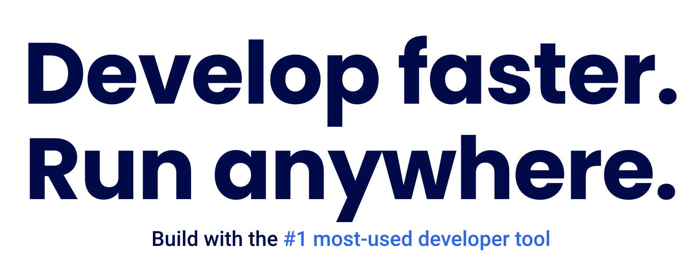

# Docker

- Docker c'est quoi ?
- A quoi ca sert ?

- Et surtout pourquoi c'est important professionnellement

## Docker pourquoi ?

Le mieux est d'aller regarder sur le site de [docker.com](https://docker.com)



- Développer plus vite
- Ca tourne partout
- L'outil de développement numéro 1

Et plus bas :


> Docker est une plateforme open source qui sert à **développer**, **partager**, **livrer** et **executer** des applications
> pour ne plus jamais entendre : **mais ça marche sur ma machine ?!**

Donc docker c'est ce qui permet de passer du stade _amateur_ au niveau **professionnel** quel que soit votre domaine (front, back, mobile, data, ML, ...).

### Sur le plan professionnel

Quelques réponses à la question : [un développeur doit-il apprendre docker](https://www.reddit.com/r/docker/comments/s18o83/is_it_worth_it_to_invest_time_learning_docker_as/) ?

> As a CTO, docker is the second thing I look for after experience with the core language the team is using. Why? Because any entry level dev can write an app that works on their laptop.
[...]. My current team uses docker to **replicate the entire stack locally**. We want to reduce the variance from our test env and our prod env.

ou
> Most definitely, not **polluting** your machine with app-specific setup is a huge **time/headache saver**.

L'enquête [Stack Overflow 2024](https://www.docker.com/blog/docker-stack-overflow-survey-thank-you-2024/):

> found Docker to be the most-admired (78%). Moreover, Docker is the **most-used tool**  by professional developers, with 59% using it in their work.

Donc quand vous êtes en recherche d'emploi, savoir utiliser docker est définitivement un élément qui vous différencie des autres candidats.

En résumé:

Docker first : c'est être vu comme un pro et pas comme un débutant.

## Dans le développement

Docker provides tooling and a platform to manage the lifecycle of your containers:

-     Develop your application and its supporting components using containers.
-     The container becomes the unit for distributing and testing your application.
-     When you're ready, deploy your application into your production environment, as a container or an orchestrated service. This works the same whether your production environment is a local data center, a cloud provider, or a hybrid of the two.

Docker, est un outil qui gère vos conteneurs de A à Z :

- On développe l'appli dans des conteneurs.
- Le conteneur devient l'unité de base pour distribuer et tester l'appli.
- Quand tout est prêt, on peut déployer l'appli en production, (conteneur simple, soit comme un service orchestré Kubernetes). Ça marche pareil, que ce soit sur l'ordi local, dans le cloud, ou un mix des deux.

Containers allow a developer to package up an application with all the parts it needs, such as libraries and other dependencies, and ship it all out as one package. In short, Docker containers encapsulate everything required to run an application, ensuring it works seamlessly in any environment.

> Les conteneurs permettent à un développeur d'**emballer** une application avec tous les éléments dont elle a besoin, comme les bibliothèques et autres dépendances, et de tout expédier en un seul paquet. En gros, les conteneurs Docker encapsulent tout ce qui est nécessaire pour faire tourner une application, garantissant qu'elle fonctionne sans accroc dans n'importe quel environnement.

### Scénarios

- Versions multiples d'une application et de tous les composants nécessaires à son execution : librairies, package mais aussi clefs API, mots de passe, fichiers de configurations, etc
- stacks dans des versions multiples
- environnements de développement, de test, de staging ou replication de l'environnement de production

- et nécessités de pouvoir faire tourner une application, sur plusieurs machines
  - autres développeurs
  - Machine Virtuelle en production
  - projet open source
  - etc

## Composants Docker

Comment ca marche ? quel est le principe ?

On parle d'image et de containers

Docker objects

When you use Docker, you are creating and using images, containers, networks, volumes, plugins, and other objects. This section is a brief overview of some of those objects.

### Images

Que dit la doc? [docs.docker.com/get-started/docker-overview](https://docs.docker.com/get-started/docker-overview/)

- An image is a read-only template with instructions for creating a Docker container.
- Often, an image is based on another image, with some additional customization.

et:

- For example, you may build an image which is based on the ubuntu image, but installs the Apache web server and your application, as well as the configuration details needed to make your application run.

Ce qui n'est pas super clair.

Un image c'est un fichier dont le role est de permettre de run une application, un service.

Une image contient:

- un OS (linux la plupart du temps)
- les librairies nécessaires
- des commandes : clés d'accès, configurations réseau, exécution de programme, etc...

ou plus généralement:

- une image de départ qui peut être un OS
- des librairies supplémentaires
- des commandes

### Containers

Un container est une instance executable de l'image en question.

> Donc à partir d'une image unique on peut avoir plusieurs containers qui exécute la même image.
> Ce qui est tout de suite très intéressant pour déployer des applications sur un grand nombre de VM (machines virtuelles) à la fois.

Un peut ```start | stop | delete``` un container. Soit:

- en ligne de commande (terminal, powershell)
- avec docker desktop


### parallèle avec la notion de classe et d'object

Container images seems like a bit class/object concept. Image is like a class or template and then you can create any number of instances of that template and it has OCI Runtime Specification. It’s a definition of the standard container.

#### Isolation

Un container existe par lui même indépendamment de la machine sur laquelle il tourne.
On dit qu'il est isolé de la machine hôte.
Donc quand on supprime un container, son état (state) de fonctionnement et les données  qui lui sont propres disparaissent avec lui.

Mais on peut attacher ou relier un container a du storage et un réseau pour rendre les données persistantes au delà de la vie du container.

On peut aussi transformer le container en une nouvelle image.

par exemple:

- On part d'une image linux (ubuntu).
- On execute le container basé sur cette image
- On rentre dans le container pour installer des librairies
- On sauve le container comme une nouvelle image

On peut ensuite démarrer un nouveau container à partir de cette nouvelle image.

Il est donc possible de faire tourner des containers en parallèle sur sa machine.
Chaque containers est indépendant des autres et de la machine hôte.

### Dockerfile

Plutôt que de toujours devoir partir d'une image simple (OS) qui de la construire instruction par instruction, on utilise un fichier  intitulé ```Dockerfile```

```Dockerfile``` un fichier au format texte de création d'une image Docker qui contient:

- la déclaration d'une image de départ
- les installations successives
- le setup réseaux, storage, accès
- les commandes d'execution

### Mais d'où viennent les images ?

du Docker registry hub


### Histoire

Eleven years ago, Solomon Hykes walked onto the stage at PyCon 2013 and revealed Docker to the world for the first time. The problem Docker was looking to solve? “Shipping code to the server is hard.”

Mar 21, 2024
<https://www.docker.com/blog/docker-11-year-anniversary/>

Ranked #1 “most-wanted” tool/platform by Stack Overflow’s developer community for the past four years
26 million monthly active IPs accessing 15 million repos on Docker Hub, pulling them 25 billion times per month
17 million registered developers

La version commerciale de dockers date de 2014. il y a 10 ans. créee par Solomon Hykes
<https://www.zdnet.com/article/docker-1-0-brings-container-technology-to-the-enterprise/>

<https://medium.com/datadriveninvestor/docker-f0b8df21f003>

depuis plus de 40 milliards

Le premier blog post
juillet 2013
<https://www.docker.com/blog/how-to-use-your-own-registry/>
celui d'apres
avec le meme
<https://www.docker.com/blog/docker-can-now-run-within-docker/>

## Liens et lectures

- <https://docs.docker.com/get-started/docker-overview/>
- <https://medium.com/@furkan.turkal/how-does-docker-actually-work-the-hard-way-a-technical-deep-diving-c5b8ea2f0422>
