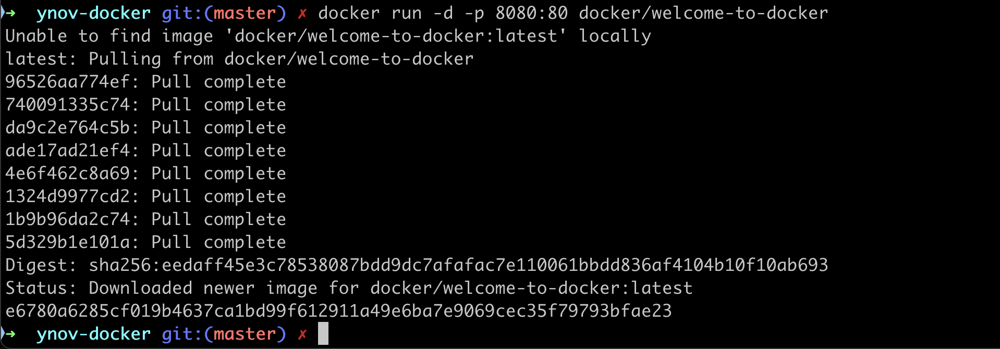

# Installer docker

But du document:

- installer Docker Desktop
- verifier l'install

Commençons par le plus important

## Installer Docker sur vos machines

Le plus simple est d'installer l'application **Docker Desktop** qui offre une interface (UI) simple et qui installera tout ce qui est nécessaire pour vous permettre d'exécuter aussi ```docker``` en ligne de commande.

Pour cela, allez sur <https://docs.docker.com/desktop/>  et choisissez la version qui vous convient

## Windows

### Installer WSL 2

Sur windows, il est fortement conseillé d'installer WSL 2 avec Ubuntu comme distribution Linux.

<https://learn.microsoft.com/fr-fr/windows/wsl/install>

### Ensuite Docker Desktop

<https://docs.docker.com/desktop/install/windows-install/>

## Mac

<https://docs.docker.com/desktop/install/mac-install/>

## Vérifier l'installation de Docker

En ligne de commande:

```bash
docker run -d -p 8080:80 docker/welcome-to-docker
```

Voici le résultat de la commande



Allez maintenant sur ```http://localhost:8080/``` dans votre navigateur

Vous devriez voir


## Conclusion

Si vous avez pu faire tourner le container welcome to docker en ligne de commande, bravo!

On va maintenant explorer ce qui la commande a fait.
