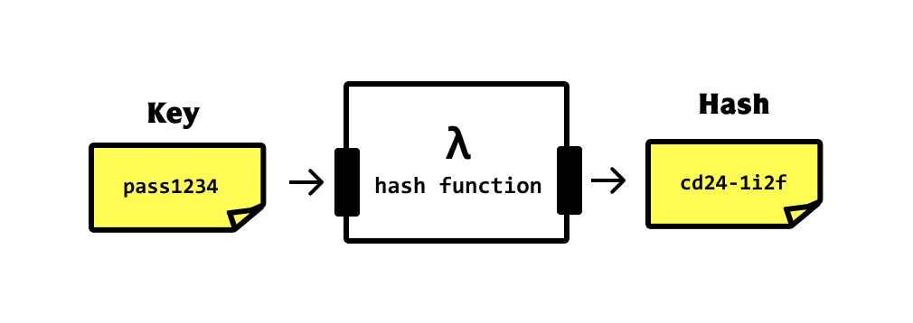

# Décryptons le hello world

Dans ce document:

- on analyse les conséquences de la commande ```docker run -d -p 8080:80 docker/welcome-to-docker```
- hash string et une hash fonction

## Que fait ```docker run``` ?

Revennons sur la sortie dans le terminal de la commande:

```bash
docker run -d -p 8080:80 docker/welcome-to-docker
```

On a

```bash
> docker run -d -p 8080:80 docker/welcome-to-docker
Unable to find image 'docker/welcome-to-docker:latest' locally
latest: Pulling from docker/welcome-to-docker
96526aa774ef: Pull complete
740091335c74: Pull complete
da9c2e764c5b: Pull complete
ade17ad21ef4: Pull complete
4e6f462c8a69: Pull complete
1324d9977cd2: Pull complete
1b9b96da2c74: Pull complete
5d329b1e101a: Pull complete
Digest: sha256:eedaff45e3c78538087bdd9dc7afafac7e110061bbdd836af4104b10f10ab693
Status: Downloaded newer image for docker/welcome-to-docker:latest
e6780a6285cf019b4637ca1bd99f612911a49e6ba7e9069cec35f79793bfae23
```

- La première ligne montre que docker va essayer de récupérer (pull) l'image ```docker/welcome-to-docker``` localement et qu'il ne la trouve pas.
- Donc il va la récupérer a partir d'un repository en ligne (**docker hub**)
- Il récupère ensuite pas moins de 8 elements.
  - Les strings de type _740091335c74_ sont les **hash** liés aux éléments récupérés.
- `Status:...` Il confirme que l'image la plus récente a bien été récupérée.
- Et il donne 2 longs hash d'identification:
  - le premier: ```Digest: sha256:eedaff45e3c78538087...``` correspond au **manifest** de l'image (fichier JSON auto généré qui décrit les composants de l'image).
  - le deuxième est le hash d'identification du container

Donc pas mal de chose et surtout beaucoup de hash strings!

## HASH string et fonctions de Hashing

Une fonction de hashing est un algorithme qui prends un chaîne de caractères en entrée et qui produit une chaîne de caractère appelée HASH de taille déterminée.



La [fonction de hashing](https://fr.wikipedia.org/wiki/Fonction_de_hachage) (hachage en français :( ) a des propriétés très spécifiques:

- **Déterministe** : la même entrée produit toujours la même sortie
- **Rapide** : le calcul du HASH est super rapide pour pouvoir être appliqué à des volumes importants de données.
- **Distribution uniforme** : (tous les symboles sont utilisés avec la même fréquence)
- **Effet d'avalanche** : un petit changement dans le contenu en entrée change fortement le HASH en sortie.

Mais surtout

- **unicité**: la probabilité pour que 2 textes différents ait le même hash (risque de collision) est de 1 sur 3.4 x 10^38.
Donc si on peut générer  1 Milliard de hashes par second, on aurait 50% de chance d'avoir une collision en 10^19 années. Par comparaison l'âge de l'univers est de 1.38×10^10!

- **transformation à sens unique** : il est impossible de retrouver le contenu original a partir du simple hash! parfait pour stocker les mots de passe de façon sécurisée

Les HASH strings sont utilisées dans de nombreux domaines

1. Structures de données : Tables de hachage pour une recherche, insertion et suppression de données rapides.
2. Cryptographie : Stockage des mots de passe : Stocker les mots de passe de manière sécurisée en les hachant.
3. Intégrité des données : Sommes de contrôle : Détecter les modifications accidentelles des données lors de la transmission ou du stockage.
4. Mise en cache : Utiliser des hachages comme clés pour stocker et récupérer des données en cache.
5. Technologie blockchain : Preuve de travail : Fondamentale pour de nombreux algorithmes de minage de cryptomonnaies.

Il existent de multiples fonctions Hash qui diffèrent par leur qualité: SHA256, MD5, ...

| Nom       | Output Size (bits) | Speed           | Security     | Common Use Cases                      |
|------------|:------------------:|-----------------|--------------|---------------------------------------|
| MD5        | 128                | Very Fast       | Broken       | Checksums (non-security)              |
| SHA-1      | 160                | Fast            | Weak         | Legacy systems, Git                   |
| SHA-256    | 256                | Moderate        | Strong       | Digital signatures, blockchain        |
| SHA-3      | 224-512            | Slow            | Very Strong  | High-security applications            |
| BLAKE2     | 256/512            | Very Fast       | Strong       | Fast hashing needs                    |
| bcrypt     | 184                | Very Slow       | Strong       | Password hashing                      |
| Argon2     | Variable           | Configurable    | Very Strong  | Password hashing, key derivation      |
| CRC32      | 32                 | Extremely Fast  | Not Secure   | Error detection                       |
| MurmurHash | 32/128             | Extremely Fast  | Not Secure   | Hash tables, caches                   |

Donc en résumé le **hash string** est un **identifiant universellement unique** d'un contenu, fichier, texte etc...

Il est impossible de retrouver le contenu original à partir de son HASH string

## De retour à Docker

La commande

```bash
docker run -d -p 8080:80 docker/welcome-to-docker
```

se décompose de la façon suivante:

- ```docker run``` : executer une image ou un container
- ```-d``` : mode détaché (le terminal redevient disponible après )
- ```-p 8080:80``` :  un mapping de port: celui interne au container: 80  qui est ainsi lié au port externe 8080. C'est sur ce port **8080** qu'on accède au service offert par l'image via l'url ```http://localhost:**8080**```
- Le nom de l'image ```docker/welcome-to-docker```

notez que docker essaie de trouver non pas ```docker/welcome-to-docker``` mais ```docker/welcome-to-docker:latest```. **latest** est un tag de version. Par défaut pour un nom d'image donné, docker va chercher la version la plus récente qui est taggé  par le mot **latest**.

## CLI

On peut lister le container et l'image en ligne de commande (CLI command line interface) avec

### ```docker images```

```bash
> docker images
REPOSITORY                 TAG       IMAGE ID       CREATED         SIZE
docker/welcome-to-docker   latest    c1f619b6477e   10 months ago   18.6MB
```

on retrouve

- le nom de l'image: docker/welcome-to-docker
- le tag: latest
- l'image ID. Ici le hash correspond au fichier executable intégrale de l'image (pas son manifeste)
- la date de création de l'image
- sa taille

Donc à retenir: ```docker images``` pour lister les images

### docker ps

La commande pour lister les containers est : ```docker ps```. (```ps``` veut dire ```process status```)

```bash
> docker ps
CONTAINER ID   IMAGE                      COMMAND                  CREATED
e6780a6285cf   docker/welcome-to-docker   "/docker-entrypoint.…"   ...

    PORTS                  NAMES
    0.0.0.0:8080->80/tcp   hungry_snyder
```

- ici le hash _e6780a6285cf_ tient lieu d'ID du container. C'est une version abrégée du hash string de la dernière ligne de ```docker run```: _e6780a6285cf019b4637ca1bd99f612911a49e6ba7e9069cec35f79793bfae23_
- un extrait de la ligne de commande qui a été executé une fois le container lancé. C'est ce qui a parmit d'acceder a une page sur localhost
- On trouve aussi le mapping entre les ports: externe -> interne : ```0.0.0.0:8080->80/tcp```
- enfin un nom aléatoire qui a été assigné au container par docker. ```hungry_snyder```

Donc à retenir: ```docker ps``` pour lister les containers (en cours d'éxécution).

Pour lister tout les containers meme ceux arretés, on ajoute `-all`

```bash
docker ps -a
```

## et docker desktop dans tout ça ?

La ligne de commande c'est super mais on a aussi **Docker Desktop**

On y retrouve bien les informations données par ```docker images```


et les éléments données par ```docker ps``` pour le container.


Il y a une correspondance directe entre l'appli Docker Desktop et docker en ligne de commande.

Dans la suite on utilisera la ligne de commande le plus possible mais docker desktop est utile pour avoir une vue d'ensemble.

## Conclusion

A ce stade vous devriez:

- comprendre que docker va changer votre vie
- avoir installé Docker Desktop, WSL
- avoir exécuté le container  hello world a partir de l'image ... hello world
- savoir gérer les containers (ps, start, stop) et les images en ligne de commande
- retrouver les information d'un container ou d'une image dans Docker Desktop
- comprendre la différence entre image et containers

Dans la prochaine session, nous attaquons Linux et nous créons une premiere image pour faire tourner un serveur web.
