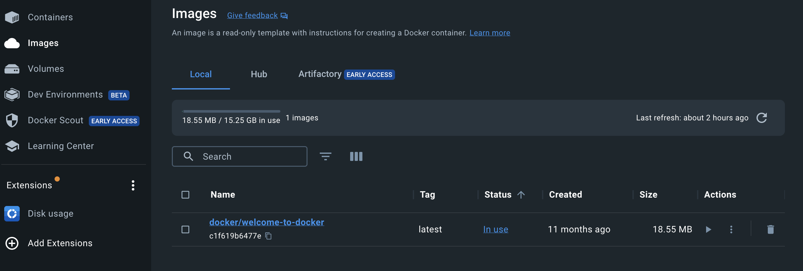
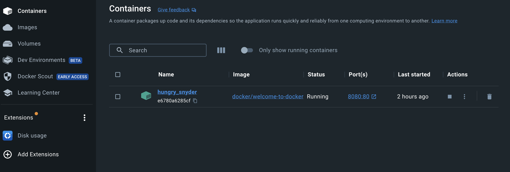

# Decriptons le hello world

Dans ce document:

- on analyse les consequences de la commande ```docker run -d -p 8080:80 docker/welcome-to-docker```
- ce qu'est un hash string et une hash fonction

## Ce que ```docker run``` a fait

Si on revient sur la sortie dans le terminal de la commande:

```bash
docker run -d -p 8080:80 docker/welcome-to-docker
```

On a

```bash
> docker run -d -p 8080:80 docker/welcome-to-docker
Unable to find image 'docker/welcome-to-docker:latest' locally
latest: Pulling from docker/welcome-to-docker
96526aa774ef: Pull complete
740091335c74: Pull complete
da9c2e764c5b: Pull complete
ade17ad21ef4: Pull complete
4e6f462c8a69: Pull complete
1324d9977cd2: Pull complete
1b9b96da2c74: Pull complete
5d329b1e101a: Pull complete
Digest: sha256:eedaff45e3c78538087bdd9dc7afafac7e110061bbdd836af4104b10f10ab693
Status: Downloaded newer image for docker/welcome-to-docker:latest
e6780a6285cf019b4637ca1bd99f612911a49e6ba7e9069cec35f79793bfae23
```

- La première ligne montre que docker va essayer de récupérer (pull) l'image ```docker/welcome-to-docker``` localement et qu'il ne la trouve pas.
- Donc il va la récupérer a partir d'un repository en ligne (**docker hub**)
- Il recapture ensuite pas moins de 8 elements.
  - Les strings de type _740091335c74_ sont les **hash** liés aux elements qui sont récupérés.
- Et après il confirme que l'image la plus récente a bien été récupérée.
- Et il donne 2 longs hash d'identification:
  - le premier: ```Digest: sha256:eedaff45e3c78538087...``` correspond au **manifest** de l'image. (Le manifeste de l'image est une description des composants de l'image).
  - le deuxième est le hash d'identification du container

pas mal d'éléments et beaucoup de hash strings!

### Image manifest

Puisqu'on le mentionne autant en parler maintenant

An image manifest is a JSON file that describes the contents and configuration of a Docker image.
When it's used: It's created when an image is built and used when pulling or pushing images to/from a registry.

It includes:

- References to the image **layers** (composants)
- Image configuration details
- Metadata about the image (like creation time, architecture, OS)

Format: It's a JSON file, not typically meant for direct human editing.
Location: It's stored within the image itself and in Docker registries.

## Qu'est ce qu'un hash string

C'est une chaine de caractères qui est un **identifiant unique** d'un contenu binaire (texte, image, fichier executable, ...) ou d'un fichier.

- mot de passe, email, clef API
- images, fichiers executables
- code, paragraphs, livres, etc ...

Il existent de multiples fonctions Hash qui diffèrent par leur qualité: SHA256, MD5, ...

### propriétés

- unicité: la probabilité pour que 2 textes différents ait le même hash (risque de collision) est de 1 sur 3.4 x 10^38.
Donc si on peut générer  1 Milliard de hashes par second, on aurait 50% de chance d'avoir une collision en 10^19 années. Par comparaison l'âge de l'univers est de 1.38×10^10!

- un petit changement dans le contenu original produit un grand changement dans le hash string

- il est impossible de retrouver le contenu original a partir du simple hash! => mot de passe

Différents algorithmes de hash

| Nom       | Output Size (bits) | Speed           | Security     | Common Use Cases                      |
|------------|:------------------:|-----------------|--------------|---------------------------------------|
| MD5        | 128                | Very Fast       | Broken       | Checksums (non-security)              |
| SHA-1      | 160                | Fast            | Weak         | Legacy systems, Git                   |
| SHA-256    | 256                | Moderate        | Strong       | Digital signatures, blockchain        |
| SHA-3      | 224-512            | Slow            | Very Strong  | High-security applications            |
| BLAKE2     | 256/512            | Very Fast       | Strong       | Fast hashing needs                    |
| bcrypt     | 184                | Very Slow       | Strong       | Password hashing                      |
| Argon2     | Variable           | Configurable    | Very Strong  | Password hashing, key derivation      |
| CRC32      | 32                 | Extremely Fast  | Not Secure   | Error detection                       |
| MurmurHash | 32/128             | Extremely Fast  | Not Secure   | Hash tables, caches                   |

Donc en résumé le **hash string** est un **identifiant universellement unique** d'un contenu, fichier, texte etc...

## De retour à Docker

On donc a les elements suivants

- image : docker/welcome-to-docker
- container
- manifest
- docker hub

et la commande

```bash
docker run -d -p 8080:80 docker/welcome-to-docker
```

qui se décompose de la façon suivante:

- ```docker run``` : executer une image ou un container
- ```-d``` : mode detaché (le terminal revient disponible après )
- ```-p 8080:80``` :  un mapping de port: celui interne au container: 80  qui est lié au port externe 8080. C'est sur ce port **8080** qu'on accède au service offert par l''image via l'url ```http://localhost:**8080**```
- enfin le nom de l'image ```docker/welcome-to-docker```
  - notez que docker essaie de trouver non pas ```docker/welcome-to-docker``` mais ```docker/welcome-to-docker:**latest**```. ici **latest** est un tag de version. par defaut pour un nom d'image donné, docker va chercher la version la plus recente: **latest**.


## CLI

On peut lister le container et l'image en ligne de commande (CLI command line interface) avec

### ```docker images```

```bash
> docker images
REPOSITORY                 TAG       IMAGE ID       CREATED         SIZE
docker/welcome-to-docker   latest    c1f619b6477e   10 months ago   18.6MB
```

on retrouve

- le nom de l'image: docker/welcome-to-docker
- le tag: latest
- l'image ID. Ici le hash correspond au fichier executable integrale de l'image (pas son manifeste)
- la date de creation et sa taille

Donc a retenir: ```docker images``` pour lister les images

### docker ps

La commande pour lister les containers est : ```docker ps```. (```ps``` veut dire ```process status```)

```bash
> docker ps
CONTAINER ID   IMAGE                      COMMAND                  CREATED      PORTS                  NAMES
e6780a6285cf   docker/welcome-to-docker   "/docker-entrypoint.…"   ...          0.0.0.0:8080->80/tcp   hungry_snyder
```

- ici le hash _e6780a6285cf_ tient lieu d'ID du container. c'est une version abrégée du hash string de la derniere ligne de ```docker run```: _e6780a6285cf019b4637ca1bd99f612911a49e6ba7e9069cec35f79793bfae23_
- un extrait de la ligne de commande qui a ete executé une fois le container lancé. C'est ce qui a parmit d'acceder a une page sur localhost
- On trouve aussi le mapping entre les ports: externe -> interne : ```0.0.0.0:8080->80/tcp```
- enfin un nom aleatoire qui a ete donné au container par docker. ```hungry_snyder```

Donc à retenir: ```docker ps``` pour lister les containers (en cours d'execution)

## et docker desktop dans tout ca ?

La ligne de commande c'est super mais on a aussi Docker Desktop

On y retrouve les informations données par ```docker images```



et les éléments données par ```docker ps``` pour le container.



Il y a une correspondance directe entre l'appli Docker Desktop et docker en ligne de commande.

Dans la suite on utilisera la ligne de commande le plus possible mais ddocker desktop est utile pour avoir une vue d'ensemble.


