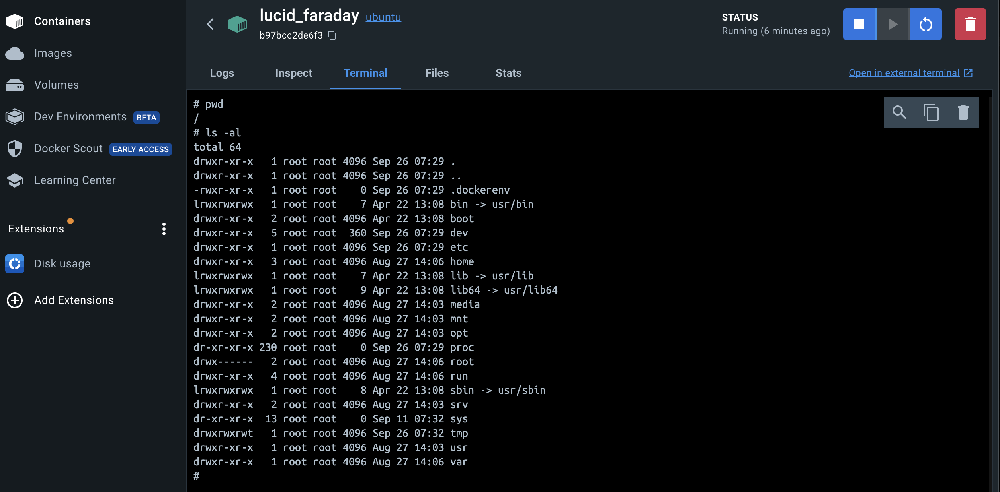

# Un peu de linux

Dans ce document

- lancer un container avec une distribution Ubuntu

## Ubuntu + Docker

Linux existe en beaucoup de versions. La plus commune est **[Ubuntu](https://ubuntu.com/)**.

Il y a plus de 600 distributions Linux active.

- Ubuntu est la plus répandu avec 34%
- suivi par Debian.

Dans un terminal, exécutez la commande `docker run` en spécifiant l'image, suivi d'une commande `/bin/bash` qui sera exécutée dans le container.

```bash
docker run -i -t ubuntu /bin/bash
```

Cette commande est composée de :

- `docker run` pour lancer un container
- `-it` des flags de configuration (pour pourvoir accéder au shell dans la même session du terminal)
- le nom de l'image `ubuntu`
- la commande à executer dans le container `/bin/bash` et qui ouvre une session dans un terminal

Docker:

- ne trouve pas l'image de Ubuntu localement, il va donc la récupérer sur Docker Hub
- Il crée et démarre un container
- il execute: /bin/bash dans le container

Si tout fonctionne bien, on voit alors le prompt par défaut sur une distribution Ubuntu:

```bash
root@45f1bbf4d38d:/#
```

Le prompt est de la forme `user@container_id:<current working directory>#`

- Notez que le user ici est **root**.
- le container_id est celui que l'on observe avec `docker ps`
- le repertoire actuel est la racine du container: `/`
- enfin le prompt ce fini par `#` indiquant qu'on est dans une session `root` et non pas utilisateur simple.

Vérifions la version de Ubuntu avec la commande `lsb_release` qui n'est pas installé par défaut dans Ubuntu. On doit donc d'abord l'installer avec `apt-get` le package manager de Ubuntu.

```bash
apt-get update && apt-get install -y lsb-release
```

On peut ensuite l'exécuter

```bash
lsb_release -a
```

Le résultat doit être similaire à :

```bash
No LSB modules are available.
Distributor ID: Ubuntu
Description: Ubuntu 24.04 LTS
Release: 24.04
Codename: noble
```

Ce qui confirme qu'on est bien sur la version 24.04 de Ubuntu.

Pour sortir du container et l'arrêter :

```bash
exit
```

Le container est stoppé mais il existe toujours. Il n'a pas été supprimé.

On peut le verifier avec ```docker ps -all```

```bash
CONTAINER ID   IMAGE              COMMAND                  CREATED
45f1bbf4d38d   ubuntu             "/bin/bash"              21 hours ago

STATUS                            PORTS     NAMES
Exited (0) 2 seconds ago                    awesome_hypatia
```

Le status est : **Exited (0) 2 seconds ago**

### Sortir du container sans le stopper

En enchaînant `CTRL+p` et `CTRL+q`, on sort du container sans l'arrêter. Le vérifier avec `docker ps`.

### Redémarrer le container

On peut redémarrer le container avec la commande

```bash
docker start 45f1bbf4d38d
```

le STATUS devient: **Up 2 seconds**.

Et pour retourner dans la  session ubuntu on utilise la commande `attach`:

```bash
docker attach 45f1bbf4d38d
```

On est à nouveau dans la session Ubuntu

### Docker Desktop

Vous pouvez accéder au container dans **Docker Desktop**

Cliquez sur le nom du container et le tab terminal



### Les flags -i et -t

On a utilisé 2 flags ```-i -t```

Le help donne les infos

```bash
docker run --help
```

- ```-t, --tty: Allocate a pseudo-TTY``` \
le flag `-t` ou `--tty` simule un **terminal interactif** (`tty`) dans le conteneur.
- `-i, --interactive: Keep STDIN open even if not attached` \
Le flag `-i` (ou `--interactive`) force Docker à garder le **STDIN** (Standard Input) ouvert
même quand le conteneur n'est pas attaché à un **terminal interactif**.

Les 2 flags sont souvent utilisés ensemble.

### Et maintenant ?

Une fois dans la session ubuntu:

- `pwd` donne le path du working directory. le directory courant
- `ls` liste les directory et fichiers.
- Essayez aussi `ls -al` et `ll`

### Différents modes d'execution des commandes dans un container

On peut executer une commande sur un container qui tourne sans rentrer dedans.

Par exemple la commande `pwd`

```bash
docker exec 45f1bbf4d38d pwd
```

Si le container est stoppé, il faut le démarrer, executer la commande puis le stopper à nouveau

```bash
docker start 45f1bbf4d38d
docker exec 45f1bbf4d38d pwd
docker stop 45f1bbf4d38d
```

Si le container tourne, on re-rentre dans le terminal avec

```bash
docker start -i 45f1bbf4d38d
```

le flag `-i` permet de rester dans la session dans le terminal du host.

### executer une commande sur une image

Le flag `-c` permet d'executer une commande dans ```bash``` de l'image Ubuntu sans le faire manuellement dans le terminal du container.

```bash
docker run ubuntu /bin/bash -c <commande>
```

par exemple

```bash
docker run ubuntu /bin/bash -c pwd
```

ou

```bash
docker run ubuntu /bin/bash -c ls
```

Mais cela crée à chaque fois un nouveau container.

Le flag `-rm` permet de supprimer le container dès que la commande est réalisée.

```bash
docker run --rm ubuntu /bin/bash -c pwd
```

Note: la différence entre les options courtes qui sont précédées d'un unique tiret `-` comme pour `-c`
et les options dites longues qui sont précédées de 2 tirets `-` comme pour `--rm`.

### En résumé

- Il est facile de lancer un container Ubuntu avec `docker run`
- et d'accéder au terminal interne du container avec les flags `-it`
- `docker <command> --help` permet d'avoir la liste des flags que l'on peut utiliser pour la commande
- les commandes suivantes seront utiles par la suite
  - docker run -it \<image name\>
  - docker start | stop \<container_id\>
  - docker attach -i \<container_id\>
  - docker ps | docker ps -a
  - docker images
  - docker exec \<container_id\> \<command\>
