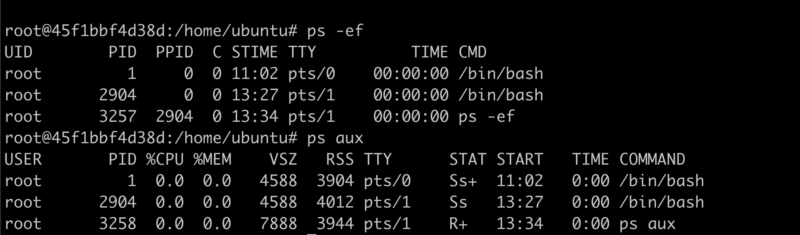

# Linux


## Linux rules the world

- Parce que Docker est construit sur linux
- Les 2 tiers ou plus des serveurs web sont du Linux
- La majorité des images docker sont construites sur une image de base linux

Il y a plus de 600 distro Linux active avec Ubuntu qui compte pour 34%, suivi par Debian

Linux c'est :

- Internet
- les mobiles (android est du linux)
- la science : NASA, ESA, CERN, Super computers etc
- [Tesla](https://rechargd.com/tesla-operating-system/) tourne sur une version propre de Linux

La liste est longue, très longue

### Distributions ou distro

Plus de 600 distributions!

- Ubuntu
- Debian
- Redhat
- Kali, Fedora, Suse, Alpine, Black Arch, ..., Mandrake

Une distribution linux est un OS (operating system) construit sur le noyau linux.

Une Linux distro contient générallement:

- Le noyau linux:

- **Linux Kernel** : Le cœur du système d'exploitation, qui gère les ressources du système et permet la communication entre le matériel et les logiciels.
- **GNU Tools** : Ce sont des outils et bibliothèques essentiels qui rendent le système utilisable (souvent appelé système GNU/Linux).
- **Package Manager** : Un système qui aide à installer, mettre à jour et gérer les paquets logiciels (par exemple, apt pour Debian/Ubuntu, dnf pour Fedora, pacman pour Arch).
- **Desktop Environment** (optionnel) : Une interface graphique comme GNOME, KDE ou Xfce, bien que certaines distributions soient minimales et n'offrent qu'une interface en ligne de commande.
- **Pre-installed Software** : Diverses applications, comme les navigateurs web, éditeurs de texte et outils multimédia, qui rendent le système prêt à l'emploi.

### Histoire


- 1991 [Linus Torvalds](https://fr.wikipedia.org/wiki/Linus_Torvalds), étudiant à l'université d'Helsinki, crée le Noyau Linux. (Il a aussi crée Git)


Lire :

- <https://fr.wikipedia.org/wiki/Linux>
- <https://en.wikipedia.org/wiki/History_of_Linux>

## Linux Basics Workshop for Docker Course

Nous avons donc accés a un container Linux :)

Que pouvons nous faire et comment ca marche ?

Dans la suite de ce document on va

- travailler sur les repertoires et fichiers
  - naviguer dans le systeme de fichier
  - Modifier, copier, creer, supprimer les fichier et repertoires
  - Voir et editer les fichiers textes
  - Modifier les permissions et accès d'un fichier
  - installer des programmes avec le package manager
  - observer les process
  - et configurer un server web nginx

Let's go!

## 1. Commandes de base Linux

Commencons par supprimer tous les containers que nous avons pu créer

Dans Docker Desktop > containers

- selectionnez tout
- cliquez sur le bouton stop
- et supprimez tous les containers

La commande `docker ps -all` ne doit retourner aucune ligne.

Dans un terminal powershell ou iTerm créez et lancez un container ubuntu avec

```bash
docker run -it ubuntu /bin/bash
```

### sortir et revenir dans le container

Si on sort du container avec `exit`, le container existe toujours mais ne tourne plus.

On peut le voir: `docker ps`  liste bien le container avec comme status **UP** .
Si le container etait stoppé, `docker ps -all` donnerait un status : "Exited"

La commande `docker run -it ubuntu /bin/bash` va creer un nouveau container. Ce n'est pas ce que l'on souhaite.
On souhaite se réattacher au container existant.

On trouve l'ID du container avec `docker ps`. ici ```45f1bbf4d38d```


On se _reconnecte_ au container avec :

```bash
docker exec -it <container ID> /bin/bash
```

Note: On peut aussi d'abord redémarrer le container puis s'y attacher

```bash
docker start <container ID>
docker attach <container ID>
```

Dans les 2 cas, on retrouve le prompt de la session Ubuntu.

```bash
root@45f1bbf4d38d:/#
```

l'architecture des répertoires d'une repo linux est stable pour toute les distro linux.

Je vous laisse lire la signification et le role de chaque repertoire.

<https://en.wikipedia.org/wiki/Unix_filesystem#Conventional_directory_layout>


or as webp


## 2. File System Navigation

### user et super user

Notez que vous etes loggué comme root

```bash
root@45f1bbf4d38d:/#
```

Root est le super user. Il peut tout faire.
Il peut même supprimer tout avec la fameuse commande

```bash
rm -rf /
```

**Attention a ne jamais executer cette commande!**

Normallement on ne travaille jamais sur le compte root. Jamais.

Mais comme notre container Ubuntu n'a pas pour vocation d'avoir des utilisateurs externes, nous allons exceptionnellement travailler en tant que root.

Un utilisateur ubuntu  a ete crée
on peut se connecter avec le user ubuntu avec

se connecter avec le user ubuntu

```bash
su - ubuntu
```

Le prompt change

```bash
ubuntu@45f1bbf4d38d:~$
```

Le user est ubuntu. Notez aussi que le `#` final est devenu `$`. Le signe `#` indfique que vous travaillez en tant que super user (zone de danger).

Enfin la commande `whoami` (lit. qui suis je?) retourne le nom de l'utilisateur qui est connecté


Pour revenir a root:

```bash
exit
```

### Se deplacer dans les repertoires

Pour se deplacer dans les repertoires on utilise les commandes

- `pwd`: Path to Working Directory: le repertoire courant
- `ls`: liste les fichiers. Utile avec les flags -al et -alh. un alias est souvent disponible : `ll`
- `cd`: change directory

Quelques commandes pour les fichers et repertoires:

- Creating directories (mkdir)
- Creating files (touch): crée un fichier vide
- Copying files and directories (cp)
- Moving/renaming files and directories (mv)
- Removing files and directories (rm, rmdir)

### noms de fichiers

 Il y a des regles à respecter dans le nomage des fichiers et repertoires

- Case sensitive: `Truc.txt` et `truc.txt` sont deux fichiers differents
- n'utiliser que: (a-z, A-Z), numbers (0-9), periods (.), underscores (_), and hyphens (-). le premier character ne doit pas etre un '-'
- PAS d'espace dans le noms de fichiers. Vraiment! C'est juste pas cool!
- Ne pas utiliser les caracteres speciaux comme: `*, &, %, $, #, @, !,`
- Les fichier cachés débutent par un '.'

Exemples a eviter:

```
My Project Report (Final Version).pdf  # espaces
2023_$ales_Data.csv  # caractere special
-start-with-hyphen.txt  # commence par un -
```

Allez dans le repertoire /home/, lieu des comptes utilisateurs et faites `ls -al` :

```bash
total 20
drwxr-xr-x 1 root   root   4096 Aug 27 16:06 .
drwxr-xr-x 1 root   root   4096 Sep 26 10:51 ..
drwxr-x--- 1 ubuntu ubuntu 4096 Sep 26 13:32 ubuntu
```

Le container ne contient qu'un utilisateur: ubuntu.

```bash
cd ubuntu
```

## 4. Voir le contenu des fichiers sans les ouvrir

Dans le reportoire /home/ubuntu on a les fichiers suivants ('ls -al'):


`.bash_logout  .bashrc  .profile`

avec `cat`, on peut afficher le contenue de ces fichiers directement dans le terminal.

executez l'un apres l'autre:

- cat .bashrc
- cat .bash_logout
- cat .profile

on a les premieres lignes

- # ~/.bashrc: executed by bash(1) for non-login shells. Every time you open a new terminal session (without logging in, such as launching a terminal from your desktop)

- # ~/.bash_logout: executed by bash(1) when login shell exits

- # ~/.profile: executed by the command interpreter for login shells

When you log in to the system (e.g., via SSH, console login, or switching to a virtual console), the shell reads .profile or .bash_profile (depending on the system setup).

Pour voir les N premieres ou N dernieres lignes d'un fichier on utilise

- `head -n N <nom du fchier>`
- `tail -n N <nom du fchier>`

on peut enchainer les commandes avec le symbole pipe '|'

```bash
head -n 200 fichier.txt | tail -n 10
```

Donne les 10 lignes 190 a 199 du fichier

Pour modifier, editer un fichier on utilise `vim` ou `nano`.

Mais vim n'est pas inclut par defaut dans ubuntu. On va l'installer plus tard.

#### question

dans le repertoire ubuntu on a la config du user ubuntu : .bashrc, .profile etc ...

mais on s'est connecté avec `root`.  ou se trouve donc le .bashrc de root ?

answer : dans le repertoire  `/root` pardi!

```bash
cd /root
ls -al
```

donne quelques fichiers

```bash
root@45f1bbf4d38d:~# ls -al
total 32
drwx------ 1 root root 4096 Sep 26 13:32 .
drwxr-xr-x 1 root root 4096 Sep 26 10:51 ..
-rw------- 1 root root 1010 Sep 26 14:06 .bash_history
-rw-r--r-- 1 root root 3106 Apr 22 15:04 .bashrc
drwx------ 3 root root 4096 Sep 26 13:32 .config
-rw-r--r-- 1 root root  161 Apr 22 15:04 .profile
```

dont .bash_history qui contient l'historique des commandes.

### Grep

Autre commande super puissante : `grep`

```bash
grep [OPTION]... PATTERNS [FILE]
```

par exemple trouver les alias (les racourcis commandes) dans le fichier .bashrc

```bash
grep alias .bashrc
```

retourne les ligne qui contiennent le mot **alias**

le format generale de grep est

```bash
Usage: grep [OPTION]... PATTERNS [FILE]...
Search for PATTERNS in each FILE.
Example: grep -i 'hello world' menu.h main.c
```

## 5. File Permissions and Ownership (30 minutes)

Quand on liste les fichiers on voit les permissions de fichier

-rw-r--r-- 1 ubuntu ubuntu  220 Mar 31 08:41 .bash_logout

le premier charactere represente le type de fichioer

- - fichier et d pour directory
ensuite on distingue 3 blocks (owner, group, other) de 3 caracteres

- r  : pour read
- w pour write
- x pour executer

si a la place du r, w ou x on a un -: le fichier n'est pas  lisible, ecrivable ou executable pour le o2ner, group ou les autres

Un fchier avec

-rwxrwxrwx est lisible modificable et surtout executable pa tous les utilisateurs. tres dangereux

on voir aussi
ubuntu ubuntu : le owner et le group auquel le fichier apaprtient

par xemple
touch fichier.txt
on aura
-rw-r--r-- 1 root   root      0 Sep 26 09:53 fichier.txt

par ce qu'on est loggué en tant que root

connectons nous maintenant en tant que user ubuntu

su - ubuntu

si on cree un autre fichier
touch fichier2.txt
on aura ubtuntu comme owner de fichier2.txt

pour revenir a root
> exit

On change les perissions dd'un fichier avec

- chmod <https://www.gnu.org/software/coreutils/chmod>
et l'onwer avec chown

c'est parfois demandé pour les cles SSH

### root ou user

sudo make me a sandwich

## 6. Package Management (30 minutes)

On va se logguer comme utilisateur et non comme root.
su - ubuntu

le prmpt doit inclure 'ubuntu'

Installer un package, un programme, utilise le package manager apt-get

et toujours en 2 temps
sudo apt-get update
sudo apt-get install

ici sudo  veut dire super user

task: on veut recuperer un ficheir online
l'utilitare le plus simple est wget. (curl est plus commpliqué, et plus complet)

mais

```bash
wget https://raw.githubusercontent.com/SkatAI/ynov-docker/refs/heads/master/data/WorldHits.csv
```

donne : wget unknown

Donc il faut installer wget

d'abord
sudo apt-get upadte

met a jour la list de package dispo pour que le system ait connaissance des dernieres versions et ed leur depenednces
n'installe rien (pour cela on fait ensuite sudo apt-get upgrade)
il faut toujours rrunner cette commaned avant d'installer quelque chose pour etre sure
que le systeme va prendre la version la plus recente du package lors de l'install

Donc pour installer wget
sudo apt-get wget

mais oh que se passe til ? sudo inconnu

En fait on est sur une version minimaliste de Ubuntu. Donc il n;'y a pas sudo.

Installons sudo
exit pour revenir a root
apt-get update
apt-get install sudo

puis retournons a ;user ubuntu
su - ubuntu

on voit
To run a command as administrator (user "root"), use "sudo <command>".

Ah!

Donc on peut maintenant installer wget

sudo apt-get install wget

et enfin downloader le fichier

### A vous

Voir le contenu d'un fichier de type texte:

Tout d'abord récupérer le fichier csv avec wget

```bash
wget https://raw.githubusercontent.com/SkatAI/ynov-docker/refs/heads/master/data/WorldHits.csv
```

C'est un fichier de quelques centaines de tracks de spotify

En utilisant cat, head et tail ainsi que |, affichez :

- la premiere ligne du fichier
- les 10 dernieres lignes du fichier
- lignes 180 a 199 du fichier

- Avec `grep` trouvez tous les tracks de :
  - Al Di Meola
  - Youssou N'Dour

- Changez le owner de WorldHits.csv pour ubuntu avec chmod
- changez les permissions de WorldHits.csv pour que le fichier soit writable par tous le monde: `-rw-rw-rw-`

#### Recap

pour installer quelque chose
sudo apt-get update
sudo apt-get install <program / package>

quand on est root, ne pas mettre sudo
ne pas travailler en tant que root

On veut maintenant installer vim , l'efiteur de texte

on peut chercher les pakacge s dispo pour vim

apt-cache search vim

et pour installer

apt-get install vim

on peut alors modifier le .bashrc

cd /home/ubuntu/
vim .bashrc

feel free to do a tutorial on vim
to exit
:wq

## 7. Process Management (20 minutes)

derniere chose

voir ce qui tourne sur une VM linux avec top et ps

top: donne la liste des process qui tourne les plus intensif
et le load average


à surveiller pour voir si la VM est bien dimensionnée

et ps donne la list des process qui tourne

ps -ef et ps aux sont les dux config les plus utilisées.



pas grand chose tourne sur cette instance.

On peut combiner avec grep pour filtrer les process

Par exemple pour trouver les process liés a postgresql, a nginx:

ps aux | grep postgres
ps aux | grep nginx

la sortie de ps aux est envoyée directement a grep keyword

## 9. Environment Variables (15 minutes)

- Understanding PATH

# next workshop

container on Alpine

install nginx
get webpage
serve webpage
