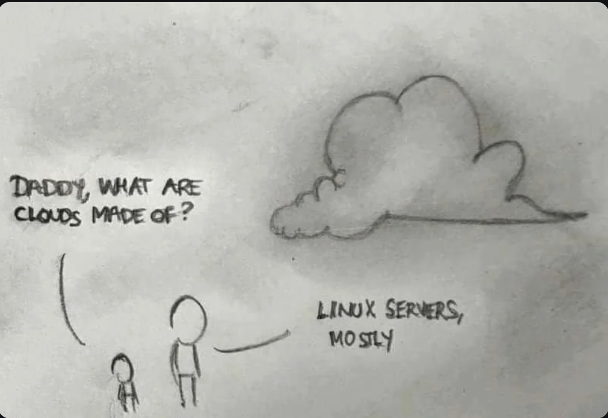

## Linux

Linux - crash course

### why linux rules the world ?

so is docker always running linux OS ?
No you can also run other OSs :

### distros

plus de 600 distributions!

* Ubuntu
* Debian
* Redhat

A linux distro 
is an operating system based on the Linux kernel. It includes the Linux kernel, system libraries, utilities, and software packages bundled together to create a fully functional operating system. A Linux distro typically combines:

- Linux Kernel: The core of the operating system, which manages system resources and allows communication between hardware and software.
- GNU Tools: These are essential tools and libraries that make the system usable (often referred to as the GNU/Linux system).
- Package Manager: A system that helps install, update, and manage software packages (e.g., apt for Debian/Ubuntu, dnf for Fedora, pacman for Arch).
- Desktop Environment (optional): A graphical user interface like GNOME, KDE, or Xfce, though some distros are minimal and offer only a command-line interface.
- Pre-installed Software: Various applications, like web browsers, text editors, and multimedia tools, that make the system ready for use.

### Histoire



<https://fr.wikipedia.org/wiki/Linux>


## Linux Basics Workshop for Docker Course

Nous avons donc accés a un container Linux :) 
que pouvons nous faire et comment ca marche.

Dans la suite de ce document on va 

- travailler sur les repertoires et fichiers
    - naviguer dans le systeme de fichier
    - Modifier, copier, creer, supprimer les fichier et repertoires
    - Voir et editer les fichiers textes
    - Modifier les permissions et accès d'un fichier
    - installer des programmes avec le package manager
    - observer et manager les process
    - travailler sur les variables d'environnement
    - aborder les aspect réseaux
    - configurer un server web nginx
    

## 1. Introduction to the Linux Terminal (15 minutes)

Commencons par supprimer tous les containers que nous avons pu creer

Dans Docker Desktop > containers 
- selectionnez tout
- cliquez sur le bouton stop 
- et supprimez tous les containers

La commande `docker ps -all` ne doit retourner aucune ligne

Dans un terminal powershell ou iTerm lancez le container ubuntu avec 

```bash
docker run -it ubuntu /bin/bash
```

### sortir et revenir dans le container

Si on sort u container `exit`, le container existe toujours et continue a tourner. 

On peut le voir: `docker ps`  liste bien le container avec comme status **UP** .
Si le container etait stoppé, `docker ps -all` donnerait un status : "Exited"


La commande `docker run -it ubuntu /bin/bash` va creer un nouveau container. Ce n'est pas ce que l'on souhaite. 
On souhaite se réattacher au container existant.

On trouve l'ID du container avec `docker ps`. ici 45f1bbf4d38d


on se ré-attache au container avec 


```
docker exec -it <container ID> /bin/bash
```
et on retrouve le prompt de la session Ubuntu.

```bash
root@45f1bbf4d38d:/#
```

Les repertoires d'une repo linux 
https://linux101.hashnode.dev/linux-directory-structure

## 2. File System Navigation (20 minutes)

Notez qu'on est loggué comme root 
Un utilisateur ubuntu par defaut a ete crree
on peut asse de root a ubuntu avec 

su - ubuntu

il ne faut jamais travailler en tant que root

on aurait pu edmarrer le contaner en specifiant l'utilisateur
docker run -it --user ubuntu ubuntu /bin/bash

Pour se depalcer dans les repertoires on utilise les commandes 

- pwd: path to working directory: le repertoire courant 
- ls: list les fichiers. Utile avec les flags -al et -alh
- cd: change directory  

Contrairement a windows et mac ou on peut tout faire il y a ddes regles a respecter dans le nomage des fochoers et repertoire

- Case sensitive: Truc.txt et truc.txt sont deux fichiers differents
- n;'utiliser que: (a-z, A-Z), numbers (0-9), periods (.), underscores (_), and hyphens (-). le premier character ne doit pas etre un '-'
- PAS d'espace dans le noms de fichiers. C'est EVIL!
- ne pas utiliser les caracteres speciaux comme: `*, &, %, $, #, @, !,`
- les fichier cachés debutent par un '.'

Examples to avoid:
```
My Project Report (Final Version).pdf  # Contains spaces
2023_$ales_Data.csv  # Contains a special character
-start-with-hyphen.txt  # Starts with a hyphen
```

allez dans le repertoire /home/ubuntu 

C'est le repoertoire par defaut de l'utilisater ubuntu 

Notre container ne contient qu'un utilisteur. C;est aussi l'utilisateur root. 

c'est dasn le epertoire /home/ubuntu  que l'on va travailler.

## 3. File and Directory Operations
Quelques commandes pour les fichers et repertoires:

- Creating directories (mkdir)
- Creating files (touch): crée un fichier vide
- Copying files and directories (cp)
- Moving/renaming files and directories (mv)
- Removing files and directories (rm, rmdir)


## 4. Viewing and Editing Files

Dans le reportoire /home/ubuntu on a les fichiers suivants ('ls -al'):


` .bash_logout  .bashrc  .profile`

avec cat, affichez dans le terminal ce que ces fichiers contiennent 

on a 
- # ~/.bash_logout: executed by bash(1) when login shell exits.
- # ~/.bashrc: executed by bash(1) for non-login shells. Every time you open a new terminal session (without logging in, such as launching a terminal from your desktop)
- # ~/.profile: executed by the command interpreter for login shells.

When you log in to the system (e.g., via SSH, console login, or switching to a virtual console), the shell reads .profile or .bash_profile (depending on the system setup). 

Pour voir les N premieres ou dernieres lignes d'un fichier on utilise  
- `head -n N <nom du fchier>`
- `tail -n N <nom du fchier>`

on peut enchainer les comandes avec le symbole pipe '|'

head -n 200 fichier.txt | tail -n 10

Donne les 10 lignes 190 a 199 du fichier 

Pour modifier, editer un fichier on utilise vim.

Mais vim n'est pas inclut par defaut dans ubuntu. On va l'installer plus tard.

#### question 
mais dans le rep ubuntu on a la config du user ubuntu 
mais on s'est connecté avec root 
ou se trouve le .bashrc etc de root ?

answer : dans /root

cd /root
ls -al 

donne quelques fichiers
dont .bash_history qui contient l'historique des commandes. 


#### A vous

Voir le contenu d'un fichier de type texte:

Tout d'abord recuperer le fichier csv avec
```bash
wget https://raw.githubusercontent.com/SkatAI/ynov-docker/refs/heads/master/data/WorldHits.csv 
```
C'est un fichier de quelques centaines de tracks de spotify

affichez les 
- la premiere ligne du fichier 
- les 10 dernieres lignes du fichier
- lignes 180 a 199 du fichier

### Grep
Autre commande super puissante : grep

grep [OPTION]... PATTERNS [FILE]

par exemple trouver les alias (les racourcis commandes) dans le fichier .bashrc

grep alias .bashrc

donne la liste des alias


## 5. File Permissions and Ownership (30 minutes)

Quand on liste les fichiers on voit ;es permissions fichier

-rw-r--r-- 1 ubuntu ubuntu  220 Mar 31 08:41 .bash_logout

le premier charactere represente le type de fichioer
- - fichier et d pour directory
ensuite on distingue 3 blocks (owner, group, other) de 3 caracteres 


- r  : pour read
- w pour write
- x pour executer

si a la place du r, w ou x on a un -: le fichier n'est pas  lisible, ecrivable ou executable pour le o2ner, group ou les autres

Un fchier avec 

-rwxrwxrwx est lisible modificable et surtout executable pa tous les utilisateurs. tres dangereux

on voir aussi 
ubuntu ubuntu : le owner et le group auquel le fichier apaprtient

par xemple 
touch fichier.txt
on aura
-rw-r--r-- 1 root   root      0 Sep 26 09:53 fichier.txt

par ce qu'on est loggué en tant que root 

connectons nous maintenant en tant que user ubuntu 

su - ubuntu

si on cree un autre fichier 
touch fichier2.txt
on aura ubtuntu comme owner de fichier2.txt

pour revenir a root 
> exit

On change les perissions dd'un fichier avec 
- chmod https://www.gnu.org/software/coreutils/chmod
et l'onwer avec chown

c'est parfois demandé pour les cles SSH


### root ou user 

sudo make me a sandwich

## 6. Package Management (30 minutes)

On va se logguer comme utilisateur et non comme root.
su - ubuntu

le prmpt doit inclure 'ubuntu'

Installer un package, un programme, utilise le package manager apt-get

et toujours en 2 temps
sudo apt-get update 
sudo apt-get install


ici sudo  veut dire super user


task: on veut recuperer un ficheir online 
l'utilitare le plus simple est wget. (curl est plus commpliqué, okus complet)
mais 
```bash
wget https://raw.githubusercontent.com/SkatAI/ynov-docker/refs/heads/master/data/WorldHits.csv 
```
donne : wget unknown

Donc il faut installer wget 

d'abord 
sudo apt-get upadte 

met a jour la list de package dispo pour que le system ait connaissance des dernieres versions et ed leur depenednces
n'installe rien (pour cela on fait ensuite sudo apt-get upgrade)
il faut toujours rrunner cette commaned avant d'installer quelque chose pour etre sure 
que le systeme va prendre la version la plus recente du package lors de l'install

Donc pour installer wget
sudo apt-get wget 

mais oh que se passe til ? sudo inconnu

En fait on est sur une version minimaliste de Ubuntu. Donc il n;'y a pas sudo.

Installons sudo 
exit pour revenir a root
apt-get update
apt-get install sudo

puis retournons a ;user ubuntu 
su - ubuntu 

on voit 
To run a command as administrator (user "root"), use "sudo <command>".

Ah!

Donc on peut maintenant installer wget

sudo apt-get install wget

et enfin downloader le fichier 

#### Recap

pour installer quelque chose 
sudo apt-get update
sudo apt-get install <program / package>

quand on est root, ne pas mettre sudo
ne pas travailler en tant que root

On veut maintenant installer vim , l'efiteur de texte 

on peut chercher les pakacge s dispo pour vim 

apt-cache search vim

et pour installer 

apt-get install vim

on peut alors modifier le .bashrc

cd /home/ubuntu/
vim .bashrc

feel free to do a tutorial on vim 
to exit 
:wq


## 7. Process Management (20 minutes)
derniere chose 

voir ce qui tourne sur une VM linux avec top et ps

top: donne la liste eds prrocess qui tourne les plus intensif
et le load average 


à surveiller pour voir si la VM est bien dimensionnée

et ps donne la list des process qui tourne 

ps -ef et ps aux sont les dux config les plus utilisées. 


pas grand chose tourne sur cette instance. 


## 9. Environment Variables (15 minutes)
- Viewing environment variables (env, echo $VAR)
- Setting environment variables
- Understanding PATH

## 10. Basic Shell Scripting (30 minutes)
- Creating a simple shell script
- Making scripts executable
- Running scripts

## 11. Practical Exercise: Setting Up a Web Server (30 minutes)
- Installing Nginx
- Configuring a basic website
- Starting and stopping services

## 12. Conclusion and Q&A (10 minutes)
- Recap of key concepts
- Additional resources for further learning
- Questions and answers

Total time: Approximately 4.5 hours (can be adjusted as needed)


# next workshop


container on Alpine 

install nginx
get webpage
serve webpage 

