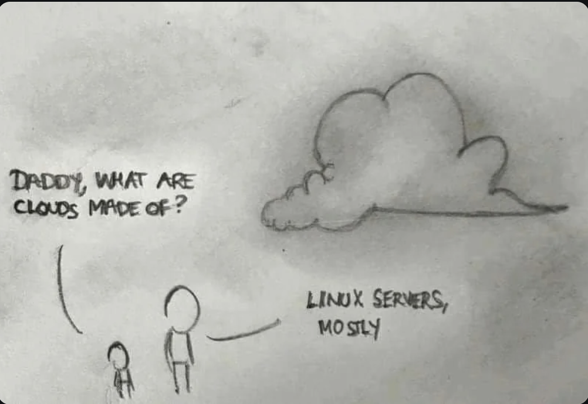
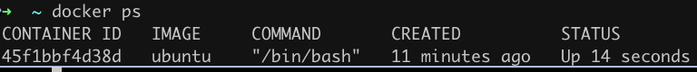
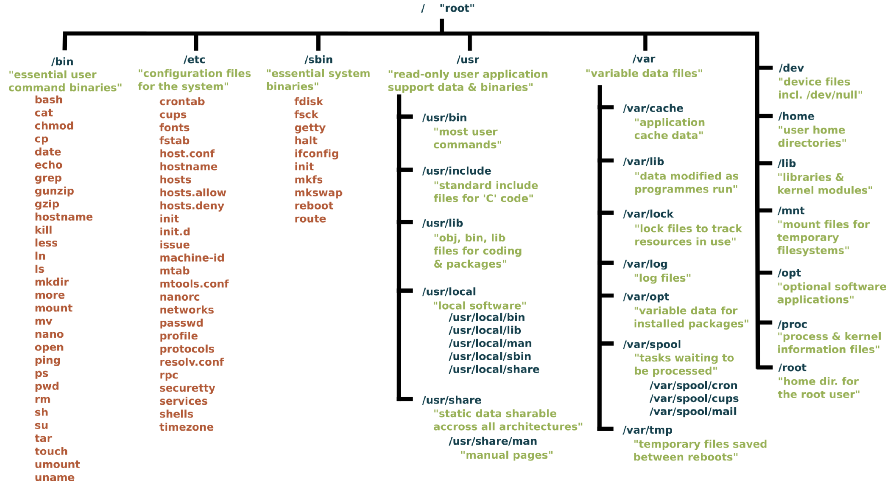
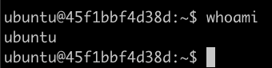
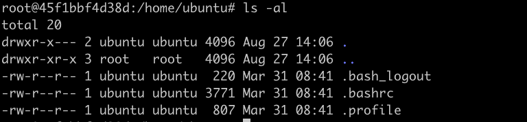
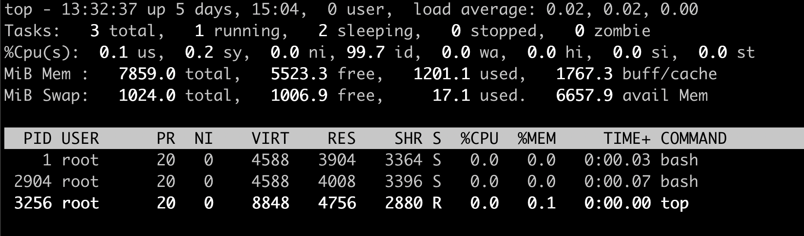
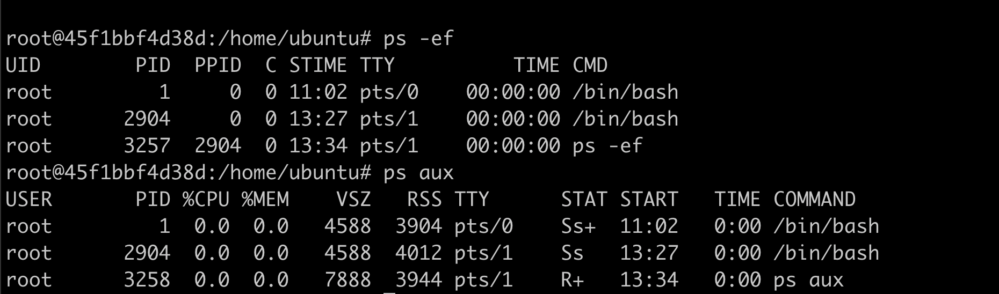
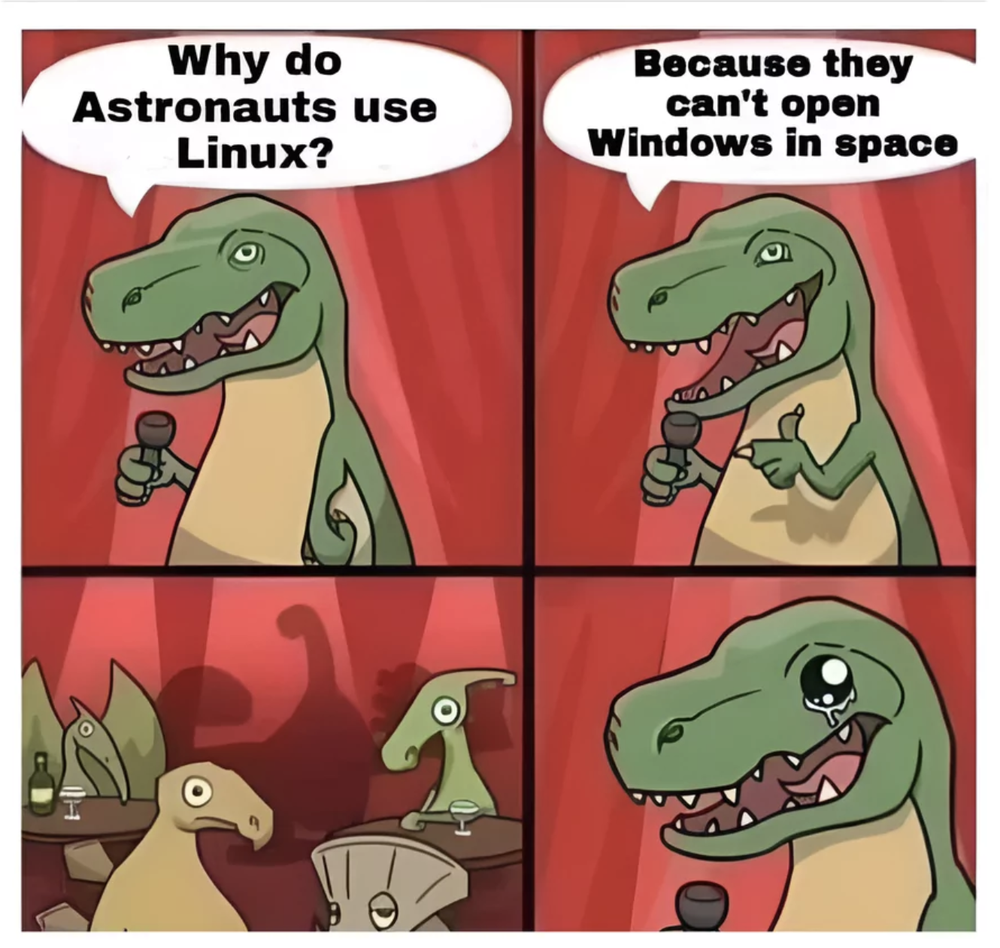

# Linux


## Linux rules the world

- Parce que Docker est construit sur linux
- Les 2 tiers ou plus des serveurs web sont du Linux
- La majorité des images docker sont construites sur une image de base linux

Donc Linux c'est

- internet
- les serveurs d'entreprise
- chatGPT et toute l'IA et le machine learning et la science et Tesla, et le spatial et ...
- les mobiles (android est du linux)
- la science : NASA, CERN, ESA,
- même [Tesla](https://rechargd.com/tesla-operating-system/) tourne sur une version propre de Linux

La liste est longue, très longue, ...

[When linux takes over the world](https://www.memedroid.com/memes/detail/4214365)

### Distributions Linux

Il y a plus de 600 distributions Linux actives avec Ubuntu qui compte pour 34%, suivi par Debian

- Ubuntu
- Debian
- Redhat
- Kali, Fedora, Suse, Alpine, Black Arch, ..., Mandrake

Une distribution linux est un OS (operating system) construit sur le noyau linux.

Une distribution Linux contient généralement :

- Le **Noyau linux** : Le cœur du système d'exploitation, qui gère les ressources du système et permet la communication entre le matériel et les logiciels.
- **GNU Tools** : outils et bibliothèques essentiels qui rendent le système utilisable.
- **Package Manager** : Un système qui aide à installer, mettre à jour et gérer les programmes (par exemple, `apt` ou `apt-get` pour Debian/Ubuntu, `dnf` pour Fedora, `pacman` pour Arch, `apk` pour Alpine).
- **Desktop Environment** (optionnel) : Une interface graphique comme GNOME, KDE ou Xfce. Certaines distributions n'offrent qu'une interface en ligne de commande.
- **Pre-installed Software** : Diverses applications, comme un éditeur de texte (`vim`).

### Histoire



1991 [Linus Torvalds](https://fr.wikipedia.org/wiki/Linus_Torvalds), étudiant à l'université d'Helsinki, crée le Noyau Linux. (Il a aussi crée Git ensuite)


Lire :

- Wikipedia Linux <https://fr.wikipedia.org/wiki/Linux>
- History of Linux <https://en.wikipedia.org/wiki/History_of_Linux> (pas de page en français :( )
- Unix vs Linux quels sont les différences
<https://www.ionos.fr/digitalguide/serveur/know-how/unix-vs-linux/>

## Linux Basics

Nous avons donc accès a un container Linux :)

Que pouvons nous faire et comment ca marche ?

Dans la suite de ce document on va :

- travailler sur les repertoires et fichier,
- naviguer dans le système de fichier,
- modifier, copier, créer, supprimer les fichier et repertoires
- voir et éditer les fichiers textes,
- modifier les permissions et accès d'un fichier,
- installer des programmes avec le package manager,
- observer les process,

Let's go!

## 1. Commandes de base Linux

Commençons par supprimer tous les containers que nous avons pu créer jusqu'ici pour démarrer from scratch (de zéro).

Dans Docker Desktop > containers

- sélectionnez tout
- cliquez sur le bouton stop
- et supprimez tous les containers

La commande `docker ps -all` ne doit retourner aucune ligne.

Maintenant, rangez Docker Desktop dans un coin, sur un étagère, ....

Dans un terminal, créez et lancez un container ubuntu avec

```bash
docker run -it ubuntu /bin/bash
```

### Rappel: sortir et revenir dans le container

Si on sort du container avec `exit`, le container existe toujours mais ne tourne plus.

On peut le voir: `docker ps`  liste bien le container avec comme status **UP** .
Si le container était stoppé, `docker ps -all` donnerait un status : "Exited"

La commande `docker run -it ubuntu /bin/bash` va créer un nouveau container. Ce n'est pas ce que l'on souhaite.
On souhaite se re-attacher au container existant.

On trouve l'ID du container avec `docker ps`. ici ```45f1bbf4d38d```



On se _reconnecte_ au container avec :

```bash
docker exec -it <container ID> /bin/bash
```

Note: On peut aussi d'abord redémarrer le container puis s'y attacher

```bash
docker start <container ID>
docker attach <container ID>
```

Dans les 2 cas, on retrouve le prompt de la session Ubuntu.

```bash
root@45f1bbf4d38d:/#
```

### Hiérarchie du système de fichier Linux

la commande `ls -al` liste les fichiers et repertoires. Comme on est à la racine du server, (`pwd` retourne `\`) `ls -al` affiche tous les répertoires de base du système Linux.

L'architecture des répertoires d'une repo linux est stable pour toute les distributions linux.

Je vous laisse lire la signification et le rôle de chaque répertoire.

<https://en.wikipedia.org/wiki/Unix_filesystem#Conventional_directory_layout>



## 2. File System Navigation

### user et super user

Notez que vous êtes loggué comme `root`

```bash
root@45f1bbf4d38d:/#
```

Root est le super user. Il peut tout faire.


<https://xkcd.com/149/>

Il peut même supprimer tout avec la fameuse commande

```bash
rm -rf /
```

**Attention à ne jamais executer cette commande!**

Normalement, on ne travaille jamais sur le compte `root`. Jamais.

Mais comme notre container Ubuntu n'a pas pour vocation d'avoir des utilisateurs externes, nous allons exceptionnellement travailler en tant que root.

Un utilisateur `ubuntu` a quand même été créée.

On peut se connecter avec le user ubuntu avec

```bash
su - ubuntu
```

Le prompt change

```bash
ubuntu@45f1bbf4d38d:~$
```

Le user est `ubuntu`. Notez aussi que le `#` final est devenu `$`. Le signe `#` indique que vous travaillez en tant que super user (zone de danger).

Enfin la commande `whoami` (lit. qui suis je?) retourne le nom de l'utilisateur qui est connecté



Pour revenir à `root`:

```bash
exit
```

### Se déplacer dans les repertoires

Pour se déplacer dans les repertoires on utilise les commandes

- `pwd`: Path to Working Directory: le repertoire courant
- `ls`: liste les fichiers. Utile avec les flags -al et -alh. un alias est souvent disponible : `ll`
- `cd`: change directory

Notes: ces commandes ont été importé dans powershell.

Quelques commandes pour les fichiers et répertoires:

- `mkdir <directory>` : créer un répertoire
- `touch <file>`:  crée un fichier vide
- `cp (-r -f) <file> <directory>`: Pour copier fichiers et répertoires
- `mv <file> <directory>`: déplacer et **renommer** fichiers et répertoires
- `rm, rmdir`: supprimer fichiers et répertoires

### noms de fichiers

 Il y a des règles à respecter dans le nomage des fichiers et répertoires

- Case sensitive: `Truc.txt` et `truc.txt` sont deux fichiers différents
- n'utiliser que: (a-z, A-Z), numbers (0-9), periods (.), underscores (_), and hyphens (-). le premier character ne doit pas être un '-'
- PAS d'espace dans le noms de fichiers. Vraiment! C'est juste pas cool!
- Ne pas utiliser les caractères spéciaux comme: `*, &, %, $, #, @, !,`
- Les fichier cachés débutent par un '.'

Exemples à éviter:

```bash
My Project Report (Final Version).pdf  # espaces
2023_$ales_Data.csv  # caractere special
-start-with-hyphen.txt  # commence par un -
```

Allez dans le répertoire `/home/`, répertoire des comptes utilisateurs et faites `ls -al` :

```bash
total 20
drwxr-xr-x 1 root   root   4096 Aug 27 16:06 .
drwxr-xr-x 1 root   root   4096 Sep 26 10:51 ..
drwxr-x--- 1 ubuntu ubuntu 4096 Sep 26 13:32 ubuntu
```

Le container ne contient qu'un utilisateur: `ubuntu`.

```bash
cd ubuntu
```

## 4. Fichiers d'initialization de la session

Dans le répertoire `/home/ubuntu` on a les fichiers suivants (`ls -al`) :`.bash_logout  .bashrc  .profile`



avec `cat`, on peut afficher le contenu de ces fichiers directement dans le terminal.

exécutez l'un après l'autre:

- `cat .bashrc`
- `cat .bash_logout`
- `cat .profile`

Voici les premières lignes de chaque fichier

- `# ~/.bashrc: executed by bash(1) for non-login shells. Every time you open a new terminal session (without logging in, such as launching a terminal from your desktop)`

- `# ~/.bash_logout: executed by bash(1) when login shell exits`

- `# ~/.profile: executed by the command interpreter for login shells`

Quand on accède à une nouvelle session dans le terminal, avec ou sans login (SSH. console login, virtual console), le shell / bash lit le fichier `.profile` ou `.bashrc`.

> c'est la même chose sur le mac. il y a un fichier .zshrc qui est lu a chaque nouvelle session dans le terminal. Sur Windows, il y a un équivalent situé: `~\Documents\PowerShell\Microsoft.PowerShell_profile.ps1`.

### Afficher le contenu d'un fichier dans le terminal

Pour voir les N premieres ou N dernieres lignes d'un fichier on utilise

- `head -n N <nom du fchier>`
- `tail -n N <nom du fchier>`

on peut enchainer les commandes avec le symbole pipe '|'

```bash
head -n 200 fichier.txt | tail -n 10
```

Donne les 10 lignes 190 a 199 du fichier

C'est très utile pour afficher en continu un fichier de log au fur et a mesure des opérations:

```bash
tail -f  -n 100 <log file>
```

Cela affiche les 100 dernières lignes du fichier log en streaming / continu.

### Éditer un fichier avec vim

Pour modifier, éditer un fichier on utilise `vim` ou `nano`.

`vim` n'est pas inclut par défaut dans ubuntu. On l'installe avec `apt-get`

```bash
apt-get install vim
```

Note pour trouver le nom d'un package on utilise `apt-cache search <nom du package>`

On édite un fichier avec

```bash
vim <nom du fichier>
```

Il y a 2 modes, le mode edition et le mode navigation.

- pour passer en mode edition: `i`
- pour passer en mode navigation: `esc`

pour sortir de vim

```bash
:wq
```


Vim prend un peu de temps à maîtriser mais ça vaut le coup.

Je conseille les tutos suivants pour démarrer:

- freecodecamp: <https://www.freecodecamp.org/news/vim-beginners-guide/>
- en français: <https://fr.linux-console.net/?p=9940>
- et interactif: <https://openvim.com/sandbox.html>

### Question

Dans le répertoire ubuntu, on a la config du user `ubuntu` : `.bashrc`, `.profile` etc ...

Mais on s'est connecté avec `root`.  Où se trouve donc le fichier `.bashrc` de root ?

Bah! Dans le répertoire  `/root` pardi!

```bash
cd /root
```

`ls -al` affiche les fichiers

```bash
root@45f1bbf4d38d:~# ls -al
total 32
drwx------ 1 root root 4096 Sep 26 13:32 .
drwxr-xr-x 1 root root 4096 Sep 26 10:51 ..
-rw------- 1 root root 1010 Sep 26 14:06 .bash_history
-rw-r--r-- 1 root root 3106 Apr 22 15:04 .bashrc
drwx------ 3 root root 4096 Sep 26 13:32 .config
-rw-r--r-- 1 root root  161 Apr 22 15:04 .profile
```

dont `.bash_history` qui contient l'historique des commandes.

### Grep

Autre commande super puissante : `grep`

```bash
grep [OPTION]... PATTERNS [FILE]
```

Par exemple trouver les alias (les raccourcis commandes) dans le fichier .bashrc

```bash
grep alias .bashrc
```

retourne les ligne qui contiennent le mot **alias**

Le format générale de `grep` est :

```bash
Usage: grep [OPTION]... PATTERNS [FILE]...
Search for PATTERNS in each FILE.
Example: grep -i 'hello world' menu.h main.c
```

Exercice:

- utilisez `cat` et `grep` pour retrouver une commande particulière dans .bash_history.
- CTRL+R marche aussi

## 5. File Permissions and Ownership

Quand on liste les fichiers avec `ls -al`, on voit les permissions de fichier

```bash
-rw-r--r-- 1 ubuntu ubuntu  220 Mar 31 08:41 .bash_logout
```

Le premier caractère représente le type de fichier:

- `d` pour directory et `-` pour fichier

ensuite on distingue 3 blocks (owner, group, other) de 3 caractères

- `r` : pour read
- `w` : pour write
- `x` : pour executer

Si a la place du `r`, `w` ou `x`, on a un `-`: le fichier n'est ni lisible, ni modifiable, ni exécutable pour le owner, le groupe ou tout le monde

 ⛔️⛔️⛔️ Un fichier avec `-rwxrwxrwx` est lisible, modifiable et surtout executable par tous les utilisateurs. très dangereux. 🧨🧨🧨

On voit aussi:

- `ubuntu ubuntu` : le owner et le group auquel le fichier appartient

### Exemple

par exemple, si on crée un nouveau fichier avec  `touch fichier.txt`, ce fichier aura un niveau de permissions assez restrictif:

```bash
-rw-r--r-- 1 root   root      0 Sep 26 09:53 fichier.txt
```

Nous sommes loggué en tant que `root`, donc le owner et le group sont aussi `root root`

Connectons nous maintenant en tant que user `ubuntu` avec `su - ubuntu`.

Si on crée un autre fichier `touch fichier2.txt`, on aura `ubuntu` comme owner de `fichier2.txt`

```bash
-rw-rw-r-- 1 ubuntu ubuntu     0 Sep 26 11:55 fichier2.txt
```

et les permissions sont moins restrictives.

Pour revenir à la session root : `exit`

### chmod et chown

On change

- les permissions d'un fichier avec `chmod`. Voir <https://www.gnu.org/software/coreutils/chmod>
- le owner avec `chown`. Voir <https://www.gnu.org/software/coreutils/chown>

Restreindre le niveau de permissions au owner est souvent demandé pour les clefs SSH ou les fichiers de mot de passe.

## 6. Package Management

Sur Debian et Ubuntu, installer un package, (programme, executable, ...) utilise le package manager `apt-get`.
Sur d'autres distributions linux, le nom du package manager peut être différent.

L'installation d'une programme est toujours en 2 temps:

1. mettre a jour l'index du package manager pour qu'il ait connaissance de l'existence de la version la plus récente du programme.

```bash
sudo apt-get update
```

2. puis installer le programme

```bash
sudo apt-get install  <nom du programme>
```

### Sudo or not Sudo

> `sudo` veut dire `super user do`.

`sudo` permet à un utilisateur non root de devenir `root` le temps d'une ou plusieurs commandes dans une session.

Comme nous sommes `root`, nous n'avons pas besoin de `sudo`.
Donc en tant que root nous installons un programme avec:

```bash
apt-get update
apt-get install <nom du programme>
```

sans faire précéder `apt-get` de `sudo`

### Installer `wget`

task: on veut récupérer un fichier online.  Le programme le plus simple est `wget`.
On peut aussi utiliser `curl` qui est plus complet et complexe.

```bash
wget <url>
```

Un exemple, essayons de récupérer un fichier csv sur le github

```bash
wget https://raw.githubusercontent.com/SkatAI/ynov-docker/refs/heads/master/data/WorldHits.csv
```

La commande ci-dessus donne : `wget unknown`

Il faut donc installer `wget`

d'abord toujours par mettre à jour la liste des packages avec:

```bash
apt-get update
```

> Note:
`apt-get upate` n'installe rien. Pour mettre à jour tous les programmes déjà installé, on fait ensuite  `apt-get upgrade`.

Ensuite on installe `wget` avec: `apt-get wget` et enfin on peut downloader le fichier

### A vous: afficher le contenu d'un fichier de type texte

Tout d'abord récupérer le fichier csv avec wget

```bash
wget https://raw.githubusercontent.com/SkatAI/ynov-docker/refs/heads/master/data/WorldHits.csv
```

C'est un fichier de quelques centaines de tracks de Spotify.

En utilisant `cat`, `head` et `tail` ainsi que le pipe `|`, affichez :

- la première ligne du fichier
- les 10 dernières lignes du fichier
- lignes 180 à 199 du fichier

- Avec `grep` trouvez tous les tracks de :
  - "Al Di Meola"
  - "Youssou N'Dour"

- Changez le `owner` de WorldHits.csv pour `ubuntu` avec `chown`
- changez les permissions de WorldHits.csv pour que le fichier soit writable par tous le monde: `-rw-rw-rw-`

Hint: regardez dans le manuel avec `man chown` et `man chown`

### Recap

Pour installer un executable (utilisateur non root)

```bash
sudo apt-get update
sudo apt-get install <program / package>
```

quand on est `root`, ne pas mettre `sudo`

Il ne faut 🧨🧨🧨 **JAMAIS TRAVAILLER EN TANT QUE ROOT** 🧨🧨🧨

## 7. Process Management avec `top` et `ps`

Dernière chose

On souhaite voir les programmes qui tournent dans le container avec `top` et `ps`. Ces commandes permettent de troubleshooter les programmes qui ont crashé ou qui sont trop consommateurs de resources.

- `top:` donne la liste des process en cours d'exécution qui sont les plus intensifs ainsi que le **load average**



Le **load average** est à surveiller pour voir si la VM est bien dimensionnée

- `ps` donne la liste des process en cours d'execution
- `ps -ef` et `ps aux` sont les deux commandes les plus utilisées.



Pas grand chose ne tourne sur cette instance.

On peut combiner avec `grep` pour filtrer les process

Par exemple pour trouver les process liés a PostgreSQL, à Nginx, ...:

- `ps aux | grep postgres`
- `ps aux | grep nginx`

La sortie de `ps` aux est envoyée directement à `grep`

## prochain exercice

Vous allez installer un programme : `cowsay` et le faire fonctionner sur un container Ubuntu

## Pour finir


