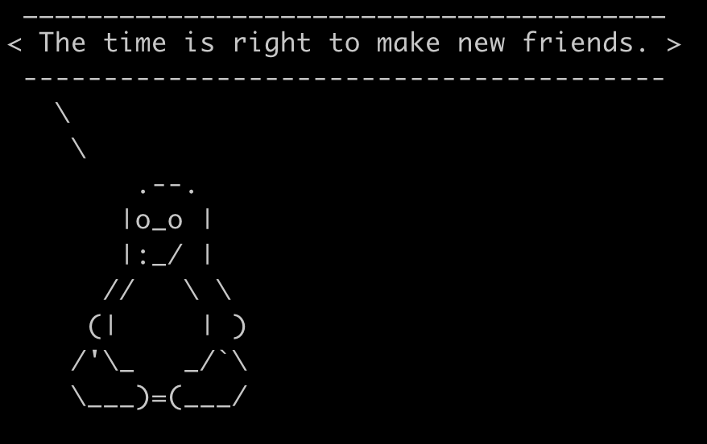

# Cowsay

Dans cet exercice on va installer un program dans un container linux

<https://en.wikipedia.org/wiki/Cowsay>

On va aborder le package manager, le PATH, et le pipe

1. lancez un container Ubuntu et allez dans le bash
2. installez le programme `cowsay`
3. exécutez `cowsay "hello world"`

Ça ne marche pas!

Le shell ne trouve pas le programme pourtant vous l'avez bien installé.

Mais où est le programme ?

## Le PATH

> PATH est une variable d'environnement dans les systèmes Linux qui indique au shell où chercher les fichiers exécutables. Elle contient une liste de répertoires, et lorsque vous exécutez une commande, le système recherche dans ces répertoires pour trouver l'exécutable correspondant.

```bash
echo $PATH
```

retourne

```bash
/usr/local/sbin:/usr/local/bin:/usr/sbin:/usr/bin:/sbin:/bin
```

Maintenant, exécutez:

```bash
which cowsay
```

et

```bash
whereis cowsay
```

> `which cowsay` This command searches for the cowsay executable in the directories listed in your $PATH environment variable. It only returns the path to the executable if it's found in one of those directories.
> `whereis cowsay`: This command searches for the cowsay executable, along with its source code and man pages, in standard locations (not just $PATH). It returns the path to the binary, source, and man page if available.

Donc si `which cowsay` ne retourne rien, c'est que le répertoire n'est pas dans le PATH.

Il faut ajouter le path `/usr/games/` où se trouve le programme `cowsay`  à la variable d'environnement PATH.

### ajouter un path au `PATH`

dans la session

```bash
export PATH=$PATH:/usr/games/
```

puis affichez le $PATH (`echo $PATH`) et vérifiez que le path est dans le`PATH`

ensuite

```bash
cowsay "bonjour le monde"
```

Ça marche!

et avec le pingouin

```bash
cowsay -f tux "bonjour le monde"
```

## A vous

1. installer le programme `fortune`, l'ajouter au $PATH si nécessaire.
2. `pipe` la sortie de `fortune` dans `cowsay`



### Bravo

You're a nerd!
