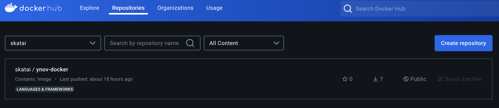
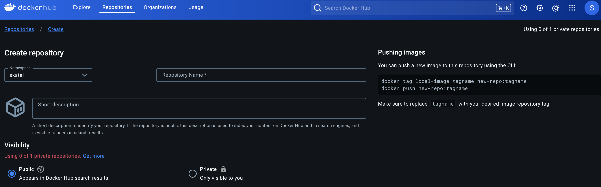

# Publiez un image sur Docker Hub

Le processus de publication d'une image locale sur un repository remote comme docker hub est en N etapes:

## Le tagging

Tagger une image avec ne copie pas l'image, mais l'associe juste a un ou plusieurs mots clès.

- Il est possible de tagger une image avec plusieurs tags.
- La commande `docker images` liste tous les tags associés aux images. vous voyez votre image listé plusieurs fois mais avec la même ID

La commande est

```bash
docker tag <nom_image | nom_image:tag | image_id> <nouveau_nom:nouveau_tag | nom_image:nouveau_tag>
```

Tagger une image a 2 objectifs:

### Versioning

Tagger l'image permet tout d'abord d'associer une version à l'image : v01, latest, stable, ...
par exemple pour une image avec l'id `abc123`,

```bash
docker tag abc123 myapp:v1.0
```

crée l'alias `myapp:v1.0` pour cette image. On peut alors la référencer non plus par son ID mais par son alias `myapp:v1.0`

### remote repositories

Tagger l'image permet ensuite de lier l'image à un ou plusieurs repositories pour ensuite la publier (`push`)

On peut ainsi tagger l'image `myapp` avec

- un numéro de version v1.0 `docker tag myapp username/myapp:v1.0`
- avec le mot clé `latest` : `docker tag myapp username/myapp:latest`
- avec un autre registry (`otheruser`) : `docker tag myapp otheruser/myapp:stable`

## Le pushing

Une fois associé / taggée avec le remote repository, on publie (push, upload) l'image sur le repository avec la commande

```bash
docker push username/image:tag
```

## Publiez l'image my_nginx_alpine:v1

### Créez votre compte et repo docker

- allez sur [https://docker.com](docker.com) et créez votre compte
- Créez un repository sur <https://hub.docker.com>





### tag, login, push

Taggez votre image locale avec votre `username` docker hub et le nom de votre repository

Par exemple:

```bash
docker tag my_nginx_alpine:v1 skatai/ynov-docker:v1
```

Puis loguez-vous sur docker:

```bash
docker login
```

Enfin publiez l'image sur Docker Hub avec `docker push`

```bash
docker push skatai/ynov-docker:v1
```

## En quoi consiste le push d'une image ?

Docker envoie les **layers** de l’image à Docker Hub.

Une image est composée de plusieurs layers (couches) chacune identifiée par un hash de son contenu.

Ce qui est stocké sur Docker Hub :

- Layers : Docker Hub stocke les différentes layers qui composent votre image. Ces layers contiennent les modifications du système de fichiers et les métadonnées.
- Le manifeste d’image : Un fichier JSON qui décrit l’image, y compris les couches qui la composent et d’autres métadonnées. visible via `docker inspect image_id`
- Configuration d’image : Contient la configuration d’exécution, comme les variables d’environnement, les ports exposés et la commande par défaut à exécuter.

Docker Hub ne fait qu’héberger votre image. Elle ne devient exécutable que lorsqu'elle est récupérée puis exécutée sur une machine avec docker run .

De même, Docker Hub n'exécute ni les images ni les containers, mais il réalise certains processus :

- Scan d’images : Recherche de vulnérabilités connues.
- Webhooks : Déclenche des actions lors du push d'une image.
- Builds automatisés : Peut créer automatiquement des images à partir de repository Git.

Quand un utilisateur récupère l’image depuis Docker Hub avec la commande `docker pull skatai/ynov-docker:v1`:

- Docker télécharge les couches nécessaires et reconstruit l’image localement ce qui lui permet ensuite de pouvoir exécuter un conteneur à partir de cette image

## Layers d'une image

Dans une image Docker, les **layers** sont des fichiers ou des répertoires individuels représentant les changements apportés au système de fichiers à différentes étapes du processus de création de l'image. Chaque layer est en lecture seule et s'appuie sur le layer en dessous, formant une pile de modifications qui, ensemble, définissent l'image complète. Voici un aperçu du fonctionnement des layers :

1. **Layer de base** : Chaque image Docker commence par un layer de base, qui peut être un système d'exploitation minimal comme Ubuntu ou Alpine.

2. **Modifications** : Chaque commande dans un **Dockerfile** (comme `RUN`, `COPY` ou `ADD`) crée un nouveau layer. Par exemple, si vous exécutez `RUN apt-get update` dans un Dockerfile, un nouveau layer est créé avec ces changements.

3. **Composition des layers** : Une image Docker est constituée de plusieurs layers empilés les uns sur les autres, où chaque layer représente un changement du système de fichiers (comme l'installation d'un package ou l'ajout d'un fichier). La combinaison de ces layers forme l'image finale.

4. **Adressable par contenu** : Chaque layer est identifié de manière unique par un hash cryptographique de son contenu, ce qui permet de réutiliser et de partager les layers entre différentes images. Par exemple, si deux images utilisent la même image de base, elles peuvent partager le même layer de base au lieu de le dupliquer.

5. **Efficacité** : Les layers sont partagés entre les images pour optimiser le stockage et réduire le temps de téléchargement. Si vous avez déjà un layer sur votre système, Docker ne le téléchargera pas à nouveau lorsqu'il récupérera une image qui utilise le même layer.

En résumé, les layers Docker sont comme des modifications incrémentales du système de fichiers qui, ensemble, constituent une image complète et exécutable.
