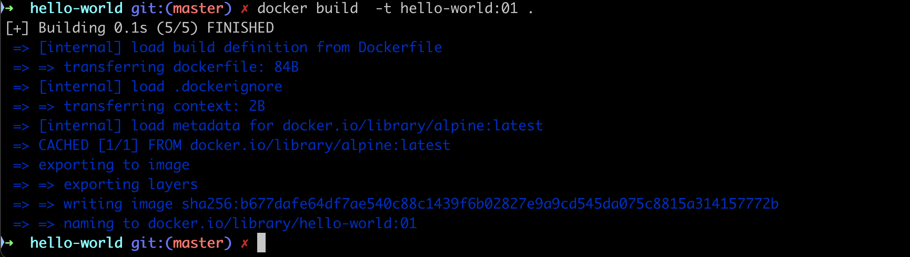
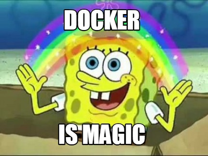

# Dockerfile

Dans cette session nous allons voir les **Dockerfile**

- comment écrire une Dockerfile, comment l'utiliser
- les instructions de base et leurs subtilités
- les layers (couches)
- le processus de build
- optimisation d'une image et rapidité du build

et pour la partie pratique

- lancer un server web Nginx en partant de nginx:latest (voir <https://training.play-with-docker.com/beginner-linux/>)

## Comment construire des images ?

Invoquer une image de base et de manuellement la modifier en ajoutant des éléments n'est pas un bon moyen de construire des images. Ca ne *scale* pas, il y a trop de risques d'erreur.

- aucun moyen de reproduire les étapes de construction de façon fiable
- pas de version control
- difficile de spécifier les versions
- faible reproductibilité
- [errare humanum est](https://fr.wikipedia.org/wiki/Errare_humanum_est,_perseverare_diabolicum)


Heureusement Docker peut construire des images automatiquement à partir d'un fichier d'instruction appelé **Dockerfile**.

## Dockerfile

Ce fichier contient une suite d'instructions, toutes au format **INSTRUCTION arguments**;

Par exemple, ce fichier Dockerfile install python sur ubuntu puis fait tourner le script `hello_world.py`

```bash
FROM ubuntu:latest
RUN apt-get install python
COPY hello-world.py
CMD python hello-world.py
```

A partir de ce fichier **Dockerfile**, on construit l'image avec;

```bash
docker build .
```

osi le nom du Dockerfile n'est pas ... Dockerfile (par exemple Dockerfile.dev ou Dockerfile.test)

```bash
docker build -f nom_du_dockerfile .
```

> La commande `docker build` fini toujours par un repertoire. Ici le '.' indique le repertoire courant ou es trouve le fichier Dockerfile.
> Par convention, le Dockerfile réside dans le repertoire racine du projet.

### Instructions du Dockerfile

Voici la Liste des instructions disponibles: <https://docs.docker.com/reference/dockerfile/>

| Instruction  | Description                                                |
|--------------|------------------------------------------------------------|
| **ADD**          | **Add local or remote files and directories.**                 |
| *COPY*         | *Copy files and directories.*                                |
| ARG          | Use build-time variables.                                  |
| **RUN**          | Execute build commands.                                    |
| **CMD**          | **Specify default commands.**                                  |
| *ENTRYPOINT*   | *Specify default executable.*                                |
| **ENV**          | **Set environment variables.**                                 |
| **EXPOSE**       | **Describe which ports your application is listening on.**     |
| **FROM**         | **Create a new build stage from a base image.**                |
| HEALTHCHECK  | Check a container's health on startup.                     |
| LABEL        | Add metadata to an image.                                  |
| MAINTAINER   | Specify the author of an image.                            |
| ONBUILD      | Specify instructions for when the image is used in a build.|
| SHELL        | Set the default shell of an image.                         |
| STOPSIGNAL   | Specify the system call signal for exiting a container.    |
| USER         | Set user and group ID.                                     |
| **VOLUME**       | **Create volume mounts.**                                      |
| WORKDIR      | Change working directory.                                  |

Nous allons partir d'un jeu d'instructions simple et construire des images de plus en plus complexes.

En parallèle de pouvoir specifier le contenu des images on regardera les différents paramètres disponibles pour la commande `build`.

## Premier Dockerfile

### Nom des fichiers `Dockerfile` ou autre

Il y a un unique Dockerfile par projet (sauf s'il y en a plusieurs pour les envt de dev, test etc )
La convention est que le fichier Dockerfile soit nommé `Dockerfile` et qu'il réside à la racine du projet.

Dans la suite nous créerons un repertoire par projet qui contiendra le Dockerfile du projet

<!-- Dans la suite nous allons écrire plusieurs dockerfile. Donc nous utiliserons un nom de fichier unique et différent de celui par défaut `Dockerfile` a chaque fois.

Le mieux est de créer un répertoire dédié au Dockerfiles
Mais normalement, le Dockerfile est crée a la racine du project
On buildera les images a partir des dockerfiles avec la commande
 -->
<!-- ```bash
docker build -f <nom du dockerfile> -t <nom de l'image>:<tag de l'image> <nom du repertoire du dockerfile>
``` -->

### hello_world.docker

Commençons par un exemple très simple

Créez un repertoire `hello-world`

```bash
mkdir hello-world
cd hello-world
```

Dans un fichier Dockerfile:

```Dockerfile
FROM alpine:latest
CMD echo Hello World!
```

- **FROM** va aller chercher l'image de base (`alpine:latest`)
- **CMD** va exécuter la commande `echo Hello World!`

puis construisez l'image `ynov:hello-world` depuis ce Docekrfile

```bash
docker build  -t ynov:hello-world .
```

On obtient:



et maintenant on peut lancer le container:

```bash
docker run ynov:hello-world
```

ce qui retourne

```bash
hello World!
```



## Les instructions du Dockerfile

On peut distinguer les instructions  principales :

| Instruction | exemple | description |
|-------------|-------------|-------------|
| **FROM** | `FROM alpine:latest` | Définit l'image de base à partir de laquelle l'image Docker est construite. |
| **WORKDIR**  | `WORKDIR /app` |  Définit le répertoire de travail dans le conteneur où les commandes suivantes s'exécuteront
|  **ADD & COPY**  |  Copie des fichiers depuis l’hôte vers le conteneur. `ADD` peut extraire des archives ou télécharger des fichiers distants, `COPY` ne fait que copier localement. | `COPY . /app` |
| **RUN**  |  Exécute une commande dans le conteneur pendant la construction de l’image (par exemple, installer des paquets).| `RUN apt-get update && apt-get install -y git` |
| **CMD & ENTRYPOINT**  |  Définit la commande par défaut à exécuter lors du lancement du conteneur. `CMD` peut être remplacé, `ENTRYPOINT` est plus rigide. | `CMD ["python", "hello-world.py"]` |
| **ENV**  |  Définit des variables d’environnement dans le conteneur. | `ENV ASPNETCORE_ENVIRONMENT=Production` |
| **VOLUME**  |  Crée un mount point (point de montage) pour stocker des données persistantes en dehors du conteneur. | `VOLUME /var/log/app` |
| **LABEL**  |  Ajoute des métadonnées à l’image, comme des informations de version ou de description. | `LABEL maintainer="John Doe <john@example.com>"` |
| **EXPOSE**  |  Indique quels ports le conteneur expose pour être accessibles depuis l’extérieur.| `EXPOSE 80` |
| **ARG**  |  Définit des variables d'environnement | `ARG CONNECTION_STRING` |
| **USER**  |  Définit le USER à utiliser pour exécuter l'image | `USER appuser` |
| **HEALTHCHECK**  |  Vérifier l'état du container régulièrement | `HEALTHCHECK --interval=30s --timeout=3s  CMD curl -f <http://localhost/health>` |

Voir la documentation: <https://docs.docker.com/reference/dockerfile> et ce site <http://anjikeesari.com/developertools/cheatsheets/dockerfile-cheat-sheet/>

### Premier exemple

On va écrire le Dockerfile qui fais tourner un serveur web NGinx et qui donne une page web index.html à l'adresse localhost:8080.
Mais cette fois-ci à partir d'un Dockerfile et non plus en modifiant directement une image de base.

Sur votre machine, créez un nouveau répertoire

```bash
mkdir -p ./demo-nginx
cd ./demo-nginx
```

Créez le fichier  `nginx.local.conf` et y copier le contenu suivant:

```conf
daemon off;

events {
 worker_connections 1024;
}

http {
 server {
    listen 80;
    root /var/www/html;
    index index.html;
 }
}
```

Téléchargez une page web html comme par exemple <https://fr.wikipedia.org/wiki/Linux> et renommez le fichier en index.html
`mv Linux index.html`

On va travailler sur **Ubuntu** donc avec `apt-get` et `/bin/bash` comme package manager.

Les instructions à écrire dans le fichier Dockerfile sont

- A partir de Ubuntu
- installer nginx et wget
- Exposer le port 80
- créer un repertoire  /var/www/html
- copier le fichier index.html dans /var/www/html/
- copier nginx.local.conf dans /etc/nginx/nginx.conf
- run nginx

Essayez de ne pas sauter sur la solution tout de suite et d'écrire vous même le Dockerfile

Les instructions a utiliser sont:

- FROM
- RUN
- WORKDIR
- COPY

Le fichier Dockerfile de solution est sur le github.

Une fois le fichier écrit et sauvegardé,

- créez l'image
  - taguez avec `-t` et le nom `nginx-demo:01`
- créez et lancez le container
  - mode détaché `-d`
  - associez le port interne du container `80` au port externe `8080`
- vérifiez que la page apparait bien sur localhost:8080

Soit:

```bash
docker build -t nginx-demo:01 .
docker run -d -p 8080:80 nginx-demo:01
```

Vérifiez que le container tourne avec `docker ps -a`

```bash
CONTAINER ID   IMAGE                    COMMAND                  CREATED
9cef311acfd2   nginx-demo:01            "nginx -g 'daemon of…"   9 seconds ago

STATUS                      PORTS     NAMES
Exited (1) 8 seconds ago              cool_moore
```

Maintenant allez dans le container (`docker exec -it nginx-demo:01 /bin/bash`)

- verifiez que le process nginx tourne bien (ps aux | grep nginx)
- verifiez que ...

--------

!!! le container s'arrete otut de suite meme en mode -d

## Autres exemples de Dockerfile

- Exemple avec Nginx:  <https://medium.com/@mrdevsecops/dockerfile-nginx-842ba0a55b82>
- Avec python et flask: <https://medium.com/@mrdevsecops/dockerfile-python-flask-e03a3c0dfe65>
- How To Dockerize an Angular Application with multistage build : <https://medium.com/@mrdevsecops/dockerfile-multiple-stage-build-3ee540e7b221>
