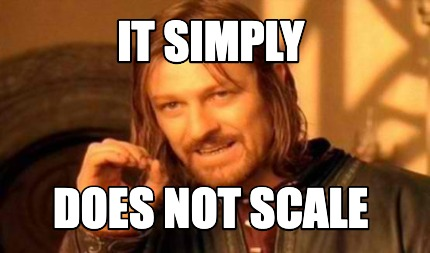
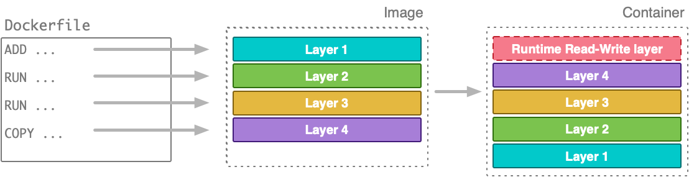
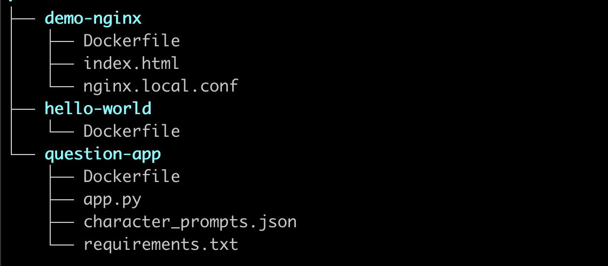
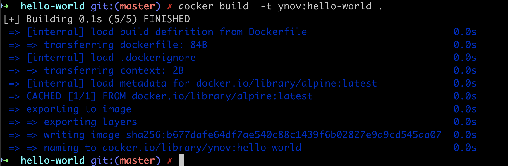
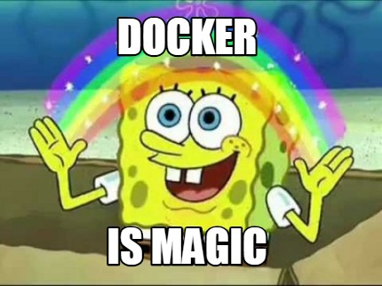
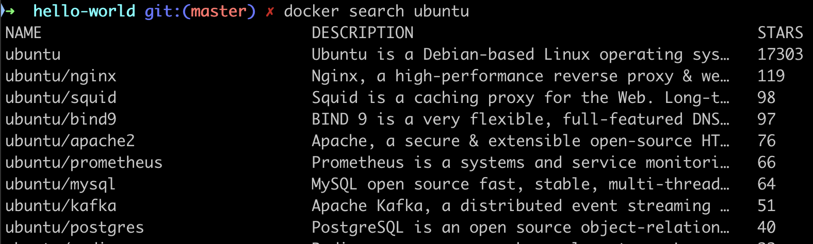
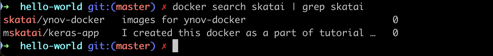

# Dockerfile

Dans cette session nous allons voir les **Dockerfile**

- comment écrire une Dockerfile, comment l'utiliser
- les instructions de base et leurs subtilités
- les layers (couches)
- le processus de build
- optimisation d'une image et rapidité du build

et pour la partie pratique

- lancer un server web Nginx en partant de nginx:latest (voir <https://training.play-with-docker.com/beginner-linux/>)

## Comment construire des images ?

Invoquer une image de base et de manuellement la modifier en ajoutant des éléments n'est pas un bon moyen de construire des images. Ca ne *scale* pas, il y a trop de risques d'erreur.

- aucun moyen de reproduire les étapes de construction de façon fiable
- pas de version control
- difficile de spécifier les versions
- faible reproductibilité
- [errare humanum est](https://fr.wikipedia.org/wiki/Errare_humanum_est,_perseverare_diabolicum)



Heureusement Docker peut construire des images automatiquement à partir d'un fichier d'instruction appelé **Dockerfile**.

## Construire une image à partir d'une Dockerfile



Ce fichier contient une suite d'instructions, toutes au format **INSTRUCTION arguments**;

Par exemple, ce fichier Dockerfile install python sur ubuntu puis fait tourner le script `hello_world.py`

```bash
FROM ubuntu:latest
RUN apt-get install python
COPY hello-world.py
CMD python hello-world.py
```

A partir de ce fichier **Dockerfile**, on construit l'image avec;

```bash
docker build .
```

Si le nom du Dockerfile n'est pas ... Dockerfile (par exemple Dockerfile.dev ou Dockerfile.test)

```bash
docker build -f nom_du_dockerfile .
```

> La commande `docker build` finit toujours par un répertoire. Ici le '`.`' indique le répertoire courant ou se trouve le fichier Dockerfile.
> Par convention, le Dockerfile réside à la racine du projet.

### Instructions du Dockerfile

Voici la Liste des instructions disponibles: <https://docs.docker.com/reference/dockerfile/>

| Instruction  | Description                                                |
|--------------|------------------------------------------------------------|
| **ADD**          | **Add local or remote files and directories.**                 |
| *COPY*         | *Copy files and directories.*                                |
| ARG          | Use build-time variables.                                  |
| **RUN**          | Execute build commands.                                    |
| **CMD**          | **Specify default commands.**                                  |
| *ENTRYPOINT*   | *Specify default executable.*                                |
| **ENV**          | **Set environment variables.**                                 |
| **EXPOSE**       | **Describe which ports your application is listening on.**     |
| **FROM**         | **Create a new build stage from a base image.**                |
| HEALTHCHECK  | Check a container's health on startup.                     |
| LABEL        | Add metadata to an image.                                  |
| MAINTAINER   | Specify the author of an image.                            |
| ONBUILD      | Specify instructions for when the image is used in a build.|
| SHELL        | Set the default shell of an image.                         |
| STOPSIGNAL   | Specify the system call signal for exiting a container.    |
| USER         | Set user and group ID.                                     |
| **VOLUME**       | **Create volume mounts.**                                      |
| WORKDIR      | Change working directory.                                  |

Nous allons partir d'un jeu d'instructions simples et construire des images de plus en plus complexes.

En parallèle de pouvoir specifier le contenu des images on regardera les différents paramètres disponibles pour la commande `build`.

## Dockerfile et layers

Voir la doc : <https://docs.docker.com/get-started/docker-concepts/building-images/understanding-image-layers/>

Dans une image Docker, les **layers** sont des fichiers ou des répertoires individuels représentant les changements apportés au système de fichiers à différentes étapes du processus de création de l'image.

Chaque layer est en lecture seule et s'appuie sur le layer en dessous, formant une pile de modifications qui, ensemble, définissent l'image complète. Voici un aperçu du fonctionnement des layers :

1. **Layer de base** : Chaque image Docker commence par un layer de base, qui peut être un système d'exploitation minimal comme Ubuntu ou Alpine.

2. **Modifications** : Chaque commande dans un **Dockerfile** (comme `RUN`, `COPY` ou `ADD`) crée un nouveau layer. Par exemple, si vous exécutez `RUN apt-get update` dans un Dockerfile, un nouveau layer est créé avec ces changements.

3. **Composition des layers** : Une image Docker est constituée de plusieurs layers empilés les uns sur les autres, où chaque layer représente un changement du système de fichiers (comme l'installation d'un package ou l'ajout d'un fichier). La combinaison de ces layers forme l'image finale.

4. **Adressable par contenu** : Chaque layer est identifié de manière unique par un hash cryptographique de son contenu, ce qui permet de réutiliser et de partager les layers entre différentes images. Par exemple, si deux images utilisent la même image de base, elles peuvent partager le même layer de base au lieu de le dupliquer.

5. **Efficacité** : Les layers sont partagés entre les images pour optimiser le stockage et réduire le temps de téléchargement. Si vous avez déjà un layer sur votre système, Docker ne le téléchargera pas à nouveau lorsqu'il récupérera une image qui utilise le même layer.

En résumé, les layers Docker sont comme des modifications incrémentales du système de fichiers qui, ensemble, constituent une image complète et exécutable.

<https://www.youtube.com/watch?v=wJwqtAkmtQA>

<iframe width="560" height="315" src="https://www.youtube.com/embed/wJwqtAkmtQA?si=5TVNBocps0luIlaL" title="YouTube video player" frameborder="0" allow="accelerometer; autoplay; clipboard-write; encrypted-media; gyroscope; picture-in-picture; web-share" referrerpolicy="strict-origin-when-cross-origin" allowfullscreen></iframe>

## Premier Dockerfile

### Nom des fichiers `Dockerfile` ou autre

Il y a un unique Dockerfile par projet (sauf s'il y en a plusieurs pour les environnements de dev, test etc )

La convention est que le fichier Dockerfile soit nommé `Dockerfile` et qu'il réside à la racine du projet.

Dans la suite nous créerons un répertoire par projet qui contiendra le Dockerfile du projet



## hello world

Commençons par un exemple très simple

Créez un répertoire `hello-world`

```bash
mkdir hello-world
cd hello-world
```

Dans un fichier Dockerfile:

```Dockerfile
FROM alpine:latest
CMD echo Hello World!
```

- **FROM** va aller chercher l'image de base (`alpine:latest`)
- **CMD** va exécuter la commande `echo Hello World!`

Construisez l'image `ynov:hello-world` depuis ce Dockerfile en lui donnant le nom `hello-world` et le tag `01` avec

```bash
docker build  -t hello-world:01 .
```

On obtient:



et maintenant on peut lancer le container:

```bash
docker run hello-world:01
```

ce qui retourne

```bash
hello World!
```



## Les instructions du Dockerfile

On peut distinguer les instructions  principales :

| Instruction | exemple | description |
|-------------|-------------|-------------|
| **FROM** | `FROM alpine:latest` | Définit l'image de base à partir de laquelle l'image Docker est construite. |
| **WORKDIR**  | `WORKDIR /app` |  Définit le répertoire de travail dans le conteneur où les commandes suivantes s'exécuteront
|  **ADD & COPY**  |  Copie des fichiers depuis l’hôte vers le conteneur. `ADD` peut extraire des archives ou télécharger des fichiers distants, `COPY` ne fait que copier localement. | `COPY . /app` |
| **RUN**  |  Exécute une commande dans le conteneur pendant la construction de l’image (par exemple, installer des paquets).| `RUN apt-get update && apt-get install -y git` |
| **CMD & ENTRYPOINT**  |  Définit la commande par défaut à exécuter lors du lancement du conteneur. `CMD` peut être remplacé, `ENTRYPOINT` est plus rigide. | `CMD ["python", "hello-world.py"]` |
| **VOLUME**  |  Crée un mount point (point de montage) pour stocker des données persistantes en dehors du conteneur. | `VOLUME /var/log/app` |
| **LABEL**  |  Ajoute des métadonnées à l’image, comme des informations de version ou de description. | `LABEL maintainer="Alphonse Daudet <alphonse@daudet.com>"` |
| **EXPOSE**  |  Indique quels ports le conteneur expose pour être accessibles depuis l’extérieur.| `EXPOSE 80` |
| **ARG & ENV** |  Définit des variables d'environnement | `ARG CONNECTION_STRING` ou `ENV ASPNETCORE_ENVIRONMENT=Production`  |
| **USER**  |  Définit le USER à utiliser pour exécuter l'image | `USER appuser` |
| **HEALTHCHECK**  |  Vérifier l'état du container régulièrement | `HEALTHCHECK --interval=30s --timeout=3s  CMD curl -f <http://localhost/health>` |

Voir la documentation: <https://docs.docker.com/reference/dockerfile> et ce site <http://anjikeesari.com/developertools/cheatsheets/dockerfile-cheat-sheet/>

## Premier exemple

On va écrire le Dockerfile qui fait tourner un serveur web Nginx et qui publie une page web `index.html` à l'adresse `localhost:8080`. Mais cette fois-ci à partir d'un Dockerfile et non plus en modifiant directement une image de base.

### Travailler dans un répertoire dédié

Sur votre machine, créez un nouveau répertoire

```bash
mkdir -p ./demo-nginx
cd ./demo-nginx
```

### Ecrire la Config Nginx

Créez le fichier  `nginx.local.conf` et y copier le contenu suivant:

```conf
events {
 worker_connections 1024;
}

http {
 server {
    listen 80;
    root /var/www/html;
    index index.html;
 }
}
```

### Récupérer une page web

Téléchargez une page web html comme par exemple <https://fr.wikipedia.org/wiki/Linux> et renommez le fichier en index.html
`mv Linux index.html`

On va travailler sur **Ubuntu** donc avec `apt-get` et `/bin/bash` comme package manager.

### Écrire le Dockerfile

Les instructions à utiliser sont:

- FROM
- RUN
- WORKDIR
- COPY

Les instructions à écrire dans le fichier Dockerfile sont :

- A partir de Ubuntu (FROM)
- installer nginx et wget (RUN)
- Exposer le port 80 (EXPOSE)
- créer un repertoire  `/var/www/html` (WORKDIR)
- copier le fichier `index.html` dans `/var/www/html/` (COPY)
- copier `nginx.local.conf` dans `/etc/nginx/nginx.conf` (COPY)
- run nginx avec : `nginx -g daemon off` (CMD)

Essayez de ne pas sauter sur la solution tout de suite et d'écrire vous même le Dockerfile

Le fichier Dockerfile de solution est sur le github : <https://raw.githubusercontent.com/SkatAI/ynov-docker/refs/heads/master/apps/demo-nginx/Dockerfile>

### Build l'image

Une fois le fichier Dockerfile écrit et sauvegardé

- créez l'image avec `docker build`
- taguez avec `-t` et le nom `nginx-demo:01`
- n'oubliez pas d'ajouter le '.' à la fin de la commande pour indiquer que le Dockerfile réside dans le répertoire courant.

`docker build` va par défaut lire le fichier Dockerfile.

Ce qui donne :

```bash
docker build -t nginx-demo:01 .
```

### Lancer le container

Créez et lancez le container

- en mode détaché `-d`
- associez le port interne du container `80` au port externe `8080`
- donnez le nom `nginx-demo`  au container avec le flag `--name` (Note: le nom du container n'admet pas de tags)

```bash
docker run -d -p 8080:80 --name nginx-demo  nginx-demo:01
```

Vérifiez que le container tourne avec `docker ps -a`

```bash
CONTAINER ID   IMAGE                    COMMAND                  CREATED
9cef311acfd2   nginx-demo:01            "nginx -g 'daemon of…"   9 seconds ago

STATUS         PORTS                   NAMES
Up 4 minutes   0.0.0.0:8080->80/tcp    nginx-demo
```

Maintenant allez dans le container

```bash
docker exec -it nginx-demo /bin/bash
```

Vérifiez que le process nginx tourne bien

```bash
ps aux | grep nginx
```

retourne

```bash
root@cd5b6b5a022b:/var/www/html# ps -ef | grep nginx
root         1     0  0 11:50 ?        00:00:00 nginx: master process nginx -g daemon off;
nobody       7     1  0 11:50 ?        00:00:00 nginx: worker process
root        18     8  0 11:52 pts/0    00:00:00 grep --color=auto nginx
```

Enfin allez sur `localhost:8080` et vérifiez que vous voyez bien votre page web.

### Troubleshooting

Lors du build, les opérations sont affichées directement dans le terminal.

On peut ajouter le flag `--progress=plain` pour obtenir plus de détail.

```bash
docker build --progress=plain -t nginx-demo:01 .
```

Pour le run du container, les opérations sont aussi écrites dans un fichier log. on peut y accéder a posteriori avec

```bash
docker logs <container_id>
```

le flag `--tail n` permet d'afficher les `n` dernières lignes du log. Par exemple : `docker logs --tail 10 <container_id>`

## Publiez votre image dans votre repository Docker Hub

Dans les lignes de tag et push, ci-dessous, remplacez `skatai` par votre username et `ynov-docker` par le nom de votre repository.

```bash
docker tag nginx-demo:01 skatai/ynov-docker:nginx-demo-01
```

```bash
docker push skatai/ynov-docker:nginx-demo-01
```

### docker search

`docker search` fait une recherche sur les images publiques. C'est comme cela que l'on peut trouver les versions des images ubuntu, nginx etc ...



Si vous cherchez votre username/repository search va aussi retourner beaucoup d'images publiques dans ses résultats.

Pour limiter votre recherche à votre repository ou username vous pouvez combiner `docker search` à `grep` :

```bash
docker search skatai | grep skatai
```



## Enregistrez votre image dans le formulaire

Une fois l'image publiée, remplissez le formulaire avec le tag de l'image en face de votre nom:

<https://docs.google.com/spreadsheets/d/17jjXXb-bJhaosVoTLk1c_JKSaDfPklLyXYP4lUPErQk/edit?gid=0#gid=0>

## Autres exemples de Dockerfile

- Exemple avec Nginx:  <https://medium.com/@mrdevsecops/dockerfile-nginx-842ba0a55b82>
- Avec python et flask: <https://medium.com/@mrdevsecops/dockerfile-python-flask-e03a3c0dfe65>
- How To Dockerize an Angular Application with multistage build : <https://medium.com/@mrdevsecops/dockerfile-multiple-stage-build-3ee540e7b221>
- A TODO list application on Node and Alpine : <https://docs.docker.com/get-started/workshop/02_our_app/>

## Ressources

- La doc docker : <https://docs.docker.com/reference/dockerfile/>
- Dockerfile Commands : <http://anjikeesari.com/developertools/cheatsheets/dockerfile-cheat-sheet>
