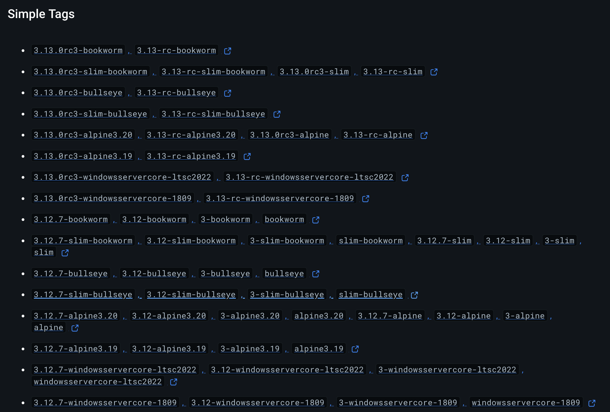

# Images, layers et optimisation

dans ce document on aborde les questions suivantes

- Comment distinguer parmi les images de base
- La notion de layers
- le caching lors du build
- l'optimisation en temps de build et en volume d'une image

et sur les Dockerfiles

- les nuances entre CMD et ENTRYPOINT, ADD et COPY, ARG et ENV
- la gestion des mots de passe et des clefs API

## Choisir une image de base adaptée

Jusqu'à maintenant nous avons travaillé avec des images de base très basique, des images qui correspondent à une distribution linux brute qui nécessite par conséquent d'y installer les packages nécessaires.

Par exemple pour faire un server Nginx, nous avons pris la distribution Alpine et nous avons installé nginx, pour une appli python, nous sommes parti de Ubuntu et avons installé ... python.

Pour la plupart des environnements open source ou propriétaires, il existe des images déjà prêtes qui inclues les packages python, PostgreSQL, Nginx, etc ...

`docker search <mot clef>` retourne la liste des images disponibles.

On peut filtrer les resultats avec filter

- is-official=true|false: Filter for official Docker images.
- is-automated=true|false: Filter for automated build images.
- stars=N: Filter images with at least N stars.
- has-stars=true|false: Filter for images with any number of stars.
- is-private=true|false: Filter for private images (useful for private registries).

Par exemple

```bash
 docker search python --filter "is-official=true"
NAME      DESCRIPTION                                     STARS     OFFICIAL   AUTOMATED
python    Python is an interpreted, interactive, objec…   9830      [OK]
```

Mais docker search est peu développé et peu utile au final.

Le mieux est d'aller sur docker hub et de chercher directement python

<https://hub.docker.com/_/python>

On tombe alors sur une jungle de tags


Difficile de s'y retrouver

Les images en questions diffèrent par

- leur taille
- l'image de base : Alpine, Debian, ...
- la sécurité
- et le temps de build

Comparons les 3 images python Slim Buster, Alpine, and Slim Bullseye.

| **Critères**       | **Slim Buster**                            | **Alpine**                                 | **Slim Bullseye**                          |
|--------------------|--------------------------------------------|--------------------------------------------|--------------------------------------------|
| **Taille**         | ~120 Mo, plus grande à cause de Debian Buster. | ~50 Mo, très compacte.                     | ~80 Mo, équilibre entre taille et compatibilité. |
| **Compatibilité**   | Excellente compatibilité avec les bibliothèques. | Problèmes potentiels à cause de musl libc. | Meilleure qu'Alpine, basée sur Debian Bullseye.  |
| **Sécurité**       | Sécurisée, bénéficie des mises à jour Debian. | Surface d'attaque minimale, très sécurisée. | Sécurisée, mais avec une surface d'attaque légèrement plus grande. |
| **Temps de build**  | Plus lent à cause du gestionnaire apt-get. | Plus rapide grâce à sa base minimaliste.   | Similaire à Slim Buster, un peu plus lent qu'Alpine. |

### Bullseye, Buster, Bookworm ?

La distribution Debian nomme ses versions, ses releases d'après les personnages de toy story. Les termes Bullseye, Buster, Bookworm correspondent donc aux versions successives de Debian

- Buster: The codename for Debian 10, released in July 2019.
- Bullseye: The codename for Debian 11, released in August 2021.
- Bookworm: The codename for Debian 12, which was released in 2023.

L'image python est donc taguée avec la version de Debian sur laquelle elle est construite.

Si l'image est aussi `slim`, la distribution de base est réduite, amincie.

- Slim Buster: A minimal version of the Debian 10-based image.
- Slim Bullseye: A minimal version of the Debian 11-based image.

Et `Alpine` correspond à la distribution Alpine qui nous avons vu est minimaliste et donc de taille très réduite.

Sauf en cas de contrainte de compatibilité avec une version antérieur de Debian, on choisira donc soit une version slim avec un Debian récent soit une version `alpine`

La même classification existe pour d'autres images:

par exemple :

- nginx:mainline-alpine3.20-slim fait 5.19 MB
- nginx:mainline-alpine3.20 fait 18.88 MB
- nginx:bookworm fait 68.01 MB
etc ...

## Layers

Dans une image Docker, les **layers** sont des fichiers ou des répertoires individuels représentant les changements apportés au système de fichiers à différentes étapes du processus de création de l'image.


Chaque layer est en lecture seule et s'appuie sur le layer en dessous, formant une pile de modifications qui, ensemble, définissent l'image complète.

1. **Layer de base** : Chaque image Docker commence par un layer de base, constitué d'un OS comme Ubuntu ou Alpine.

2. **Modifications** : Les instructions comme `RUN`, `COPY` ou `ADD` du Dockerfile crée une nouvelle layer.

3. **Hash** : Chaque layer est identifié de manière unique par un hash de son contenu.

4. **Partage des layers entre les images** : Cela permet de réutiliser et de partager les layers entre différentes images. Par exemple, si deux images utilisent la même image de base, elles peuvent partager le même layer de base au lieu de la dupliquer.

Si vous avez déjà une layer sur votre système, Docker ne le téléchargera pas à nouveau lorsqu'il récupérera une image qui utilise la même layer.

En résumé, les layers Docker sont comme des modifications incrémentales qui, ensemble, constituent une image complète et exécutable.

Notez :

- Certaines instructions comme ENV, WORKDIR, and CMD ne crée pas de nouvelles layers.
- La combinaison de ces layers forme l'image finale.

### Exemple

Ce Dockerfile  construit 3 layers

```Dockerfile
FROM python:3.9-slim
COPY . /app
RUN pip install -r requirements.txt
CMD ["python", "/app/app.py"]
```

Seul `CMD` ne crée par de nouvelle layer.

### Docker caches layers

Si entre 2 builds successifs, une layer n'a pas changée par rapport au premier build, elle sera est ré-utilisée intégralement dans le deuxième.

Ce qui accélère fortement le temps de build de l'image.

C'est le **caching**


L'ordre des instructions dans un Dockerfile est donc important.

Il faut commencer par les couches qui ne changent pas beaucoup.
Par exemple les installs de packages et librairies soit avec RUN apt-get soit avec pip install requirements.txt

puis suivre par celle qui sont amenées à changer fréquemment comment celles qui copient le code du host vers le container.

### optimal order of layers in a Dockerfile

L'ordre des layers est primordial pour rendre le build plus rapide

Le principe général est le suivant :

1. réduire les changements dans les layers du début pour bénéficier du caching.
2. Séparer les layers qui changent souvent des layers plus statiques.
3. grouper les operations pour réduire le nombre de layers.

Plus précisément, sur ce dernier point, on va grouper les install de packages avec `&&` entre les `apt-get` pour réduire la taille de l'image

```Dockerfile
RUN apt-get update && \
    apt-get install -y package1 package2 && \
    apt-get clean && \
    rm -rf /var/lib/apt/lists/*

```

Au lieu de 4 RUNs et donc 4 layers

```Dockerfile
RUN apt-get update
RUN apt-get install -y package1 package2
RUN apt-get clean
RUN rm -rf /var/lib/apt/lists/*
```

Un ordre optimisé pour une application python classique sera par exemple

### 1. **Base Image**: Start with a stable base image that includes your desired Python version

### 2. **Set environment variables**: Any environment settings, such as `ENV`, `WORKDIR`, or `PATH`, that don’t change often

### 3. **Install dependencies**: First copy only the dependencies file (like `requirements.txt`), and install them. This allows Docker to cache the installed dependencies layer if the dependencies haven’t changed

### 4. **Copy application code**: Copy the app code and configure it

### 5. **Expose ports and define entry points**: Define how your app will start and what ports are exposed

Here’s an example for a Python app with a `requirements.txt` file:

### Optimized Dockerfile for a Python App

```Dockerfile
# 1. On commence par l'image de base
FROM python:3.9-slim

# 2. Les variables d'environment variables
ENV PYTHONDONTWRITEBYTECODE=1
ENV PYTHONUNBUFFERED=1

# 3. Le directory de travail
WORKDIR /app

# 4. les install système
RUN apt-get update && apt-get install -y --no-install-recommends gcc

# 5. Les librairies pythin
COPY requirements.txt /app/
RUN pip install --no-cache-dir -r requirements.txt

# 6. Puis le code de l'application
COPY . /app

# 7. Exposer le  port (si nécessaire)
EXPOSE 8000

# 8. Enfin démarrer l'application
CMD ["python", "app.py"]
```

Notez que l'on copie et installe d'abord `requirements.txt` puis le reste du code.
En effet, la liste des librairies va changer moins souvent que le code. On a ainsi un boost de performance significatif à chaque itération du code.

`EXPOSE 8000` est à la fin du Dockerfile. Pourtant le port exposé par le container ne va pas changer souvent. Cependant comme EXPOSE ne crée par de nouvelle layer, le mettre à la fin ne va pas impacter le build time.
Par contre comme c'est un paramètres moins ... primordiale de l'image il est plus lisible ed le mettre à la fin. Le port est exposé juste avant le lancement de l'application avec `CMD`

L'ordre de ce Dockerfile est optimisé car

- il maximise la réutilisation du cache par Docker.
- le nombre de layer est réduit en regroupant les install système.
- la layer du code vient après l'install des librairies système et python car le coed change plus fréquemment que les dependencies.

## Les subtilités

Certaines instructions semblent assez similaires

- ARG et ENV
- ADD et COPY
- CMD et ENTRYPOINT

### ARG et ENV

La différence entre ARG et ENV dans un Dockerfile est la suivante :

- **ARG** *argument* : Définit une variable à utiliser uniquement pendant le build de l'image. Elle n'est pas conservée dans l'image finale et ne sera pas accessible lors de l'exécution du conteneur.

- **ENV** *environnement* : Définit une variable d'environnement qui est disponible à la fois pendant le build et dans le conteneur au moment de son exécution. Elle reste dans l'image finale.

En résumé :

    ARG : utilisé uniquement lors du build.
    ENV : utilisé lors du build et à l'exécution.

### ADD et COPY

La différence entre `ADD` et `COPY` dans un Dockerfile est :

- **`COPY`** : Copie simplement des fichiers ou dossiers du contexte de build vers l'image. Utilisé pour des copies simples.

- **`ADD`** : Fait tout ce que `COPY` fait, mais en plus, il peut **décompresser des archives** (comme un fichier `.tar.gz`) et **télécharger des fichiers depuis une URL**.

En résumé :

- **`COPY`** est plus simple et recommandé pour la copie de fichiers.
- **`ADD`** a des fonctionnalités supplémentaires (décompression, téléchargement).

### CMD et ENTRYPOINT

La différence entre `CMD` et `ENTRYPOINT` dans un Dockerfile est :

- **`CMD`** : Spécifie une commande **par défaut** qui peut être **remplacée** au moment de l'exécution du conteneur.

- **`ENTRYPOINT`** : Définit une commande qui sera **toujours exécutée** et ne peut pas être remplacée, sauf en utilisant l'option `--entrypoint`.

En résumé :

- **`CMD`** : Commande par défaut, remplaçable.
- **`ENTRYPOINT`** : Commande fixe, non remplaçable sans option spéciale.

### Les 2 styles d'écriture des CMD ou ENTRYPOINT

Les instructions `CMD` et `ENTRYPOINT` peuvent être écrites suivant deux formats:

- **Shell** : Simple string appelé format shell car il invoque automatiquement le shell `/bin/sh -c` pour executer la CMD.

```Dockerfile
CMD echo "Hello World"
ENTRYPOINT echo "Hello World"
```

- **Exec** qui définit la commande et ses arguments sous forme d'array

```Dockerfile
CMD ["echo", "Hello World"]
ENTRYPOINT ["echo", "Hello World"]
```

Le format exec est jugé plus sécurisé et plus performant. La commande est executé par docker sans invoquer en plus un shell.

## la gestion des mots de passe et clefs API

Comment gérer de la façon la plus sécurisée, les variables secretes dans un Dockerfile

La règle d'or est de ne jamais copier le mot de passe ou la clef API directement dans le Dockerfile.
Le Dockerfile est inclu dans l'image et le mot de passe sera accessible à tous ceux qui ont accès l'image.

### Lors du RUN du container

Imaginons que le mot de passe de la base de donnée est '123abc'

On peut directement passer cette valeur lors du `docker run` en utilisant le flag `-e`

```bash
# -e, --env list                       Set environment variables
docker run -e PGPASS=123abc my_image
```

Mais passer une valeur secrète de façon aussi exposée est TRES fortement déconseillé.

Le mieux est de stocker la valeur dans une variable d'environnement (soit avec `export` soit dans le `.bashrc` ou `.zshrc` ou équivalent sur windows)

```bash
# le mot de passe de la base de données
export PGPASS='123abc'
```

et d'utiliser la variable d'environnement dans le `docker run`

```bash
docker run -e PGPASS="$PGPASS" my_image
```


### utiliser un fichier `.env`

Stocker les cles et mot de passe dans un fichier .env

> Attention à ne jamais copier le .env file directement dans le dockerfile

mais

- soit passer le fichier lors du docker run

```bash
docker run --env-file .env my_image
```

- soit monter le `.env` file lors du docker run

```bash
docker run -v $(pwd)/.env:/app/.env my_image
```

Le fichier `.env` n'est disponible que dans le container quand il run mais pas dans l'image.

## Lectures

- <https://medium.com/@arif.rahman.rhm/choosing-the-right-python-docker-image-slim-buster-vs-alpine-vs-slim-bullseye-5586bac8b4c9>

- CMD vs Entrypoint <https://medium.com/@mrdevsecops/dockerfile-cmd-vs-entrypoint-78b219d55df0>
