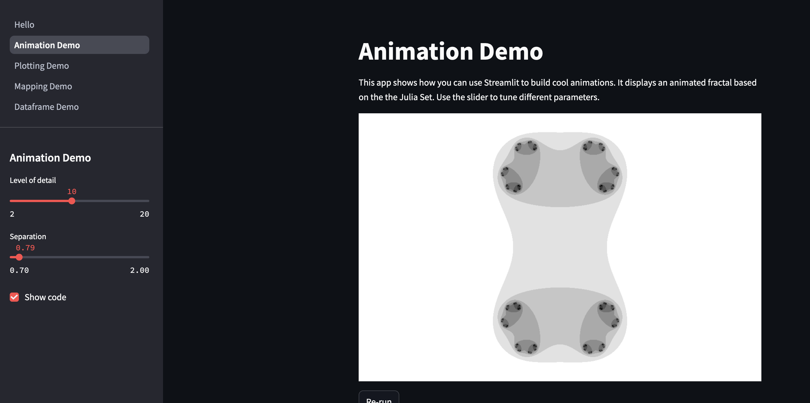

# Application OpenAI

Dans ce tuto nous allons creer une application ou l'utilisateur pose des questions a un personnage celebre et ce personnage lui répond.

L'application repose sur l'envoi d'un prompt a l'API OpenAI.

D'un point de vue technique le stack est composé de

- python 3.12
- [streamlit](https://streamlit.io/)
- OpenAI

ce tuto nous permettra d'implementer les points suivants

- gerer une cle API
- application python
- mounter le repertoire courant pour le code
- .dockerignore

## Streamlit

Streamlit n'est pas directement lié à notre sujet de docker. Mais c'est un framework qui vaut la peine d'etre connu.

Streamlit.io permet en quelques lignes de creer des applications et eds dashboards tres efficiace, utile, beau etc
Streamlit est particulierement adaptée aux projet e data science et aux dataframes pandas

Dans un terminal

```bash
pip install streamlit
streamlit hello
```

puis allez sur <http://localhost:8501>



## Construire l'application

Tout d'abord la partie python

- `app.py`
Le code de l'application tient dans un fichier app disponible sur <https://github.com/SkatAI/ynov-docker/blob/master/apps/question-app/app.py>

- `requirements.txt` contient 3 lignes : streamlit, openai et python-dotenv pour lire les variables d'environnement

```text
streamlit
openai
python-dotenv
```

la derniere librairie `python-dotenv` permet lire les variables d'environnement à partir d'un fichier .env ou réside la clef API.

- `character_prompts.json`
On a aussi besoin d'un fichier json pour la liste des personnages.

```json
{
  "Louis de Funès": "Tu es Louis de Funès le comique français, répond en ralant de façon drôle.",
  "Voltaire": "Tu es Voltaire le philosiphe des lumières, répond à la question en philosophant. reste concis.",
  "Albert Einstein": "You are Albert Einstein, the famous physicist. Answer the question as you would.",
  "Sherlock Holmes": "You are Sherlock Holmes, the fictional detective. Use your keen deductive skills to answer.",
}
```

Changez les noms et instructions relatives aux personnages comme bon vous semble.

Les 3 fichiers sont sur <https://github.com/SkatAI/ynov-docker/blob/master/apps/question-app/>

## Le Dockerfile

Le Dockerfile suit les instructions suivantes

- on part de l'image python:3.12-slim
- Définir le repertoire de travail `/app` dans le container

Installer les librairies python

- copier le fichier requiremtns.txt dans /app
- installer les librairies avec pip install -r requirements.txt

Le code

- copier les autres fichiers  dans /app

Accessiboilité

- exposer le port 8501 du container

Démarrer l'application

- avec `streamlit run app.py`

La solution se trouve sur github mais il est plus intéressant pour vous d'essayer d'abord d'écrire le Dockerfile.

## la clef API

La clef API ne doit pas être divulguée. Le service d'OpenAI étant payant, la facture finale pourrait être salée si la clef etait rendu publique.

On va prendre l'approche du fichier .env pour la securiser. Et utiliser .dockerignore pour empecher ce fichier d'arriver dans l'image.

- Dans le même repertoire créez un fichier .env
- récupérez la clef API dans le discord dans le channel #cle-API
- copiez la cles dans le fichier .env

Ensuite créez un fichier .dockerignore et ajoutez y les lignes suivantes

```text
.env
dockerfile
```

## Buildez l'image

Simplement en lui donnant le nom `questions` et le tag de version `01`: `questions:01`

```bash
docker build -t questions:01 .
```

Notez que l'étape d'install des librairies de requirements prend le plus de temps.

Notez aussi que l'image commence a être de taille conséquente avec 533MB

```bash
➜  question-app git:(master) ✗ docker images
REPOSITORY   TAG       IMAGE ID       CREATED          SIZE
questions    01        fbad21d64f53   12 seconds ago   533MB
```

## Exécutez le container

Quels sont les paramètres à passer au container ?

- le fichier .env avec le flag `-e`
- le mapping des ports 8500:8500 avec `-p`
- le mode détaché avec `-d`
- le nom de l'image
- et le nom du container : `questions_app`

Ce qui donne

```bash
docker run -d -p 8500:8500 -e ./.env questions:01 --name questions_app
```

### Noms des images et containers

Le best practice est de ne pas donner le même nom au container et a son image.
L'image est permanente tandis que le container est ephemere. son nom doit refleter le caractere operationnel du container.
Toutefois il est utile que les 2 noms soient liées pour une meilleure organization.
Le tout est donc de définir la bonne convention et e s'y tenir.

Ici ,l'image est le simple mot `questions` tandis que le container est nommé `questions_app` pour souligner qu'il s'agit là de l'application elle même.

## Debugging et troubleshooting

que vous voyez votre application sur localhost:8501 ou non il est toujouts interessant de surveiller ce qui se passe.

### Voir les logs

Quand vous runnez streamlit en local, les logs apparraissent dasn le terminal.

Par l'intermediaire d'un docker, les logs sont disponoible via docker avec

```bash
docker logs -n 20 -f 99ee30a14b5b
```

le `-f` permet de streamer les logs (equivalent de tail -f)

si tout va bien vous devriez voir

```bash
2024-10-05 15:25:12.407 Starting server...
2024-10-05 15:25:12.407 Serving static content from /usr/local/lib/python3.12/site-packages/streamlit/static
2024-10-05 15:25:12.411 Server started on port 8501
2024-10-05 15:25:12.411 Runtime state: RuntimeState.INITIAL -> RuntimeState.NO_SESSIONS_CONNECTED

  You can now view your Streamlit app in your browser.

  Local URL: http://localhost:8501
  Network URL: http://172.17.0.2:8501
  External URL: http://149.40.50.114:8501
```

### accéder au container

L'autre moyen de debugguer et de voir que tout est en ordre est d'acceder au container avec

```bash
docker exec -it 99ee30a14b5b /bin/sh
```

On utilise /bin/sh et non /bin/bash car le bash n'est pas installé sur les image slim.

Vous pouvez verifier que le fichier .env n'est pas dans le container.

## Modifier le code

On va maintenant modifier le code et voir la modification apparaitre dans l'application

Pour cela il faut relancer le container en montant le repertoire courant au repertoire /app du container

`-v $(pwd):/app`

mais il faut stopper et suprimer le contaner d'baord

et relancer un nouveau container avec cette fois

```bash
docker run -d -p 8500:8500 -e ./.env -v $(pwd):/app questions:01 --name questions_app
```

pour verifier que tout fonctionne, allez dans le fichier app.py et modifiez le code. Rechargez la page pour voir les modifications.

De meme ajoutez un personnage dans le fichier character_prompts.json il doit apparaitre dans le menu déroulant apres avoir rechargé la page.

### Rechargement automatique de la page

Streamlit dispose d'une fonction de reload automatique de la page. Pour l'activer il faut ajouter un fichier `config.toml` qui contient les lignes suivantes

**Ajouter un fichier `config.toml` (optionnel)** : Vous pouvez créer un fichier de configuration Streamlit dans le dossier de votre projet pour vous assurer que le rechargement automatique est activé.

   Créez un fichier `.streamlit/config.toml` :

   ```toml
   [server]
   headless = true
   reload = true
   ```

Cela garantira que Streamlit surveille les changements de fichiers et recharge automatiquement l'application.

## Volume

Here's how you can do it:

### Step 1: Modify the Docker Run Command

You can use Docker’s **volume mounting** feature to mount your local code into the container. This allows you to develop locally and see the changes without rebuilding the image.

Assuming your project directory looks like this:

```
/project
  |-- app.py
  |-- requirements.txt
  |-- character_prompts.json
  |-- .env
  |-- Dockerfile
```

Run the container with the `-v` option to mount the current directory (`$(pwd)` on Linux/Mac, `%cd%` on Windows) to the `/app` directory inside the container:

```bash
docker run -p 8501:8501 --env-file .env -v $(pwd):/app gpt-character-app
```

- `-v $(pwd):/app`: This mounts the current working directory on your host machine to `/app` in the container.
- Now any changes you make to `app.py` or other files in the directory will be instantly reflected in the container.

### Step 2: Ensure Auto-reloading with Streamlit

Streamlit has an auto-reload feature, but we need to ensure it works inside the Docker container. Streamlit automatically watches for changes to files in the working directory and reloads the app.

If you don't see this behavior, make sure the Streamlit configuration is correct:

1. **Add a `config.toml` file (optional)**: You can create a Streamlit config file in your project folder to ensure auto-reloading is enabled.

   Create a `.streamlit/config.toml` file:

   ```toml
   [server]
   headless = true
   reload = true
   ```

This will ensure that Streamlit watches for file changes and reloads the app automatically.

### Step 3: Running the Container in Development Mode

1. **Build the image** (you only need to do this once or when dependencies change):

    ```bash
    docker build -t gpt-character-app .
    ```

2. **Run the container with volume mounting** to reflect code changes without rebuilding:

    ```bash
    docker run -p 8501:8501 --env-file .env -v $(pwd):/app gpt-character-app
    ```

This approach will let you work on your app code without having to rebuild the Docker image, providing a faster development experience.
