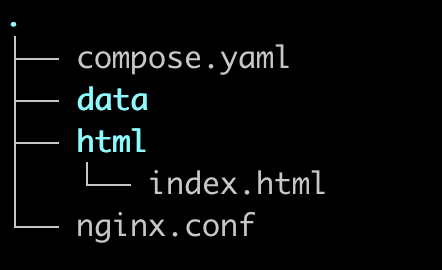
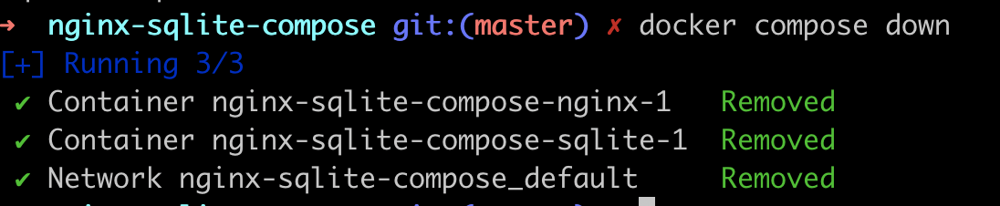

# Tutorial guidé : Docker compose pour Nginx, SQLite et Vue.js


On va construire une application web avec **docker compose**, composée de

- Nginx pour le serveur web
- SQLite pour la base de données
- Vue.js pour le front-end

En plusieurs étapes:

- 1: page static + SQLite en background
- 2: puis initialiser la bdd avec quelques échantillons
- 3: Enfin, afficher les données sur la page

Créez un répertoire pour l'application

```bash
mkdir nginx-sqlite-vue
cd nginx-sqlite-vue
```

Dans ce répertoire créez les repertoire `data` et `html`

```bash
mkdir data
mkdir html
```

## Première version

On souhaite avoir

- une simple page web statique : `index.html` servie par Nginx
- et lancer une base de donnée SQLite (simple et petite) en background

La base de donnée sera vide mais on verra comment y accéder et la peupler de données.

On a besoin des fichiers suivants:

### nginx.conf

```json
events {
    worker_connections 1024;
}

http {
    server {
        listen 80;
        server_name localhost;

        location / {
            root /usr/share/nginx/html;
            index index.html;
        }
    }
}
```

### html/index.html

```html
<h1>Bonjour</h1>
```

Le fichier `index.html` doit être dans le repertoire `./html`

### compose.yaml

et le fichier docker compose à la racine du projet:

```yaml
version: '3.8'

services:
  nginx:
    image: nginx:latest
    ports:
      - "80:80"
    volumes:
      - ./nginx.conf:/etc/nginx/nginx.conf:ro
      - ./html:/usr/share/nginx/html
    depends_on:
      - sqlite

  sqlite:
    image: keinos/sqlite3:latest
    volumes:
      - ./data:/data
    command: /bin/sh -c "while true; do sleep 1; done"

```

Vous devez avoir l'arborescence suivante



Lancez l'application avec

```bash
docker compose up
```

La page <http://localhost:80> doit afficher "Bonjour".

### Revenons sur le fichier `compose.yaml`

Dans le fichier `compose.yaml`.

- 2 services sont déclarés: `nginx` et `sqlite`
- avec comme point de depart les images : `nginx:latest` et `keinos/sqlite3:latest`
- chaque service définit un ou plusieurs volumes en montant un repertoire local sur un repertoire du container:

```yaml
volumes:
    - ./nginx.conf:/etc/nginx/nginx.conf:ro
    - ./html:/usr/share/nginx/html
```

Dans les 2 cas on a le repertoire local (host) à gauche et celui du container à droite: **host:container**

Notez le `:ro` ajouté au fichier `/etc/nginx/nginx.conf` pour read only

On a aussi la ligne

```yaml
command: /bin/sh -c "while true; do sleep 1; done"
```

En fait il s'agit la d'un hack pour que le serveur SQLite tourne indéfiniment.

L'image de SQLite  `keinos/sqlite3:latest`  n'est pas faite pour tourner comme un serveur et n'a donc pas de processus principale. Ce hack crée un processus de fond qui toune indéfiniment et qui permet à SQLite de rester vivant.

On pourrait aussi utiliser comme commande `command: tail -f /dev/null` à la place de `/bin/sh -c "while true; do sleep 1; done"`.

Enfin il y à la ligne **`depends_on`**:

```yaml
depends_on:
    - sqlite
```

qui indique que Nginx ne sera démarré que si SQLITE est déjà activé.

### depends on

La ligne `depends_on`: - sqlite indique que le service nginx dépend du service sqlite. Cette dépendance a plusieurs implications :

- **Ordre de démarrage** : Docker Compose démarrera le service sqlite avant de démarrer le service nginx. Cela garantit que le conteneur sqlite est en cours d'exécution avant que nginx ne tente de démarrer.
- **Ordre d'arrêt** : Lors de l'arrêt des services, Docker Compose arrêtera le service nginx avant d'arrêter le service sqlite.

- **État de préparation** : Il est important de noter que `depends_on` attend uniquement le démarrage du conteneur, et non qu'il soit "prêt" ou entièrement initialisé. Il ne vérifie pas si le service à l'intérieur du conteneur est réellement opérationnel.

- **Commandes Docker Compose** : Lorsque vous exécutez des commandes comme `docker compose up` ou `docker compose stop`, la dépendance sera respectée. Par exemple, `docker compose up nginx` démarrerait également le service sqlite car nginx en dépend.

> Cependant, dans ce cas précis, l'utilité de cette dépendance est discutable car
Le service sqlite, tel qu'il est configuré, n'exécute pas réellement un serveur SQLite.
Il maintient simplement un conteneur en vie avec un sleep. Il n'y a aucune indication claire dans la configuration fournie que le service nginx a réellement besoin ou utilise le service sqlite.


### regardons ce qui tourne

`docker ps` et `docker images` montrent bien les 2 images nginx et sqlite et les 2 processus

```bash
docker ps
CONTAINER ID   IMAGE                   COMMAND                 ...
aa32c7dfd768   nginx:latest            "/docker-entrypoint.…"  ...
122d33c48dec   keinos/sqlite3:latest   "/bin/sh -c 'while t…"  ...
```

On peut executer une commande dans un des containers qui tourne avec

```bash
docker compose exec <nom du service> <commande>
```

On peut par consequent interagir avec la bdd sqlite en se connectant avec

```bash
docker-compose exec sqlite /bin/sh
> sqlite3 /data/your_database.db
```

ou directement

```bash
docker-compose exec sqlite sqlite3 /data/your_database.db
```

puis une fois dans `sqlite`:

```sql
.tables
create table user (id serial, email text);
.tables
```

puis `.quit` pour sortir de sqlite.

On peut aussi accéder au container du service nginx

par exemple

```bash
docker compose exec nginx ls -l /usr/share/nginx/html
```

#### down down down

pour arrêter les containers on fait

```bash
docker compose down
```



La commande down arrête les 2 containers et le réseaux interne.

### Recap

Donc on a un fichier `compose.yaml` qui fait tourner 2 services et donc 2 containers.

Mais pour l'instant la partie web n'utilise pas la base de données.

Donc étape 2 : on veut initializer la bdd sqlite avec des données

## Version avec des données

Il nous faut executer un script SQL pour créer la table, et y insérer des rows

dans un fichier `init.sql` dans le repertoire racine du projet

```sql
CREATE TABLE IF NOT EXISTS users (
    id INTEGER PRIMARY KEY AUTOINCREMENT,
    name TEXT NOT NULL,
    email TEXT UNIQUE NOT NULL,
    created_at DATETIME DEFAULT CURRENT_TIMESTAMP
);

INSERT INTO users (name, email) VALUES ('John Doe', 'john@example.com');
INSERT INTO users (name, email) VALUES ('Jane Smith', 'jane@example.com');
```

Il faut ensuite modifier le compose.yaml et plus particulièrement la partie volume et commande de sqlite

```yaml
volumes:
    - ./data:/data
    - ./init.sql:/init.sql
command: >
    /bin/sh -c "
      sqlite3 /data/mydatabase.db < /init.sql &&
      while true; do sleep 1; done
    "
```

ou le symbol `>` après `command` indique un texte sur plusieurs lignes.

On peut alors verifier que la bdd n'est plus vide

1. connection

```bash
docker compose exec sqlite sqlite3 /data/mydatabase.db
```

Puis

```sql
.tables
select * from users;
```

`.quit` pour sortir.

### 3 ieme version : lister les users sur la page

On va utiliser vue.js

Mettons en place une interface simple utilisant Vue.js pour afficher le contenu de la base de données SQLite sur la page index.html. Nous devrons apporter quelques modifications à notre configuration existante :

- Mettre à jour la configuration Nginx pour autoriser les requêtes API.
- Ajouter un nouveau service pour un serveur API simple afin de récupérer les données depuis SQLite.
- Mettre à jour le fichier index.html pour inclure Vue.js et afficher les données.


Commençons par mettre à jour notre fichier Docker Compose :

```yaml
services:
  nginx:
    image: nginx:latest
    ports:
      - "80:80"
    volumes:
      - ./nginx.conf:/etc/nginx/nginx.conf:ro
      - ./html:/usr/share/nginx/html
    depends_on:
      - api

  sqlite:
    image: keinos/sqlite3:latest
    volumes:
      - ./data:/data
      - ./init.sql:/docker-entrypoint-initdb.d/init.sql
    command: /bin/sh -c "sqlite3 /data/mydatabase.db < /docker-entrypoint-initdb.d/init.sql && while true; do sleep 1; done"

  api:
    build: ./api
    volumes:
      - ./data:/app/data
    environment:
      - DATABASE_PATH=/app/data/mydatabase.db

volumes:
  data:

```

Mettons a jours la config Nginx

```yaml
events {
    worker_connections 1024;
}

http {
    server {
        listen 80;
        server_name localhost;

        location / {
            root /usr/share/nginx/html;
            index index.html;
        }

        location /api {
            proxy_pass http://api:5000;
            proxy_set_header Host $host;
            proxy_set_header X-Real-IP $remote_addr;
        }
    }
}

```

Et créons une API Flask pour servir les données

```python
from flask import Flask, jsonify
import sqlite3
import os

app = Flask(__name__)

DATABASE_PATH = os.environ.get('DATABASE_PATH', '/app/data/mydatabase.db')

def get_db_connection():
    conn = sqlite3.connect(DATABASE_PATH)
    conn.row_factory = sqlite3.Row
    return conn

@app.route('/api/users')
def get_users():
    conn = get_db_connection()
    users = conn.execute('SELECT * FROM users').fetchall()
    conn.close()
    return jsonify([dict(user) for user in users])

if __name__ == '__main__':
    app.run(host='0.0.0.0', port=5000)

```

Le Dockerfile pour le service API est :


```dockerfile
FROM python:3.9-slim

WORKDIR /app

COPY requirements.txt .
RUN pip install --no-cache-dir -r requirements.txt

COPY app.py .

CMD ["python", "app.py"]

```

Un fichier `requirements.txt`:

```text
Flask==2.0.1

```

et on mets a jour le fichier `inex.html` pour inclure vue.js et afficher les données.

```html
<!DOCTYPE html>
<html lang="en">
<head>
    <meta charset="UTF-8">
    <meta name="viewport" content="width=device-width, initial-scale=1.0">
    <title>User List</title>
    <script src="https://cdn.jsdelivr.net/npm/vue@2.6.14/dist/vue.js"></script>
    <script src="https://cdn.jsdelivr.net/npm/axios/dist/axios.min.js"></script>
</head>
<body>
    <div id="app">
        <h1>User List</h1>
        <ul>
            <li v-for="user in users" :key="user.id">
                {{ user.name }} ({{ user.email }})
            </li>
        </ul>
    </div>

    <script>
        new Vue({
            el: '#app',
            data: {
                users: []
            },
            mounted() {
                axios.get('/api/users')
                    .then(response => {
                        this.users = response.data;
                    })
                    .catch(error => {
                        console.error('Error fetching users:', error);
                    });
            }
        });
    </script>
</body>
</html>

```

Now, let's go through the steps to set up and run this updated configuration:

1. Update your project structure:

   ```
   nginx-sqlite-project/
   ├── docker-compose.yml
   ├── nginx.conf
   ├── init.sql
   ├── html/
   │   └── index.html
   ├── data/
   └── api/
       ├── Dockerfile
       ├── app.py
       └── requirements.txt
   ```

2. Create all the files mentioned above with their respective contents.

3. Run the Docker Compose file:

```bash
docker-compose up --build -d
```

This setup does the following:

- Creates an Nginx service that serves the front-end and proxies API requests.
- Creates a SQLite service that initializes the database.
- Creates an API service using Flask to serve data from the SQLite database.
- The front-end uses Vue.js to fetch and display data from the API.

You can now access your application at `http://localhost`. You should see a list of users fetched from the SQLite database.

Remember to stop the services when you're done:

```bash
docker compose down
```

This setup provides a full-stack application with a Vue.js front-end, a Flask API, and a SQLite database, all orchestrated with Docker Compose. The front-end fetches data from the API, which in turn queries the SQLite database and returns the results.
