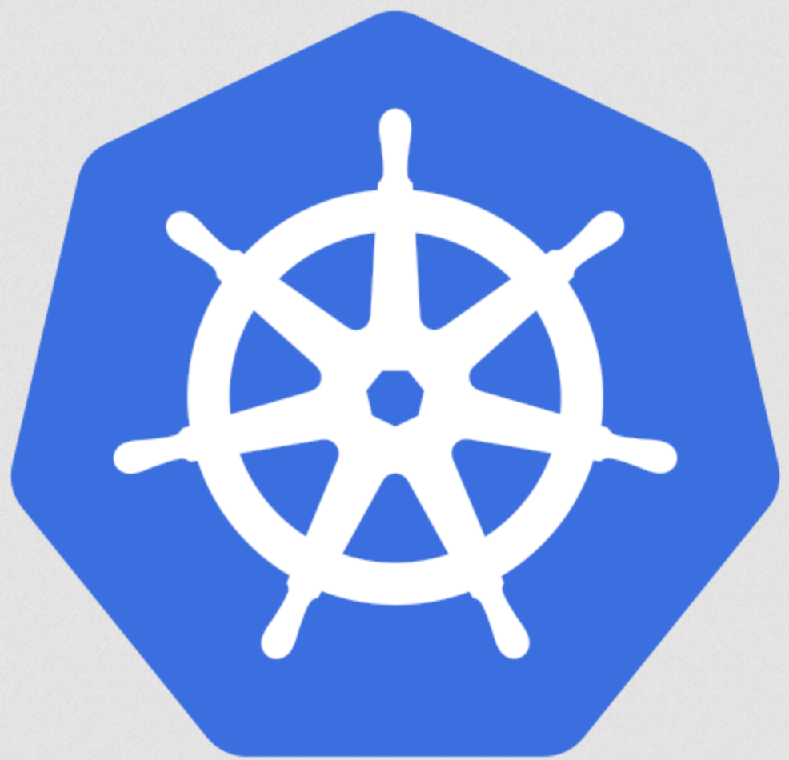
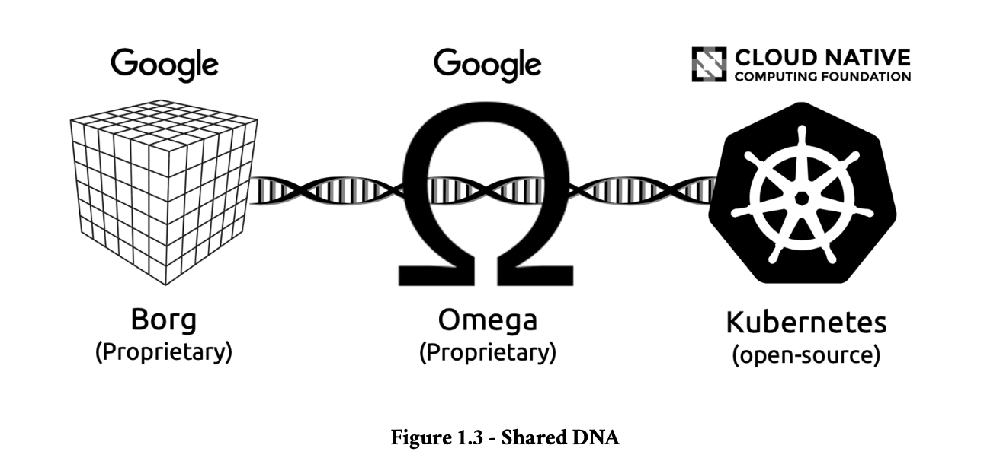
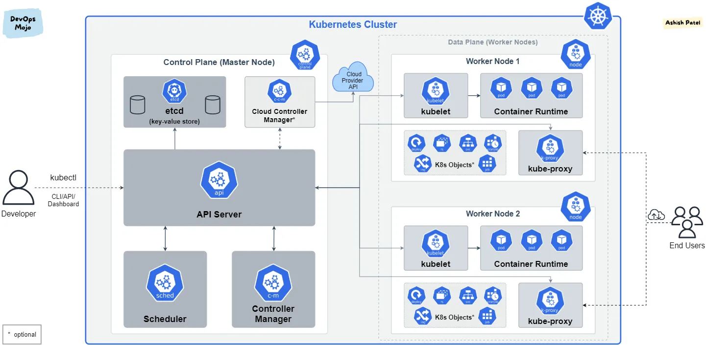

# Kubernetes

## A quoi ca sert

Kubernetes est un outil d'orchestration de containers.

img : chef d'orchestre

Kubernetes a été inventé par Google en 2014 pour s'affranchir de la plateforme d'hébergement (hosting) d'une application.
Cela permet a une entreprise d'héberger ses services sur n'importe quel fournisseur : GCP, AWS, DO, ...

quand

- Docker permet de faire tourner une application **multi containers** sur n'importe quelle machine,

alors

- K8s permet faire tourner une application décentralisée **multi-serveurs** sur n'importe quel fournisseur cloud.

> Kubernetes permet de s'abstraire de l'infrastructure d'hébergement (*it abstracts infrastructure*)

K8s apporte des fonctionnalités importantes en plus de la gestion des containers:

- déploiement zéro temps d'arrêt (*zero downtime*)
- **auto scaling** en fonction de la demande
- **self-healing**: auto reparation des éléments qui plantent

Avec Kubernetes on passe d'une application

- docker : mono container
- docker compose : multi containers
- Kubernetes : multi containers + multi serveurs  / multi cloud + [self heal + auto scaling + zéro temps d'arrêt]

img : single soyouz / fleet of satellites / star trek armada

### origine du mot Kubernetes

Kubernetes vient du grecque et veut dire timonier (*helmsman*): le pilote à la roue du bateau. D'ou le logo qui est une roue de bateau



K8s = Kubernetes est une evolution des outils interne à Google de gestion des containers a grande échelle : Borg et Omega



- pourquoi l'appli [Borg](https://research.google/pubs/large-scale-cluster-management-at-google-with-borg/) est un [cube](https://headhuntersholosuite.fandom.com/wiki/Borg_Cube) ?
- pourquoi 7 branches dans la roue ? [7 of 9](https://screenrant.com/seven-of-nine-star-trek-worst-things-happened/)

## Principe

## Usages et fonctionnalités

Quand passer de Docker à Kubernetes ?

### Scaling et high availability / haute disponibilité

Docker Compose ne sait pas fournir

- scaling automatique en fonction de la demande (load)
- déploiements sans interruption: zéro temps d'arrêt
- Plusieurs instances déployées sur plusieurs machines
- un failover automatique en cas de panne

Kubernetes est utile quand on a besoin de

- gérer des applications déployées sur plusieurs serveurs/régions
- de load balancing/ répartition de charge entre les serveurs
- de gestion automatique des pannes avec récupération
- Un scaling automatique basée sur des métriques
- Une utilisation efficace des ressources entre machines

De même, il vaut mieux passer à Kubernetes quand plusieurs équipes doivent déployer de manière indépendante.

et de plus Kubernetes devient indispensable si on a besoin de

- Service discovery avancée
- Gestion automatique des certificats SSL/TLS
- Règles de routage complexes (Ingress)
- Scheduling des containers sur plusieurs nodes
- Gestion des ressources GPU
- Politiques de réseau avancées

Par contre il vaut mieux rester avec Docker simple lorsque

- Le déploiement est sur un seul serveur
- L'application est relativement simple
- L'équipe est petite
- Pas besoin d'orchestration avancée
- Les besoins en scaling sont minimes
- La complexité opérationnelle doit être réduite


Docker Compose suffit :

- Petite application web + base de données
- Environnements de développement
- Micro-services simples (2-3 services)
- Déploiements sur serveur unique
- Équipe de 1-5 développeurs

Kubernetes devient nécessaire :

- Plateforme e-commerce avec plusieurs services
- Application globale avec déploiements par région
- Applications nécessitant une disponibilité de 99,99%
- Architecture de micro-services avec 10+ services
- Équipe de 10+ développeurs travaillant sur différents composants

### zero downtime

Un focus sur un des points forts de Kubernetes dans une problématique de déploiement

Pour une application typique basée sur Docker, sans Kubernetes, voici ce qui peut se passer lors d’un déploiement :

- Cycle d’arrêt et de démarrage (*Stop and Start Cycle*) :  il faut généralement arrêter le conteneur existant et en démarrer un nouveau avec le code mis à jour. Cette séquence stop + start peut entraîner un court temps d'arrêt, l'application étant offline pendant la transition.

- Absence de mises à jour progressives (*Rolling Updates*) : Docker n’a pas de support intégré pour les mises à jour progressives. Donc, lors du déploiement d’un nouveau conteneur, on remplace soit immédiatement l’ancien conteneur (ce qui provoque un temps d'arrêt), soit on lance un nouveau conteneur séparément. Cela signifie aussi qu’il n’y a pas de transition en douceur entre les anciennes et les nouvelles versions.

Kubernetes, en revanche, est conçu spécifiquement pour gérer ces transitions :

- **Mises à jour progressives** (*Rolling Updates*) : Kubernetes permet des mises à jour progressives, qui remplacent progressivement les anciennes instances de l’application par les nouvelles. Cela signifie que Kubernetes peut servir le trafic à partir de l’ancienne version pendant l’initialisation de la nouvelle, garantissant qu’aucune requête n’est perdue.
- **Vérifications de santé** (health checks) et sondes de disponibilité (readiness probes) : Kubernetes possède des health checks qui empêchent le trafic d’atteindre les conteneurs tant qu’ils ne sont pas totalement prêts. Donc seules les instances operationnelles servent les requêtes lors d’un déploiement => pas de temps d'arrêt.
- **Routage du trafic** : Dans Kubernetes, la couche Service gère le routage du trafic. Lors d’un déploiement, Kubernetes contrôle quelles instances de Pods reçoivent le trafic, permettant une transition fluide entre les versions.

En résumé, l’architecture Kubernetes garantit zéro temps d'arrêt en maintenant les instances actives et en routant le trafic intelligemment, alors que les déploiements avec des configurations Docker basiques manquent de ces mécanismes intégrés, entraînant souvent de courts temps d'arrêt lors des mises à jour.

## Structure de base d'un cluster Kubernetes

Brut!


By Khtan66 - Own work, CC BY-SA 4.0, https://commons.wikimedia.org/w/index.php?curid=53571935

Voir aussi:


https://medium.com/devops-mojo/kubernetes-architecture-overview-introduction-to-k8s-architecture-and-understanding-k8s-cluster-components-90e11eb34ccd

Les briques de bases sont : **pods**, **worker nodes** et **plane control**

### **Pods** (Pensez : Docker containers+)

- La plus petite unité dans Kubernetes.
- Similaire aux Docker containers, mais peut contenir plusieurs containers.

Exemple : Un container d'application web et son container de logs dans un même pod.

### **Nodes** (Pensez : Docker hosts)

- les machines physiques ou virtuelles qui exécutent les pods.
- Similaires aux Docker hosts, mais gérés par Kubernetes.

Chaque node exécute :

  - un runtime container (comme Docker) `containerd`
  - `Kubelet` (agent qui gère le node)
  - `Kube-proxy` (proxy réseau)

> Un runtime comme `containerd` manage le cycle de vie des containers: création,  démarrage, arrêt et suppression des containers, ainsi que la gestion des opérations de bas niveau nécessaires pour les exécuter.

### **Cluster**

- Groupe de nodes gérés ensemble.
- Composé de :
  - Control plane (master nodes)
  - Worker nodes (où les pods s'exécutent)

### **Deployments** (Pensez : Docker Compose services, mais plus puissant)

- Définit combien de répliques de votre pod doivent s'exécuter.
- Gère les mises à jour et les rollbacks.
- Auto-réparation : redémarre automatiquement les pods en échec.

### **Services** (Pensez : Docker Compose network settings)

- Fournit un réseau stable pour les pods.

###  **ConfigMaps & Secrets** (Pensez : Docker environment variables et secrets)

###  **Volumes** (Pensez : Docker volumes)

- Similaires aux Docker volumes mais avec plus d'options.
- Peuvent être éphémères ou persistants.
- Plusieurs backends de stockage supportés.

### **Namespaces**

- Moyen d’organiser les ressources.
- Comme avoir plusieurs projets Docker Compose.
- Fournit une isolation entre les équipes/projets.

## Le manifest

Dans Kubernetes, le fichier **manifest** est le document de configuration qui définit l’état souhaité d'une application et la charge de travail (workload).

### **Configuration Déclarative**

- Kubernetes suit un **modèle déclaratif** : on décrit l’état souhaité dans un manifest, et Kubernetes s’occupe d’atteindre cet état. C'est la même logique pour [Terraform](https://www.terraform.io/) : Infrastructure as Code (IaC)
- Le manifest spécifie les ressources: Pods, Deployments, Services, ConfigMaps, PersistentVolumeClaims, et leurs paramètres

- **Gestion des Ressources** : Les manifests définissent les ressources Kubernetes
  - **Pods** : Groupes de conteneurs.
  - **Deployments** : Gestion et scaling des Pods.
  - **Services** : Configuration de l’accès réseau.
- **ConfigMaps et Secrets** : Stockage sécurisé de configurations et informations sensibles.

En définissant ces ressources, le manifest facilite la gestion complète du cycle de vie de l'application : scaling, mises à jour, et self-healing.

- **Contrôle de Version** : fichiers en YAML ou JSON, contrôle de version avec Git
  - cohérence de la configuration entre différents environnements (développement, staging, production).
  - rollback, blame, etc

- **Portabilité, Automatisation**: Les manifests rendent les applications portables et déployables sur différents clusters Kubernetes. automatisation dans des pipelines CI/CD, pour déployer automatiquement des applications après chaque modification.

Kubernetes utilise le manifest pour comprendre **l'état souhaité** (desired state) de l’application (nombre de réplicas, versions des images, allocations de ressources, etc.). Le **Kubernetes Controller** surveille le cluster pour garantir que l’état en cours correspond à celui qui est défini dans le manifest. Si des écarts se produisent (ex. crash de Pods), Kubernetes prend des mesures correctives. => self-healing


### Exemple de fichier Manifest

Exemple de manifest pour un Deployment Kubernetes :

```yaml
apiVersion: apps/v1
kind: Deployment
metadata:
  name: nginx-deployment
  labels:
    app: nginx
spec:
  replicas: 3
  selector:
    matchLabels:
      app: nginx
  template:
    metadata:
      labels:
        app: nginx
    spec:
      containers:
      - name: nginx
        image: nginx:1.14.2
        ports:
        - containerPort: 80
```

Ce fichier définit un déploiement  `nginx-deployment`, avec trois `replicas` d’un conteneur `nginx` exposant le port 80.

Une **replica** désigne le nombre d'instances (copies) d'un Pod que l'on souhaite faire fonctionner à un moment donné. Cela est particulièrement utile pour garantir une haute disponibilité et une tolérance aux pannes de l'application.

## Résumé

Les manifests sont fondamentaux dans Kubernetes. Ils agissent comme des plans pour déployer, gérer et scaler les ressources dans un cluster. Ils permettent une gestion déclarative de l'infrastructure, soutiennent l'automatisation, facilitent la collaboration via le contrôle de version, et aident Kubernetes à maintenir l’état souhaité des applications.


