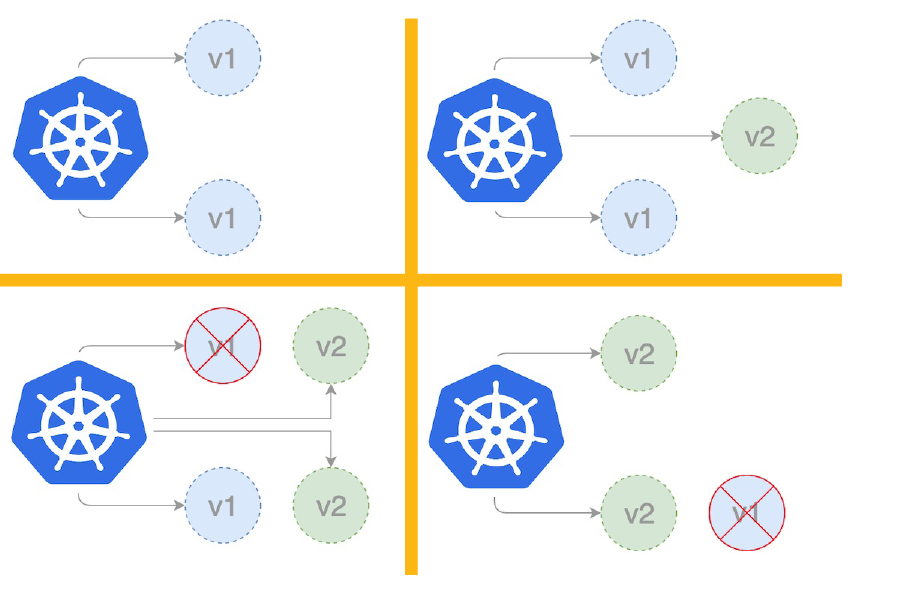
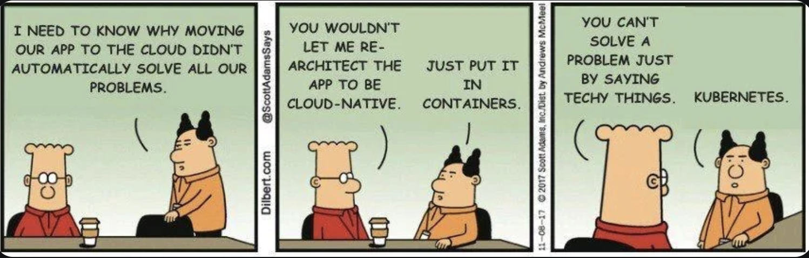
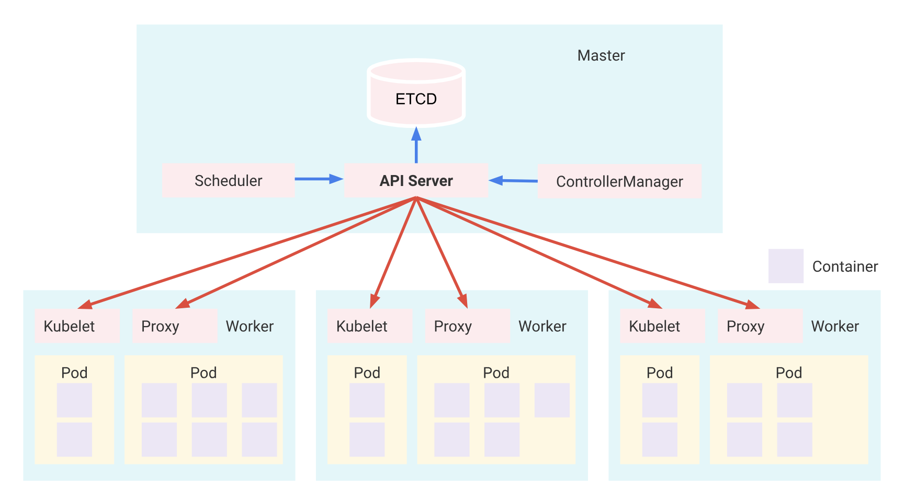

# Kubernetes

## A quoi ca sert

Kubernetes est un outil d'orchestration de containers.

img : chef d'orchestre

Kubernetes a été inventé par Google en 2014 pour s'affranchir de la plateforme d'hébergement (hosting) d'une application.

Cela permet a une entreprise d'héberger ses services sur n'importe quel fournisseur : GCP, AWS, DO, ...

Quand :

- Docker permet de faire tourner une application **multi containers** sur n'importe quelle machine,

Alors :

- Kubernetes permet faire tourner une application décentralisée **multi-serveurs** sur n'importe quel fournisseur cloud.

> On dit que Kubernetes permet de s'abstraire de l'infrastructure d'hébergement (*it abstracts infrastructure*)

Kubernetes est conçu comme un **cluster** de machines hautement disponibles. Ces machines sont connectées pour travailler comme une seule. Cette **abstraction** permet de déployer des applications sans penser aux machines spécifiques sur lesquelles elles doivent fonctionner.

### et en plus

K8s apporte des fonctionnalités importantes en plus de la gestion des containers:

- déploiement zéro temps d'arrêt (*zero downtime*)
- **auto scaling** en fonction de la demande
- **self-healing**: auto reparation des éléments qui plantent

Avec Kubernetes on passe d'une application

- docker : mono container
- docker compose : multi containers
- Kubernetes : multi containers sur multi serveurs / multi cloud
  - + [self healing + auto scaling + zéro temps d'arrêt]

### origine du mot Kubernetes

Kubernetes vient du grecque et veut dire timonier (*helmsman*): le pilote à la roue du bateau. D'ou le logo qui est une roue de bateau


K8s = Kubernetes est une evolution des outils interne à Google de gestion des containers a grande échelle : Borg et Omega


## Quand passer de Docker à Kubernetes ?

Il vaut mieux rester avec Docker ou docker compose lorsque l'application est relativement simple et l''équipe est petite:

- Le déploiement est sur un seul serveur
- Pas besoin d'orchestration avancée
- Les besoins en scaling sont minimes
- La complexité opérationnelle doit être réduite

Mais Docker Compose ne sait pas fournir

- scaling automatique en fonction de la demande (load)
- déploiements sans interruption: zéro temps d'arrêt
- Plusieurs instances déployées sur plusieurs machines de façon automatique
- un failover / récupération automatique en cas de panne (le self healing)

Docker Compose suffit :

- Petite application web + base de données
- Environnement de développement
- Micro-services simples (2-3 services)
- Déploiements sur serveur unique
- Équipe de 1-5 développeurs


### Passer à Kubernetes

Kubernetes est utile quand on a besoin de

- gérer des applications déployées sur plusieurs serveurs (régions)
- de load balancing/ répartition de charge entre les serveurs
- de gestion automatique des pannes avec récupération
- Un scaling automatique basée sur des métriques
- Une utilisation efficace des ressources entre machines

et Kubernetes devient indispensable si on a besoin de

- Service discovery avancée (on y revient plus loin)
- Gestion automatique des certificats SSL/TLS
- Gestion des ressources
- Règles de routage complexes (Ingress)
- Scheduling des containers sur plusieurs nodes


Exemple d'applications pour lesquelles Kubernetes devient nécessaire :

- Plateforme e-commerce avec plusieurs services
- Application globale avec déploiements par région
- Applications nécessitant une disponibilité de 99,99%
- Architecture de micro-services avec 10+ services
- Équipe de 10+ développeurs travaillant sur différents composants

Voici un très bon article sur Kubernetes

<https://wiki.sfeir.com/kubernetes/>


## Déploiement sans temps mort

Pour une application typique basée sur Docker, sans Kubernetes,  il faut généralement arrêter le conteneur existant et en démarrer un nouveau avec le code mis à jour. Cette séquence stop + start peut entraîner un court temps d'arrêt, l'application étant offline pendant la transition.

- Absence de mises à jour progressives (*Rolling Updates*) : Docker n’a pas de support intégré pour les mises à jour progressives. Donc, lors du déploiement d’un nouveau conteneur, on remplace soit immédiatement l’ancien conteneur (ce qui provoque un temps d'arrêt), soit on lance un nouveau conteneur séparément et on switch.

Kubernetes, en revanche, est conçu spécifiquement pour gérer ces transitions **en douceur**:

- **Mises à jour progressives** (*Rolling Updates*) : Kubernetes permet des mises à jour progressives, qui remplacent progressivement les anciennes instances de l’application par les nouvelles. Cela signifie que Kubernetes peut servir le trafic à partir de l’ancienne version pendant l’initialisation de la nouvelle, garantissant qu’aucune requête n’est perdue.
- **Vérifications de santé** (health checks) et sondes de disponibilité (readiness probes) : Kubernetes possède des health checks qui empêchent le trafic d’atteindre les conteneurs tant qu’ils ne sont pas totalement prêts. Donc seules les instances opérationnelles servent les requêtes lors d’un déploiement => pas de temps d'arrêt.
- **Routage du trafic** : Dans Kubernetes, la couche Service gère le routage du trafic. Lors d’un déploiement, Kubernetes contrôle quelles instances de Pods reçoivent le trafic, permettant une transition fluide entre les versions.

### Rolling Updates - Mises à jour progressives

Au lieu de tout mettre à jour d'un coup, Kubernetes met à jour les pods un par un (ou par petit groupe)
et l'application reste disponible pendant la mise à jour

Imaginons que vous avez 4 pods de version v1. Vous voulez passer à la version v2

Kubernetes va :

1. Créer 1 nouveau pod v2
2. Attendre qu'il soit prêt
3. Supprimer 1 ancien pod v1
4. Répéter jusqu'à ce que tous les pods soient en v2

Avantages :

- Zéro temps d'arrêt
- Possibilité de revenir en arrière en cas de problème
- et Contrôle du rythme de mise à jour





> En résumé, l’architecture Kubernetes garantit zéro temps d'arrêt en maintenant les instances actives et en routant le trafic intelligemment, alors que les déploiements avec des configurations Docker basiques manquent de ces mécanismes intégrés, entraînant souvent de courts temps d'arrêt lors des mises à jour.




## Structure de base d'un cluster Kubernetes


By Khtan66 - Own work, CC BY-SA 4.0, https://commons.wikimedia.org/w/index.php?curid=53571935

Voir aussi:


https://medium.com/devops-mojo/kubernetes-architecture-overview-introduction-to-k8s-architecture-and-understanding-k8s-cluster-components-90e11eb34ccd

et




Les elements d'un cluster Kubernetes  sont : **pods**, **worker nodes** et **plane control**

- Le master (plane control), qui est la tour de contrôle, il est composé d’un ou plusieurs noeuds / nodes.
- Les workers nodes, qui hébergent les Pods.
- Les Pods sont constitués de conteneurs.

### **Nodes**

Un noeud peut être une machine virtuelle ou une machine physique. Chaque noeud contient les services nécessaires à l’exécution des pods et est géré par le ou les masters.

Chaque noeud (master ou worker) exécute :

- un runtime container (comme Docker) `containerd`
- `Kubelet` (agent qui gère le node)
- `Kube-proxy` (proxy réseau)

> Un runtime comme `containerd` manage le cycle de vie des containers: création,  démarrage, arrêt et suppression des containers, ainsi que la gestion des opérations de bas niveau nécessaires pour les exécuter.

Pensez-y comme un restaurant :

* Master Node = chef du restaurant (qui prend les décisions)
* Worker Nodes = Personnel de cuisine (qui fait le vrai travail)

Quand on dit "node" sans précision, on parle généralement d'un "worker node"

### plane control (master node)

Le rôle du master est de piloter le fonctionnement du cluster Kubernetes.

Il exécute un serveur d’API, un scheduler, divers contrôleurs et un système de stockage pour conserver l’état du cluster et la configuration réseau.

```bash
Master Node
├── Container Runtime (containerd)
│   └── Runs control plane containers:
│       ├── kube-apiserver
│       ├── kube-scheduler
│       ├── kube-controller-manager
│       └── etcd
├── kubelet
│   └── Manages these control plane containers
└── kube-proxy
    └── Handles networking rules
```

Le Master Node (Plan de Contrôle) :

* Agit comme le cerveau du cluster
* Prend les décisions globales concernant le cluster
* Gère la planification (scheduling)
* Détecte et répond aux événements du cluster


### Workers node

Les workers de Kubernetes sont les noeuds en charge de l’exécution des applications


```bash
Kubernetes Cluster
├── Master Node (Control Plane)
│   ├── API Server
│   ├── Scheduler
│   ├── Controller Manager
│   └── etcd
└── Worker Nodes
    ├── kubelet
    ├── kube-proxy
    └── Container Runtime (Docker/containerd)
```

Un Worker Node :

- Exécute les applications réelles (pods)
- Effectue la charge de travail réelle
- Fait des rapports au master node
- Peut être ajouté/supprimé selon les besoins


### **Pods** (Pensez : Docker containers+)

Un Pod est la plus petite unité déployable dans Kubernetes.

Un Pod :

- Peut contenir un ou plusieurs conteneurs
- Les conteneurs dans un Pod partagent :
  - Même adresse IP
  - Même espace de stockage
  - Même cycle de vie

Voici un exemple simple d'un Pod :

```yaml
apiVersion: v1
kind: Pod
metadata:
  name: mon-application
spec:
  containers:
  - name: app-container
    image: nginx:latest
    ports:
    - containerPort: 80
```

Un pod est :

- Éphémère (peut être détruit/recréé à tout moment)
- Toujours programmé sur un seul Node
- Obtient une IP unique dans le cluster
- Peut mourir et être remplacé (nouvelle IP)

Un Pod est comme une équipe de travail dans un bureau partagé (node) où plusieurs personnes (containers) travaillent ensemble

Pensez-y comme  :

- L'équipe (Pod) travaille toujours au même endroit
- Les membres de l'équipe (conteneurs) partagent les mêmes ressources
- Si l'équipe change de bureau, elle reste ensemble

Par exemple :

- Application web + cache
- Application + collecteur de logs
- Application principale + conteneur auxiliaire (sidecar)

#### Replicas

Un Replica est une copie identique d'un Pod qui permet d'avoir plusieurs instances d'une même application

Les Replicas sont Gérés par un `ReplicaSet` ou un `Deployment`

1. Exemple de configuration :
```yaml
apiVersion: apps/v1
kind: Deployment
metadata:
  name: mon-app
spec:
  replicas: 3    # Ici on demande 3 copies identiques
  selector:
    matchLabels:
      app: mon-app
  template:
    metadata:
      labels:
        app: mon-app
    spec:
      containers:
      - name: nginx
        image: nginx:latest
```

Avantages des Replicas :

- Haute disponibilité
- Répartition de charge
- Tolérance aux pannes
- Mise à l'échelle facile

1. Commandes utiles :

```bash
# Modifier le nombre de replicas
kubectl scale deployment mon-app --replicas=5

# Voir l'état des replicas
kubectl get deployment mon-app

# Voir les pods (replicas) en cours d'exécution
kubectl get pods
```

Scénarios d'utilisation :

- Trafic élevé → augmenter les replicas
- Maintenance → garder le service actif
- Mise à jour progressive → remplacer les replicas un par un
- Économie de ressources → réduire les replicas la nuit


#### outils utilisés par un pod

Les pods dans Kubernetes utilisent plusieurs outils essentiels.

- Runtime Container : `containerd` (le plus courant aujourd'hui) (historiquement  Docker), ou CRI-O, podman qui gère:
  - L'exécution des conteneurs
  - La gestion des images
  - L'isolation des ressources

- Outils de Networking qui gèrent :
  - La communication entre pods
  - L'attribution des IPs
  - Les règles de réseau

```
├── CNI (Container Network Interface)
│   ├── Calico
│   ├── Flannel
│   ├── Weave
│   └── Cilium
```

- Outils de gestion de Stockage

```
├── CSI (Container Storage Interface)
│   ├── AWS EBS
│   ├── Azure Disk
│   ├── GCE PD
│   └── Local Storage
```

- Outils de Surveillance :
  - cAdvisor : metriques des conteneurs
  - Liveness probes : vérification santé
  - Readiness probes : vérification disponibilité
  - Startup probes : vérification démarrage

Un exemple de configuration :

```yaml
apiVersion: v1
kind: Pod
metadata:
  name: mon-pod
spec:
  containers:
  - name: app
    image: nginx
    livenessProbe:
      httpGet:
        path: /health
        port: 80
    volumeMounts:
    - name: data
      mountPath: /data
  volumes:
  - name: data
    persistentVolumeClaim:
      claimName: mon-pvc
```

- Outils de Logging :
  - stdout/stderr
  - Fluentd
  - Logrotate
  - Journald

Pensez-y comme une maison 🏡 :

- Runtime : Système électrique 🔌
- Network : Plomberie 🚰
- Storage : Rangements 🛍️
- Monitoring : Alarmes et capteurs 🌡️

### **Deployments** (Pensez : Docker Compose services, mais plus puissant)

- Définit combien de répliques de votre pod doivent s'exécuter.
- Gère les mises à jour et les rollbacks.
- Auto-réparation : redémarre automatiquement les pods en échec.

Un Deployment est un objet qui gère des `ReplicaSet` pour

- déployer et mettre à jour des applications
- Gèrer automatiquement les pods
- Garantir la disponibilité de l'application

1. Structure basique :
```yaml
apiVersion: apps/v1
kind: Deployment
metadata:
  name: mon-app
spec:
  replicas: 3
  selector:
    matchLabels:
      app: mon-app
  template:
    metadata:
      labels:
        app: mon-app
    spec:
      containers:
      - name: mon-container
        image: nginx:1.19
```

Les fonctionnalités  principales du module de deploiement sont :

- Scaling (mise à l'échelle)
  * `kubectl scale deployment mon-app --replicas=5`
- Rolling Updates (mises à jour progressives)
- Rollback (retour arrière)
  * `kubectl rollout undo deployment/mon-app`
- Auto-réparation


On peut definir une stratégie de mise à jour avec

```yaml
spec:
  strategy:
    type: RollingUpdate
    rollingUpdate:
      maxSurge: 1        # Pods supplémentaires max
      maxUnavailable: 1  # Pods indisponibles max
```

Par analogie, pensez à une équipe de serveurs dans un restaurant :

- Le Deployment est le manager
- Les ReplicaSets sont les équipes
- Les Pods sont les serveurs individuels
- Si un serveur est malade (pod crash), il est remplacé
- Pendant les heures de pointe, on peut ajouter plus de serveurs (scaling)

Quelques commandes utiles :

```bash
# Créer un deployment
kubectl create deployment mon-app --image=nginx

# Voir le statut
kubectl get deployment

# Voir l'historique
kubectl rollout history deployment/mon-app

# Mettre à jour l'image
kubectl set image deployment/mon-app nginx=nginx:1.20
```


### **Services** (Pensez : Docker Compose network settings)

Un Service définit un ensemble logique de pods

- Fournit un point d'accès réseau stable (IP stable & nom de domaine DNS `mon-service.namespace.svc.cluster.local`)
- Agit comme un équilibreur de charge / load balancer
- Permet la communication entre les pods


Il y a différents types de services:

- **ClusterIP** (par défaut): Accès interne au cluster uniquement
- **NodePort**: Expose le service sur l'IP de chaque Node
- **LoadBalancer**: Expose le service à l'extérieur et utilise le load balancer du cloud provider
- **ExternalName**: Mappe le service vers un nom DNS externe


Exemple simple de déclaration de service :

```yaml
apiVersion: v1
kind: Service
metadata:
  name: mon-service
spec:
  type: ClusterIP
  selector:
    app: mon-app
  ports:
    - protocol: TCP
      port: 80        # Port du Service
      targetPort: 8080 # Port du Pod
```

- Découverte de services


Par analogies pensez à un service comme à l'accueil d'une entreprise :

- Les visiteurs (requêtes) passent par l'accueil (Service)
- L'accueil les dirige vers les employés disponibles (Pods)
- Si un employé change de bureau (Pod redémarre), l'accueil sait toujours comment le joindre


### Découverte de services / Service Discovery

Les Pods (conteneurs) dans Kubernetes peuvent apparaître et disparaître et leurs adresses IP peuvent aussi changer

Mais les applications ont besoin d'un moyen fiable pour se trouver et communiquer entre elles

La Découverte de Services (Service Discovery) dans Kubernetes fonctionne comme un annuaire  / mapping

- Kubernetes attribue un nom fixe à chaque Service
- Les applications peuvent utiliser ce nom au lieu de mémoriser des adresses IP
- Kubernetes maintient automatiquement la liste des pods en bon état derrière chaque service

Voici un exemple simple :

```yaml
# Un service nommé 'database'
apiVersion: v1
kind: Service
metadata:
  name: database
spec:
  selector:
    app: mysql
  ports:
    - port: 3306
```

Quand d'autres applications veulent se connecter à la base de données, elles utilisent simplement :

```bash
database.default.svc.cluster.local
```

ou simplement `database` dans le même `namespace`.

Pensez-y comme à une commande de pizza 🍕🍕🍕 :

- Vous n'avez pas besoin de connaître le numéro de téléphone 📲 du livreur spécifique 🛵
- Vous avez juste besoin du nom de la pizzeria
- La pizzeria s'occupe de trouver un livreur disponible
- De la même façon, Kubernetes s'occupe de trouver le bon **pod** pour votre requête


###  **Volumes** (Pensez : Docker volumes)

- Similaires aux Docker volumes mais avec plus d'options.
- Peuvent être éphémères ou persistants.
- Plusieurs backends de stockage supportés.

### **Namespaces**

- Moyen d’organiser les ressources.
- Comme avoir plusieurs projets Docker Compose.
- Fournit une isolation entre les équipes/projets.

## Le manifest

Dans Kubernetes, le fichier **manifest** est le document de configuration qui définit l’état souhaité d'une application et la charge de travail (workload).

### **Configuration Déclarative**

Kubernetes suit un **modèle déclaratif** : on décrit l’état souhaité dans un manifest, et Kubernetes s’occupe d’atteindre cet état. C'est la même logique pour [Terraform](https://www.terraform.io/) : Infrastructure as Code (IaC)

Le **manifest** spécifie les ressources: Pods, Deployments, Services, ConfigMaps, Volume, et leurs paramètres ainsi que les stratégies employées. c'est un fichier yaml =>  contrôle de version avec Git

- **Gestion des Ressources** : Les manifests définissent les ressources Kubernetes
  - **Pods** : Groupes de conteneurs.
  - **Deployments** : Gestion et scaling des Pods.
  - **Services** : Configuration de l’accès réseau.
- **ConfigMaps et Secrets** : Stockage sécurisé de configurations et informations sensibles.

En définissant ces ressources, le manifest facilite la gestion complète du cycle de vie de l'application : scaling, mises à jour, et self-healing.

- **Contrôle de Version** : fichiers en YAML ou JSON, contrôle de version avec Git
  - cohérence de la configuration entre différents environnements (développement, staging, production).
  - rollback, blame, etc

- **Portabilité, Automatisation**: Les manifests rendent les applications portables et déployables sur différents clusters Kubernetes. automatisation dans des pipelines CI/CD, pour déployer automatiquement des applications après chaque modification.

Kubernetes utilise le manifest pour comprendre **l'état souhaité** (desired state) de l’application (nombre de réplicas, versions des images, allocations de ressources, etc.). Le **Kubernetes Controller** surveille le cluster pour garantir que l’état en cours correspond à celui qui est défini dans le manifest. Si des écarts se produisent (ex. crash de Pods), Kubernetes prend des mesures correctives. => self-healing


### Exemple de fichier Manifest

Exemple de manifest pour un Deployment Kubernetes :

```yaml
apiVersion: apps/v1
kind: Deployment
metadata:
  name: nginx-deployment
  labels:
    app: nginx
spec:
  replicas: 3
  selector:
    matchLabels:
      app: nginx
  template:
    metadata:
      labels:
        app: nginx
    spec:
      containers:
      - name: nginx
        image: nginx:1.14.2
        ports:
        - containerPort: 80
```

Ce fichier définit un déploiement  `nginx-deployment`, avec trois `replicas` d’un conteneur `nginx` exposant le port 80.

Une **replica** désigne le nombre d'instances (copies) d'un Pod que l'on souhaite faire fonctionner à un moment donné. Cela est particulièrement utile pour garantir une haute disponibilité et une tolérance aux pannes de l'application.

Les manifests sont fondamentaux dans Kubernetes.

- Ils agissent comme des plans pour déployer, gérer et scaler les ressources dans un cluster.
- Ils permettent une gestion déclarative de l'infrastructure, soutiennent l'automatisation, facilitent la collaboration via le contrôle de version
- Ils aident Kubernetes à maintenir l’état souhaité des applications.


## Conclusion et suite

Avant de passer a la suite et la mise en pratique, 2 questions primordiales

- pourquoi l'appli [Borg](https://research.google/pubs/large-scale-cluster-management-at-google-with-borg/) est un [cube](https://headhuntersholosuite.fandom.com/wiki/Borg_Cube) ?
- pourquoi 7 branches dans la roue ? [7 of 9](https://screenrant.com/seven-of-nine-star-trek-worst-things-happened/)

Quelques resources:

- Une explication en comics de Kubernetes : <https://cloud.google.com/kubernetes-engine/kubernetes-comic>
- Une terminologie : <https://wiki.sfeir.com/kubernetes/terminologie/>
- Une liste de tuto : <https://wiki.sfeir.com/kubernetes/tutorial_kubernetes/>
