# BioDex: A Startup's Journey Through Kubernetes

Meet BioDex, a startup building an AI-powered biodiversity monitoring platform. Their journey from a simple MVP to a scalable platform perfectly illustrates why each layer of Kubernetes becomes necessary.

## Step 0: Single Container MVP

**Startup Stage**: First Beta Release

- BioDex starts with a simple image recognition API that identifies plant species from photos
- Single Docker container running a Python Flask API with a TensorFlow model
- Works great for their pilot with **50 users** in a single nature reserve
- **Why it's enough**: Simple deployment, easy to debug, perfect for proving the concept

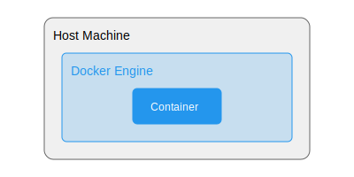

- **Tools Used**:
  - Docker Engine
  - Docker CLI
- **Gains**:
  - Application isolation
  - Reproducible environments
  - Easy distribution

## Step 1: Lightweight Runtime Evolution

**Startup Stage**: Production Release

- Success! The nature reserve pilot leads to contracts with 5 more reserves
- Users complain about image processing delays during peak hours
- Team realizes Docker overhead is impacting performance
- **Why `containerd`**: Need better performance to handle increased load, especially during morning hours when rangers upload most photos

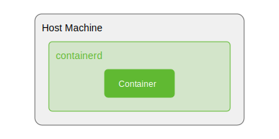

**Evolution**: Move from Docker to containerd
- **Need**:
  - Docker is too heavy for production
  - Need OCI-compliant runtime
- **Tools Used**:
  - containerd
  - runc
- **Gains**:
  - Better performance
  - Reduced overhead
  - Industry standard compatibility

## Step 2: Enter Pods

**Startup Stage**: Feature Expansion

- BioDex adds real-time weather data correlation to improve species identification
- Now needs:
  - Main AI service
  - Weather data service
  - Shared cache for both services
- **Why Pods**: Services need to communicate frequently and share cached data
- **Real Impact**: Reduced API calls to weather services by 90% through shared caching

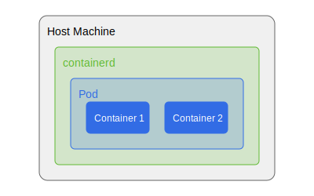

**Evolution**: Group related containers
- **Need**:
  - Run multiple containers that work together
  - Share network namespace and storage
- **Tools Used**:
  - kubectl (CLI tool)
  - kubelet (node agent)
- **Gains**:
  - Logical grouping of containers
  - Shared resources
  - Single unit of scaling

## Step 3: Single Node Setup

**Startup Stage**: Regional Growth

- Expanded to 20 nature reserves across France
- Added logging service to track species trends
- Need proper orchestration as manual container management becomes error-prone
- **Why Worker Node**: System restarts during updates cause service outages, need proper container lifecycle management

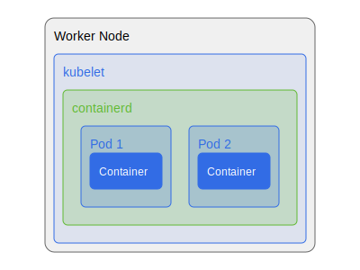

**Evolution**: Set up first worker node

- **Need**:
  - Run pods on a machine
  - Manage container lifecycle
- **Tools Used**:
  - kubelet
  - Container runtime (containerd)
  - kube-proxy
- **Gains**:
  - Container orchestration
  - Network management
  - Resource allocation

## Step 4: Multi-Node Reality

**Startup Stage**: Going International

- Major contract with The European Commission brings 100+ new locations across 27 countries
- Different regions need different AI models based on local species
- **Why Multiple Nodes**:
  - Need to serve different geographical regions
  - Handle timezone-based load spikes
  - Ensure service stays up during maintenance

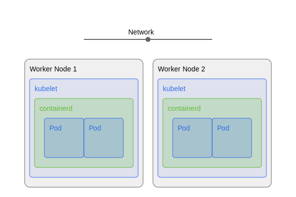

**Evolution**: Add more worker nodes

- **Need**:
  - Scale horizontally
  - Handle more workload
- **Tools Used**:
  - kubelet (on each node)
  - kube-proxy (on each node)
  - Container Network Interface (CNI)
- **Gains**:
  - Increased capacity
  - Better availability
  - Workload distribution

## Step 5: Control Plane Necessity

**Startup Stage**: Enterprise Clients

- Large environmental consulting firms start using the platform
- Need to:
  - Track system usage per client
  - Ensure fair resource allocation
  - Manage different service tiers
- **Why Control Plane**: Manual management of multiple nodes becomes impossible

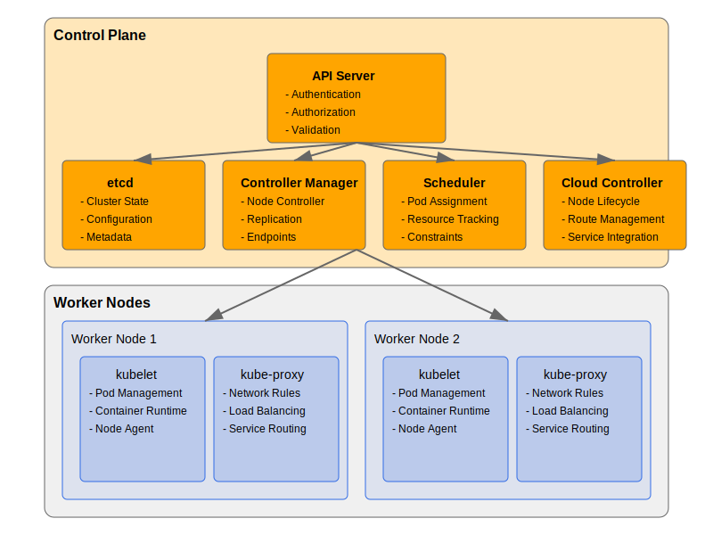

**Evolution**: Separate control and data planes

- **Need**:
  - Central management
  - Cluster state coordination
- **Tools Used**:
  - kube-apiserver
  - etcd
  - kube-controller-manager
  - kube-scheduler
- **Gains**:
  - Centralized control
  - Cluster state management
  - Declarative configuration

## Step 6: State Management Crisis

**Startup Stage**: Critical Data Requirements

- Government environmental agencies join as clients
- Need to:
  - Store configuration for hundreds of different AI models
  - Maintain audit trails of system changes
  - Track long-term biodiversity trends
- **Why etcd**: Configuration chaos leads to wrong AI models being deployed in wrong regions

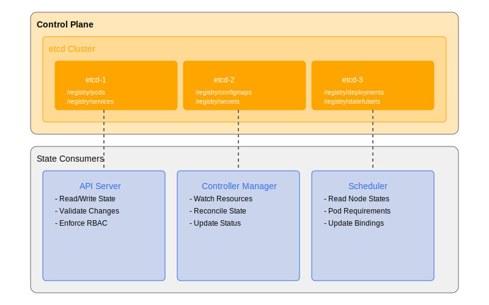

**Evolution**: Implement reliable state storage

- **Need**:
  - Store cluster configuration
  - Maintain consistency
- **Tools Used**:
  - etcd
  - Persistent volumes
- **Gains**:
  - Reliable state storage
  - Configuration persistence
  - Distributed consensus

## Step 7: Scheduling Challenges

**Startup Stage**: Resource Optimization

- Different clients have different priorities:
  - Research institutions need batch processing
  - Parks need real-time identification
  - Some regions need specific hardware for local AI models
- **Why Advanced Scheduling**: Need to optimize expensive GPU resources and ensure proper regional data processing

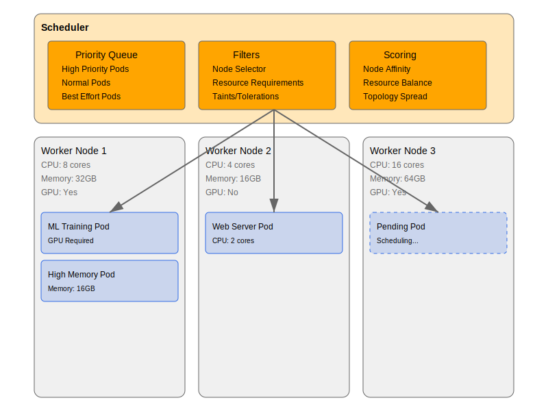

**Evolution**: Add scheduling capabilities

- **Need**:
  - Optimize pod placement
  - Resource utilization
- **Tools Used**:
  - kube-scheduler
  - Resource quotas
  - Node affinity rules
- **Gains**:
  - Efficient resource use
  - Workload distribution
  - Constraint satisfaction

## Step 8: Health Management Imperative

**Startup Stage**: Reliability Demands

- Platform now critical for endangered species monitoring
- Downtime has real environmental impact
- **Why Health Checks**:
  - Automatic recovery from ML model crashes
  - Ensure accurate species identification
  - Maintain SLAs with government clients

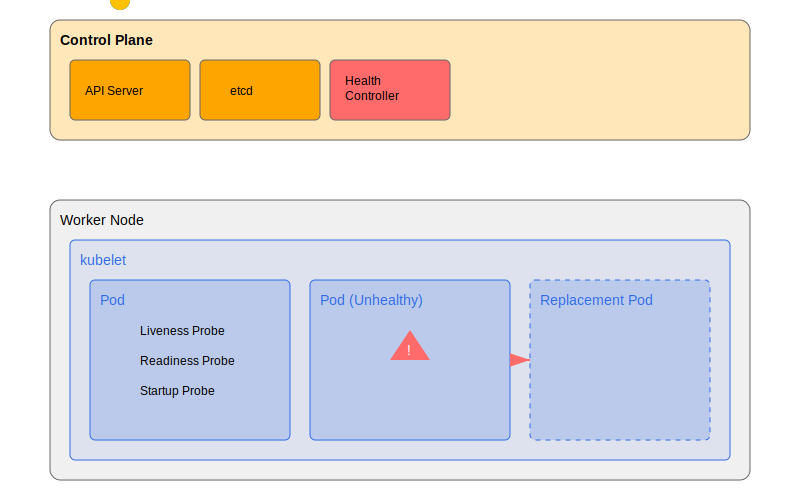

**Evolution**: Implement health checks and self-healing

- **Need**:
  - Detect and recover from failures
  - Maintain desired state
- **Tools Used**:
  - Liveness probes
  - Readiness probes
  - ReplicaSets
- **Gains**:
  - Automatic recovery
  - High availability
  - Reliable services

## Step 9: Load Balancing Requirements

**Startup Stage**: Global Platform

- Platform goes global with installations in national parks worldwide
- Traffic patterns follow the sun
- **Why Load Balancing**:
  - Handle dawn/dusk spikes when wildlife is most active
  - Direct traffic to geographically closest servers
  - Balance between real-time and batch processing workloads

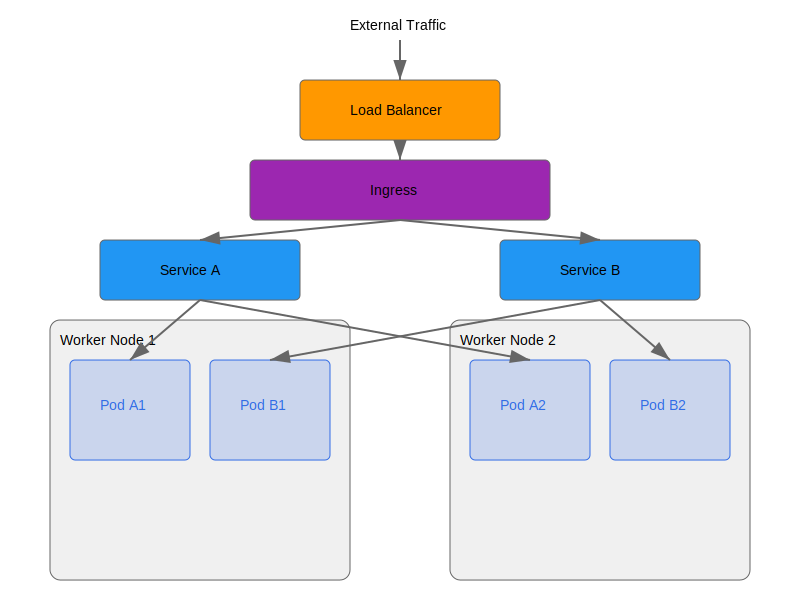

**Evolution**: Distribute traffic

- **Need**:
  - Balance workload
  - Handle traffic spikes
- **Tools Used**:
  - Services (ClusterIP, NodePort, LoadBalancer)
  - Ingress controllers
  - kube-proxy
- **Gains**:
  - Traffic distribution
  - Service discovery
  - External access

## Step 10: Development Ecosystem

**Startup Stage**: Team Growth

- Multiple development teams across time zones
- Features needed:
  - Regular model updates
  - New species detection capabilities
  - Regional customizations
- **Why Development Environment**: Need to test changes without risking production environment

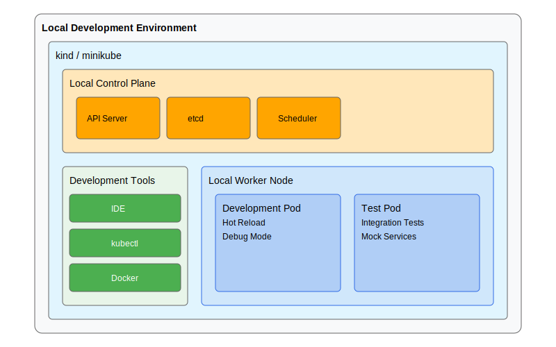

**Evolution**: Local development setup
- **Need**:
  - Test locally
  - Development workflow
- **Tools Used**:
  - kind (Kubernetes in Docker)
  - minikube
  - k3d
- **Gains**:
  - Local testing
  - Fast iteration
  - Production-like environment

## Current State

BioDex now:

- Processes millions of images daily
- Supports real-time species identification in 500+ locations
- Helps track and protect endangered species globally
- Provides critical biodiversity data to researchers and governments

Each Kubernetes feature they adopted solved real problems:

- Scaling to handle growing data
- Maintaining reliability for critical conservation work
- Managing complex deployment of regional AI models
- Ensuring efficient resource use across global infrastructure

> The complexity wasn't added for its own sake - each layer solved specific challenges in BioDex's mission to protect global biodiversity.

